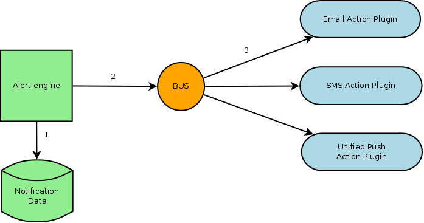
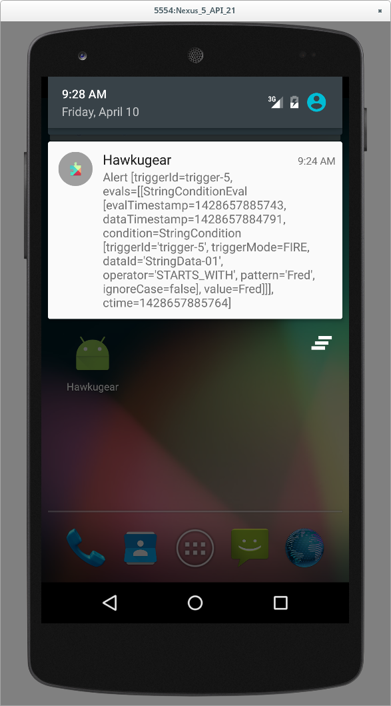

= Alert notifiers for mobile devices
Thomas Segismont
2015-04-09
:jbake-type: post
:jbake-status: published
:jbake-tags: blog, alerts, mobile, SMS, Aerogear
:idprefix:
:linkattrs:

Hawkular Alerts has new notifications senders which target mobile devices. Let's start with a brief explanation of
notification sending.

== How notification senders work?

When the alert engine detects a problem, it sends an action message to the configured sender(s) for this type of issue.
The action message has all the details:

* which problem triggered the alert
* who are the configured recipients

[[img-action-plugins]]
.Action plugins overview
ifndef::env-github[]
image::/img/blog/2015/alert-action-plugins.png[Action plugins overview,600,align="center"]
endif::[]
ifdef::env-github[]

endif::[]

. The alert engine inspects notification data to determine which action messages should be sent to the Hawkular bus.
. Then it sends a message for each configured notification (email/SMS/push).
. Action plugins pick up their messages and build the notification with the details given in the notification message.

Makes sense? Now which new plugins do we have?

=== Unified Push Notifications

Hawkular Alert's `aerogear` plugin is able to send notification messages to
https://www.jboss.org/unifiedpush/[Aerogear's Unified Push Server]. Which means that you can send alerts as native push
messages to an Android, iOS, Windows or Firefox OS application.

At the time of writing, Hawkular doesn't have a mobile application for any of these platforms (an Android application
might come soon with the help of a Google Summer of Code student). So for demonstration purposes we've built a sample
application, `Hawkugear` and ran it with the Android Emulator.

[[img-action-plugins]]
.Hawkugear Android application
ifndef::env-github[]
image::/img/blog/2015/hawkugear-android-app.png[Hawkugear Android application,350,align="center"]
endif::[]
ifdef::env-github[]

endif::[]

The application lacks proper formatting of course, but you can see on this screenshot that the notification message
landed properly on the mobile device after travelling through the Hawkular Bus, the Aerogear Unified Push Server and
Google Cloud's Messaging platform.

To configure the `aerogear` sender plugin, add these system property definitions (with your own values) into your
Wildfly `standalone.xml` file:

[source,xml]
----
<system-properties>
    <property name="org.hawkular.actions.aerogear.root.server.url" value="http://localhost:9191/ag-push/"/>
    <property name="org.hawkular.actions.aerogear.application.id" value="as304-6019-8a256afkbc-935b274-16247"/>
    <property name="org.hawkular.actions.aerogear.master.secret" value="94b2-qc156s-719725j6-4k04d566-bs0a340"/>
</system-properties>
----

Or using the CLI:

[source,bash]
----
/system-property=org.hawkular.actions.aerogear.root.server.url:add(value="http://localhost:9191/ag-push/")
/system-property=org.hawkular.actions.aerogear.application.id:add(value="as304-6019-8a256afkbc-935b274-16247")
/system-property=org.hawkular.actions.aerogear.master.secret:add(value="94b2-qc156s-719725j6-4k04d566-bs0a340")
----

=== Short Message Service

There's also an `sms` plugin which is built on https://www.twilio.com/sms[Twilio's SMS services]. No mobile application
required here, all you need to do is to create a Twilio account and configure the plugin with your application `sid`,
authorization `token`, and `from` number.

As for the `aerogear` plugin, add these system property definitions (with your own values) into your Wildfly
`standalone.xml` file:

[source,xml]
----
<system-properties>
    <property name="org.hawkular.actions.sms.sid" value="ACdc5f132a3c49700934481addd5ce1659"/>
    <property name="org.hawkular.actions.sms.token" value="3036d49cAf5Cd019c81de12354d57ac49a"/>
    <property name="org.hawkular.actions.sms.from" value="+14158141829"/>
</system-properties>
----

Or using the CLI:

[source,bash]
----
/system-property=org.hawkular.actions.sms.sid:add(value="ACdc5f132a3c49700934481addd5ce1659")
/system-property=org.hawkular.actions.sms.token:add(value="3036d49cAf5Cd019c81de12354d57ac49a")
/system-property=org.hawkular.actions.sms.from:add(value="+14158141829")
----

=== More to come...

We have planned to integrate with http://www.pagerduty.com/[PagerDuty]. In the beginning, each notification message
will be sent with a new indentifier. As a consequence, PagerDuty will see recurrent notifications of the same problem
as different incidents. The Hawkular Alerts team is working on an incident worflow and we should be able to solve this
problem in the near future.

That's it! Questions? Comments? Feel free to ask here or irc://irc.freenode.net/#hawkular[join us on Freenode]!
