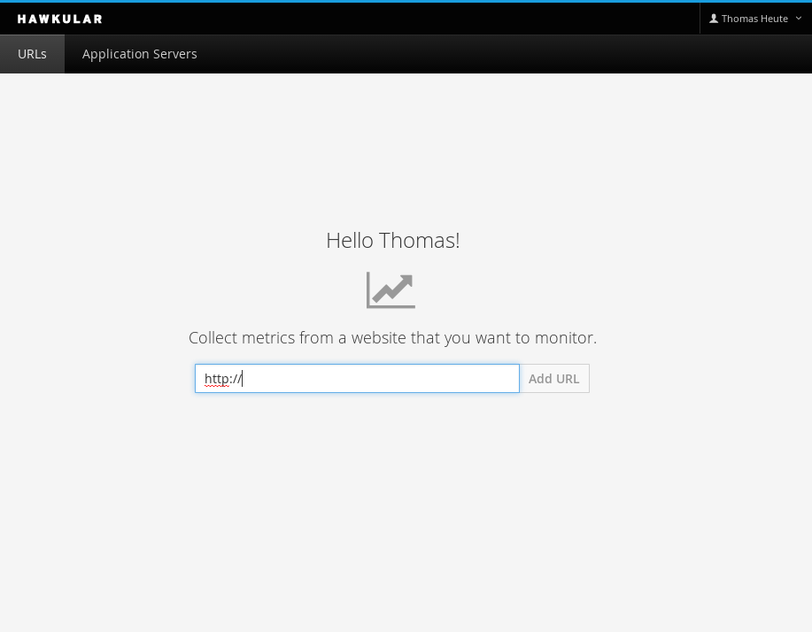
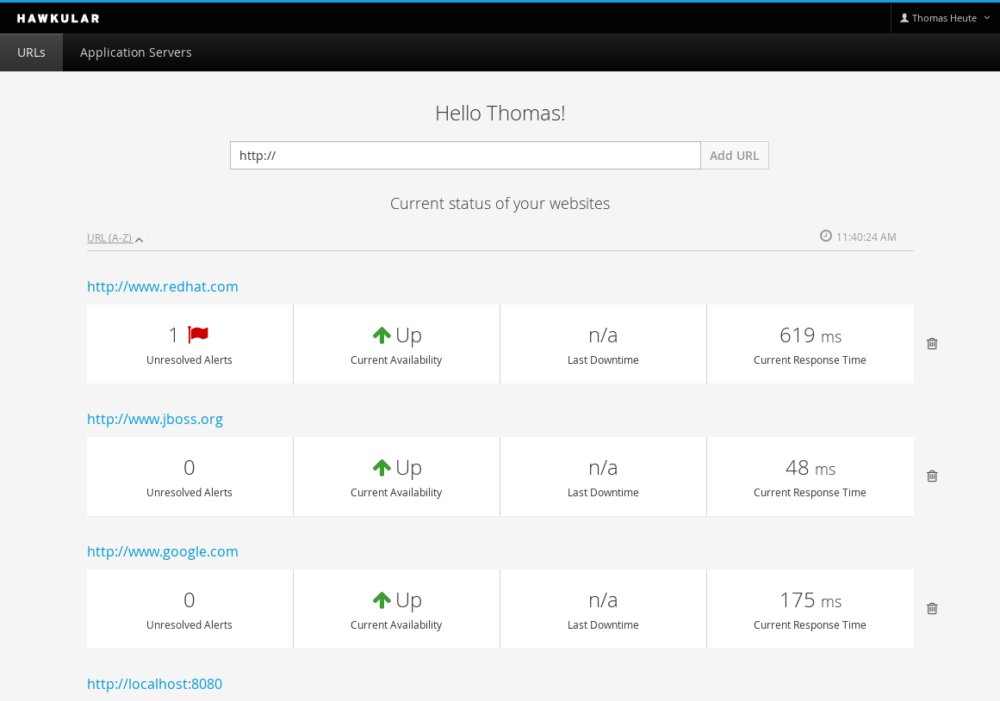
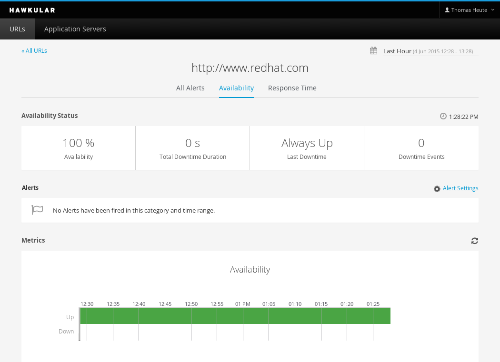
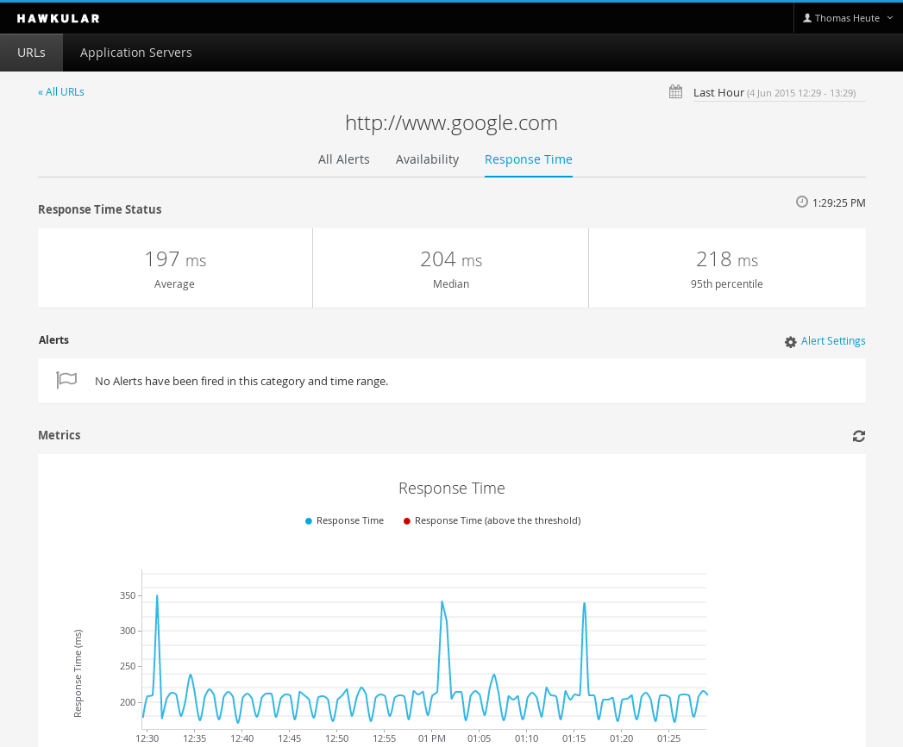
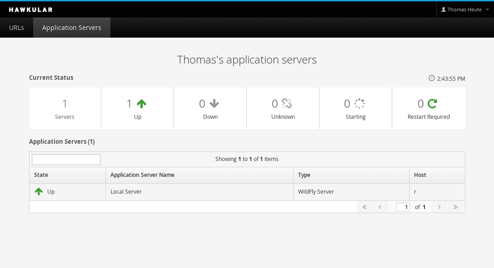

= Hawkular, the first release!
Thomas Heute
2015-06-04
:jbake-type: post
:jbake-status: published
:jbake-tags: blog, hawkular, release

We are very happy to release our very first version of Hawkular!
This is an important milestone for us, one of many more to come.

What you can already do with this release:

- Self register & login

[[img-welcome]]
ifndef::env-github[]
image::/img/blog/2015/1.0.0.Alpha1_welcome.png[Hawkular welcome page,500,align="center",link="/img/blog/2015/1.0.0.Alpha1_welcome.png"]
endif::[]
ifdef::env-github[]

endif::[]

- Add URLs to monitor. Hawkular will tell you if your URLs are accessible and what was the response time from the server, it keeps history of this data and you can browse the graphs to see the data at a particular time. The monitoring data for URLs added by you can be seen by you only.

[[img-urllist]]
ifndef::env-github[]
image::/img/blog/2015/1.0.0.Alpha1_urllist.png[Hawkular URL list,500,align="center",link="/img/blog/2015/1.0.0.Alpha1_urllist.png"]
endif::[]
ifdef::env-github[]

endif::[]

- Be alerted by Email when certain thresholds are met with dampening to avoid false alerts

[[img-urlavailability]]
ifndef::env-github[]
image::/img/blog/2015/1.0.0.Alpha1_urlavailability.png[Hawkular URL availability,500,align="center",link="/img/blog/2015/1.0.0.Alpha1_urlavailability.png"]
endif::[]
ifdef::env-github[]

endif::[]

[[img-urlresponsetime]]
ifndef::env-github[]
image::/img/blog/2015/1.0.0.Alpha1_urlresponsetime.png[Hawkular URL response time,500,align="center",link="/img/blog/2015/1.0.0.Alpha1_urlresponsetime.png"]
endif::[]
ifdef::env-github[]

endif::[]

- Add WildFly servers to monitor (for the moment you will need to instrument your server manually following http://www.hawkular.org/docs/user/getting-started.html#_install_a_wildfly_monitoring_agent[these instructions] and Hawkular user interface will tell you if they are up or down).

[[img-serverslist]]
ifndef::env-github[]
image::/img/blog/2015/1.0.0.Alpha1_serverslist.png[Hawkular servers list,500,align="center",link="/img/blog/2015/1.0.0.Alpha1_serverslist.png"]
endif::[]
ifdef::env-github[]

endif::[]

There is a lot more behind the scenes:

- Hawkular Metrics is a sub-project that allows you to store timeseries over a long period of time, this is based on the work done with the RHQ project and uses Cassandra in the background
- Hawkular Alerts is a component used by Hawkular to manage alerts. It is extremely configurable through a rule based engine
- The WildFly Agent exposes a lot of metrics from WildFly but also feed the inventory with deployments, datasources, etc.

We plan to do a lot more Alpha releases with even more features, the next Alpha is planned for July 1st, and link:/docs/dev/development.html[you can help us] :)

Thank you for the contributions!

You can download it here:

- http://download.jboss.org/hawkular/hawkular/1.0.0.Alpha1/hawkular-dist-1.0.0.Alpha1.zip[Hawkular 1.0.0.Alpha1 (zip)]
- http://download.jboss.org/hawkular/hawkular/1.0.0.Alpha1/hawkular-dist-1.0.0.Alpha1.tar.gz[Hawkular 1.0.0.Alpha1 (tar.gz)]

Oh, and we have a new logo, the hawk is looking at your apps, be kind to him!

[[img-logo]]
ifndef::env-github[]
image::/img/hawkular_logo_200x200.png[Hawkular logo,200,align="center",link="/img/hawkular_logo_200x200.png"]
endif::[]
ifdef::env-github[]

endif::[]

