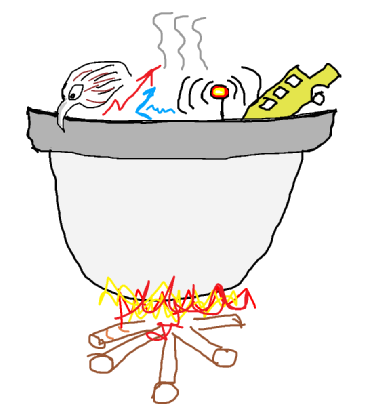

= The Kettle starts boiling
Heiko W. Rupp
2015-02-24
:jbake-type: post
:jbake-status: published
:jbake-tags: blog, kettle, integration
:idprefix:

We have been working hard the last weeks to integrate the individual pieces of hawkular into some _good old
distribution_, basically a thingy you can check out, unzip and run. And here it is, the _Kettle_

ifndef::env-github[]
image::/img/Kettle.png[]
endif::[]
ifdef::env-github[]

endif::[]

To build the Kettle you basically checkout the Hawkular main repository and run `mvn install`

[source,shell]
----
git clone https://github.com/hawkular/hawkular.git
cd hawkular
mvn install -Pdev -Dlicense.skip
cd kettle/target
cd wildfly-8.2.0.Final
bin/standalone.sh
----

You can then point your web browser at http://localhost:8080/ and use Hawkular.
