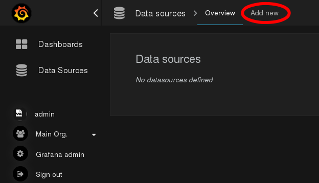
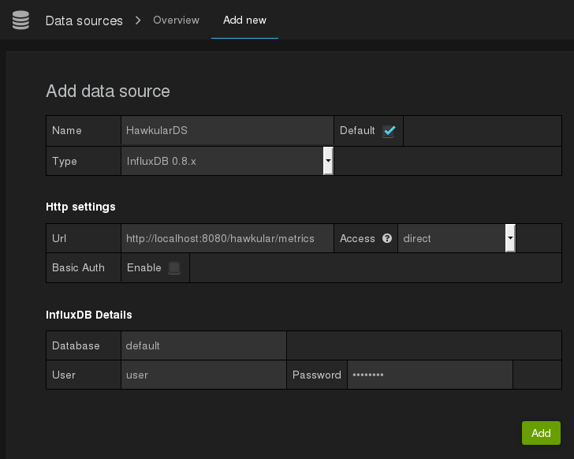
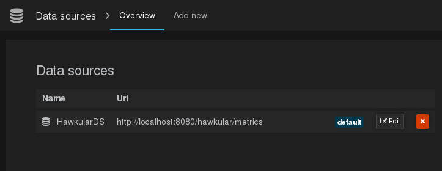
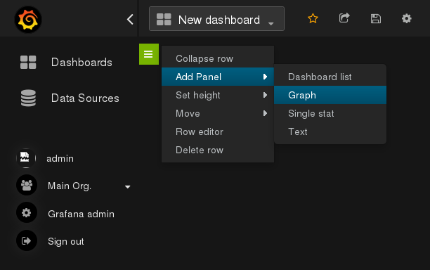
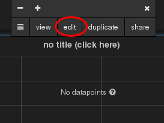
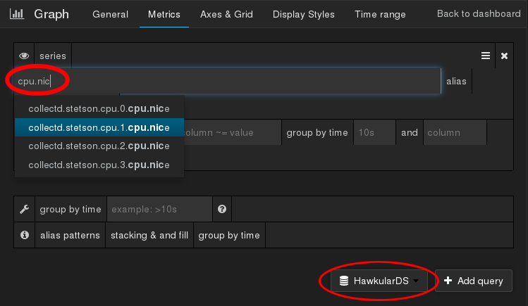
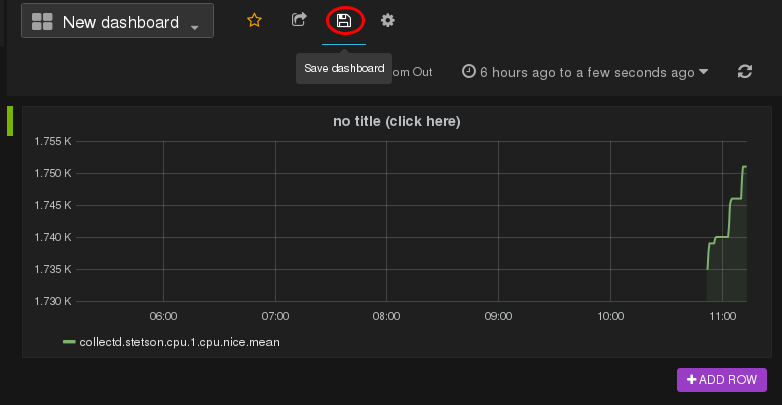

= Grafana Integration Guide
Thomas Segismont
2015-06-15
:icons: font
:jbake-type: page
:jbake-status: published

This guide will help you to configure http://grafana.org[Grafana] so that you can build awesome dashboards with
the data stored in Hawkular Metrics.

NOTE: We assume you've already installed and started a Hawkular Metrics server.

== Installing Grafana

http://docs.grafana.org/[Grafana's documentation] has a comprehensive list of installation options.
Pick the one which is most approriate for you.

TIP: If you just want to give Grafana a try, then running it with Docker is probably the most straightforward option.

To start Grafana with Docker, execute `docker run -i -p 3000:3000 grafana/grafana` in a Terminal.
After setup, browse to `http://localhost:3000`. You can login with the default user, `admin`, with the `admin` password.

== Creating the Hawkular Data Source

At the time of writing, Grafana doesn't have a plugin to integrate with Hawkular Metrics natively. But it is able to
work with InfluxDB servers and Hawkular Metrics has an InfluxDB v0.8 API compatibility layer.

NOTE: Hawkular Metrics **does not embed** InfluxDB. Our REST API simply exposes an InfluxDB v0.8 compatible endpoint:
`/hawkular/metrics/db/<tenant>/series`.

Click on the Grafana logo at the top left corner to open the menu. Then click on the _Data Sources_ link.
In the _Data sources_ page, click on _Add new_ at the top of the page.

[[img-add-new-data-source]]
.Add new Grafana Data Source
ifndef::env-github[]
image::/img/docs/components/metrics/grafana_integration/add_new_data_source.png[Add new Grafana Data Source, align="center"]
endif::[]
ifdef::env-github[]

endif::[]

Fill-in the datasource creation form.

[cols="1,8", options="header"]
|===
|Name
|Description

|Name
|Your data source name. `HawkularDS` in this guide.

|Default
|Check to use `HawkularDS` by default in new graphs.

|Type
|Select `InfluxDB 0.8.x`.

|Url
|Hawkular Metrics base url. `http://localhost:8080/hawkular/metrics` in this guide.
Change the scheme, host and port as needed.

|Access
|Set to `direct` if the Hawkular Metrics server is not reachable from the Grafana backend.

|Database
|The tenant name.

|User
|Hawkular Metrics does not support authentication yet. Fill the field with random data to pass form validation.

|Password
|Hawkular Metrics does not support authentication yet. Fill the field with random data to pass form validation.
|===

[[img-data-source-details]]
.Data source creation form
ifndef::env-github[]
image::/img/docs/components/metrics/grafana_integration/data_source_details.png[Data source creation form, align="center"]
endif::[]
ifdef::env-github[]

endif::[]

Then click the `Add` button. The new data source should be listed.

[[img-data-source-added]]
.Data source added
ifndef::env-github[]
image::/img/docs/components/metrics/grafana_integration/data_source_added.png[Data source added, align="center"]
endif::[]
ifdef::env-github[]

endif::[]

== Adding a new graph

Create a new dashboard or open an existing one. Then click on the small green bar at the top to open the contextual menu.

[[img-add-new-data-graph]]
.Add new graph
ifndef::env-github[]
image::/img/docs/components/metrics/grafana_integration/add_new_graph.png[Add new graph, align="center"]
endif::[]
ifdef::env-github[]

endif::[]

After the new graph shows up in the dashboard, click on the title to open the contextual menu then on `edit`.

[[img-edit-new-data-graph]]
.Edit new graph
ifndef::env-github[]
image::/img/docs/components/metrics/grafana_integration/edit_new_graph.png[Edit new graph, align="center"]
endif::[]
ifdef::env-github[]

endif::[]

Open the `Metrics` tab. Make sure `HawkularDS` is the selected data source. Type your metric name or part of it in the
`series` field. A list of matching metric names will show up.

[[img-graph-details]]
.Graph edition form
ifndef::env-github[]
image::/img/docs/components/metrics/grafana_integration/graph_details.png[Graph edition form, align="center"]
endif::[]
ifdef::env-github[]

endif::[]

When you have selected a metric, click on `Back to dashboard`, then click on the save icon.

[[img-save-dashboard]]
.Save dashboard
ifndef::env-github[]
image::/img/docs/components/metrics/grafana_integration/save_dashboard.png[Save dashboard, align="center"]
endif::[]
ifdef::env-github[]

endif::[]

== What's next?

Now you know all that's required to integrate Grafana with Hawkular Metrics. If you're not familiar with the product,
take the time to read the http://docs.grafana.org/[Grafana doc pages]. And build awesome dashboards with Grafana and
Hawkular Metrics!
