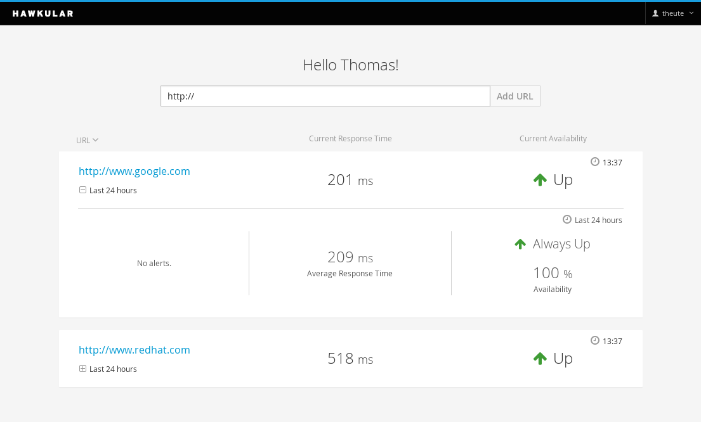

= Intro to Hawkular, a middleware open-source management solution
Thomas Heute
2015-04-17
:jbake-type: post
:jbake-status: published
:jbake-tags: blog, hawkular, intro, mission
:idprefix:
:linkattrs:

The [big]*mission* of Hawkular is to provide an easy-to-use management solution with a particular focus on your [big]*middleware applications*.

Our efforts are primarily about [big]*monitoring* at this stage. We are putting a lot of efforts in providing a [big]*usable user interface*, it's no longer an after-thought, the UI design actually drives a lot of the requirements (and don't worry all the capabilities of the UI interface are available through a REST interface, this is per design). 

We also think that alerts should be [big]*smart* ! We definitely want to reduce the amount of false alerts to the minimum. A slower response time might not prove a dysfunction if there is a heavier usage of a system, it would be if the response time increase for no reason. Higher load and higher response time may trigger auto-scaling in a cloud environment… We also want to add [big]*prediction* capabilities to let you react [big]*before* things start breaking.

.Provisioning and configuration
NOTE: Speaking of auto-scaling and cloud environment, in a later phase we (and/or http://www.hawkular.org/community/join.html[you]?) will add provisioning and configurations of servers to Hawkular.

Hawkular will also help you with out of the box alert configurations that makes sense and that you can adjust/change/remove/add. Because we deal with many common issues through supporting our projects and products we aim at bringing that knowledge back into the monitoring tool. 

No matter if you belong to the SOA "old-school" or Micro Services "hype", it's usually hard to properly get a grasp of the relations between multiple services running on multiple servers and how one can affect another one. It is our goal to focus on an application rather than on a plain list of servers. We'll help you visualize that infrastructure by discovering as much as possible the relationships between the various elements and making this graph of resources easy to browse, we'll want to tell you what applications are affected when a particular service, database, server... is having issues.

As for the [big]*current status*, we are heavily working on the core services (Metrics storing and collection, alerts, inventory, reactive architecture...) but to get something usable today we are already providing a tool to monitor websites by providing its URL. You'll immediately get historical data about availability and response times on which you can decide to receive email notifications when something goes wrong. (http://www.hawkular.org/blog/2015/04/09/alert-notifiers-for-mobile-devices.html[Mobile push notifications and SMS using Twilio just made it] and PagerDuty support is on its way ! Easily extensible)

[[img-ping-service]]
.Hawkular ping service
ifndef::env-github[]
image::/img/blog/2015/hawkular-intro1.png[Hawkular ping service,800,align="center",link="/img/blog/2015/hawkular-intro1.png"]
endif::[]
ifdef::env-github[]

endif::[]

To [big]*get started* you have several options (more info http://www.hawkular.org/docs/user/getting-started.html[here]):

* Use our docker image. Assuming you have docker already installed, it's also a very easy way to get started, here are the instructions:
 . sudo docker run -d -p 8081:8080 hawkular/hawkular
 . Open your web browser and go to http://localhost:8081
* http://www.hawkular.org/docs/dev/development.html#_full_distribution[Build from sources]
	
It's fully open-source and as you can tell we are at the beginning of the journey (with 10+ years of experience with the http://rhq-project.github.io/rhq/[RHQ project]),  feel free to contribute https://lists.jboss.org/mailman/listinfo/hawkular-dev[ideas] and https://github.com/hawkular/hawkular.git[code] and/or report https://issues.jboss.org/browse/HAWKULAR[issues] !

That's it! Questions? Comments? Feel free to ask here or irc://irc.freenode.net/#hawkular[join us on Freenode]!
