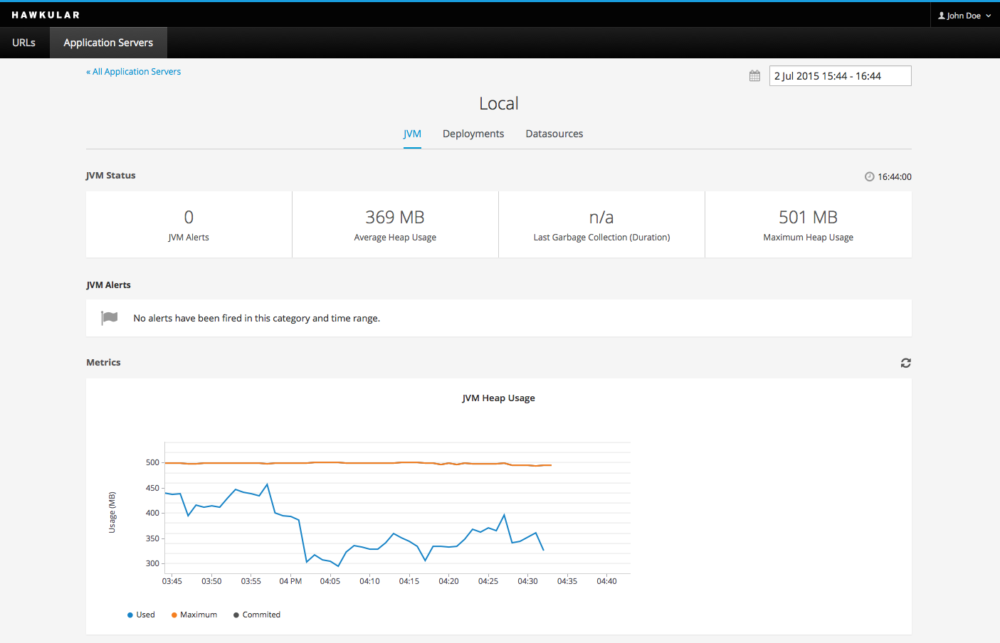
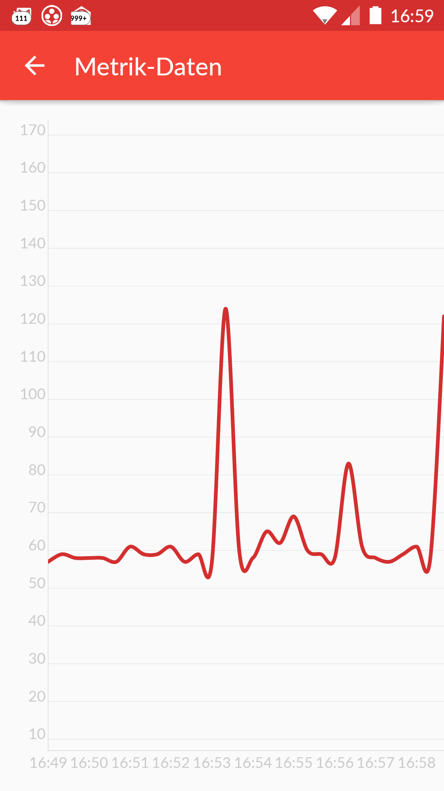

= Hawkular, the second release!
Heiko Rupp
2015-07-02
:jbake-type: post
:jbake-status: published
:jbake-tags: blog, hawkular, release

We are very happy to release the second version of Hawkular!
As with the previous one, this was the most important release of Hawkular so far.

== App server support

The main focus of this release clearly was the monitoring of http://www.wildfly.org/[WildFly] application servers.

NOTE: For the moment you will need to instrument your server manually following
http://www.hawkular.org/docs/user/getting-started.html#_install_a_wildfly_monitoring_agent[these instructions].
We will make this easier in the future.

[[img-serverslist]]
ifndef::env-github[]
image::/img/blog/2015/1.0.0.Alpha1_serverslist.png[Hawkular servers list,500,align="center",link="/img/blog/2015/1.0.0.Alpha1_serverslist.png"]
endif::[]
ifdef::env-github[]
image::../../../../../assets/img/blog/2015/1.0.0.Alpha1_serverslist.png[Hawkular servers list,200,align="center",link="../../../../../assets/img/blog/2015/1.0.0.Alpha1_serverslist.png"]
endif::[]

Now when you click on a server name you can see some of the details like JVM-Info, defined Datasources and a list of
deployments on the server.

[[img-serversdetail]]
ifndef::env-github[]
image::/img/blog/2015/1.0.0.Alpha2_appserver_details.png[Hawkular servers details,500,align="center",link="/img/blog/2015/1.0.0.Alpha2_appserver_details.png"]
endif::[]
ifdef::env-github[]

endif::[]

== Notable changes in this release were:

* Move the underlying container to WildFly 9.0 CR2
* Implement some app server details as mentioned above
* Upgrade underlying versions of Hawkular-Metrics and other subsystems

Head over to the link:/releasenotes/1.0.0.Alpha2.html[Full release notes] for more details.

== Demo

Thomas Heute has run a demonstration of the new Hawkular features, that you can watch here:

video::MbGoVh4d6cA[youtube,width=600,height=400]

We plan to do a lot more Alpha releases with even more features, the next Alpha is planned for July 29th, and
link:/docs/dev/development.html[you can help us] :)

Thank you for the contributions!

== Downloads

You can download the release here:

* http://download.jboss.org/hawkular/hawkular/1.0.0.Alpha2/hawkular-dist-1.0.0.Alpha2.zip[Hawkular 1.0.0.Alpha2 (zip)]
* http://download.jboss.org/hawkular/hawkular/1.0.0.Alpha2/hawkular-dist-1.0.0.Alpha2.tar.gz[Hawkular 1.0.0.Alpha2
(tar.gz)]

== What's next?

During the weeks until the next release and demo we want to address the following:

* More details of the application servers
* Fix issues that are reported around web site pings and existing appserver details
* Start running operations on the managed servers like redeploying applications

== Android client

As you have seen in the demo video, Hawkular has an Android client, that is implemented by GSoC student
Arthur Dryomov. Here is the current version of its metrics screen

[[img-serversdetail]]
ifndef::env-github[]
image::/img/blog/2015/1.0.0.Alpha2_android_client.png[Android client metrics chart,300,align="center",link="/img/blog/2015/1.0.0.Alpha2_android_client.png"]
endif::[]
ifdef::env-github[]

endif::[]
