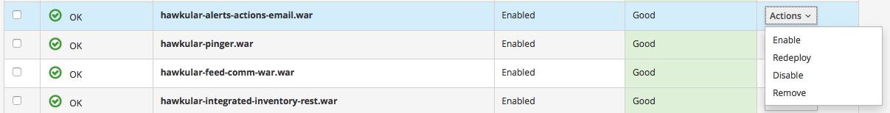
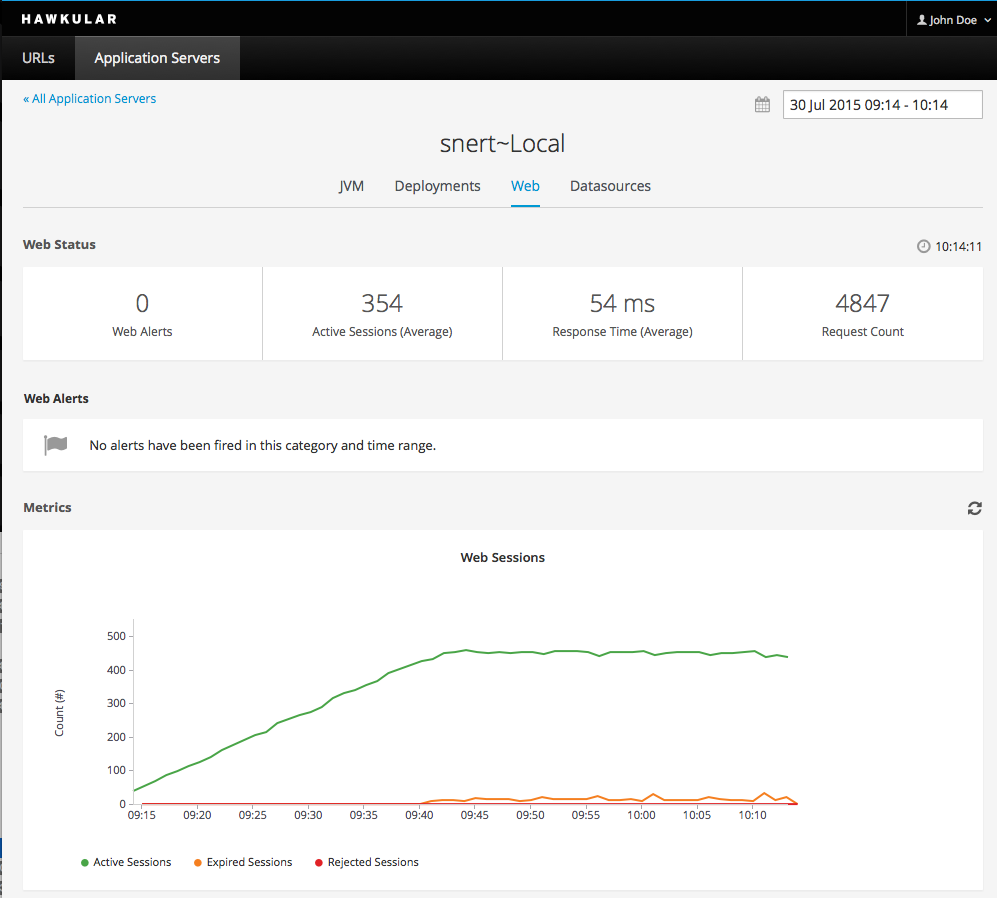
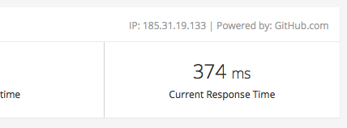

= Hawkular, all good things make three!
Heiko Rupp
2015-07-30
:jbake-type: post
:jbake-status: published
:jbake-tags: blog, hawkular, release

We are very happy to release the third version of Hawkular!
As with the previous one, this was the most important release of Hawkular so far.

== App server support

The main focus of this release clearly was the extended monitoring of http://www.wildfly.org/[WildFly] application
servers.

NOTE: For the moment you will need to instrument your server manually following
http://www.hawkular.org/docs/user/getting-started.html#_install_a_wildfly_monitoring_agent[these instructions].
We will make this easier in the future.

Deployments in the monitored server can now be enabled/disabled and redeployed. Deployment of new content
will come in the next release.

[[img-server-deploy-detail]]
ifndef::env-github[]
image::/img/blog/2015/1.0.0.Alpha3_deploy_actions.png[Hawkular server deployments,500,align="center",link="/img/blog/2015/1.0.0.Alpha3_deploy_actions.png"]
endif::[]
ifdef::env-github[]

endif::[]

We also have a new _web_-tab that gives statistics about the web subsystem of the managed WildFly

[[img-webtab]]
ifndef::env-github[]
image::/img/blog/2015/1.0.0.Alpha3_web_tab.png[Wildfly servers web stats,500,align="center",link="/img/blog/2015/1.0.0.Alpha3_web_tab.png"]
endif::[]
ifdef::env-github[]

endif::[]

== More details for URLs

Hawkular now also collects the current IP address and the server information for the URLs being monitored

[[img-url-detail]]
ifndef::env-github[]
image::/img/blog/2015/1.0.0.Alpha3_url_traits.png[URL details,500,align="center",link="/img/blog/2015/1.0.0.Alpha3_url_traits.png"]
endif::[]
ifdef::env-github[]

endif::[]

== Notable changes in this release were:

* Implement more app server details as mentioned above
* Upgrade underlying versions of Hawkular-Metrics and other subsystems
* More alerting capabilities

Head over to the link:/releasenotes/1.0.0.Alpha3.html[Full release notes] for more details.

== Demo

We will again run a demonstration of the new Hawkular features, which we will link here.

We plan to do a lot more Alpha releases with even more features, the next Alpha is planned for August 26th, and
link:/docs/dev/development.html[you can help us] :)

Thank you for the contributions!

== Downloads

You can download the release here:

* http://download.jboss.org/hawkular/hawkular/1.0.0.Alpha3/hawkular-dist-1.0.0.Alpha3.zip[Hawkular 1.0.0.Alpha3 (zip)]
* http://download.jboss.org/hawkular/hawkular/1.0.0.Alpha3/hawkular-dist-1.0.0.Alpha3.tar.gz[Hawkular 1.0.0.Alpha3
(tar.gz)]

== What's next?

During the weeks until the next release and demo we want to address the following:

* More details of the application servers
* Uploading of new applications into managed servers
* More alerting related changes
* An easiert to grasp resource naming schema
* Hopefully definition of jdbc drivers and data sources
