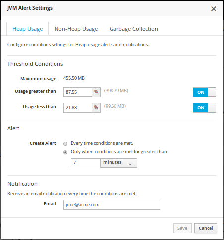
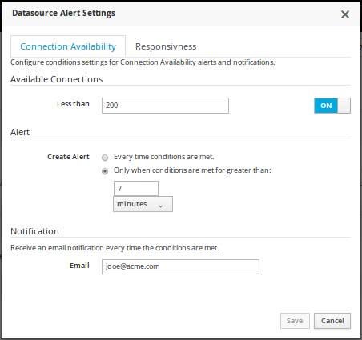
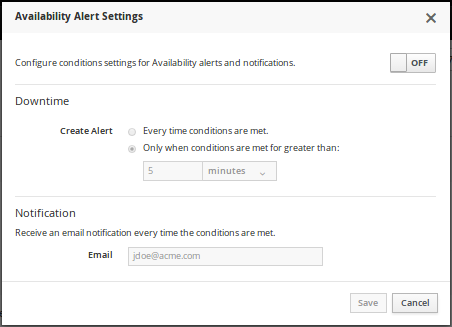
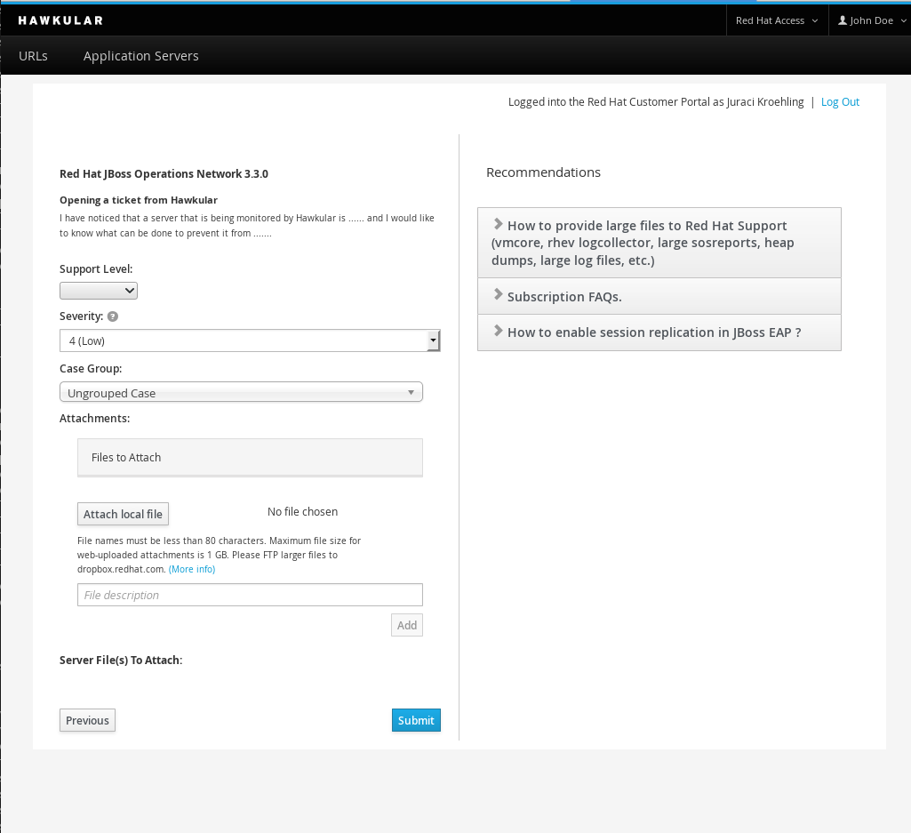

= The fourth milestone of Hawkular released
Peter Palaga
2015-08-27
:jbake-type: post
:jbake-status: published
:jbake-tags: blog, hawkular, release

Hawkular, the monitoring platform, is happy to announce the release of its fourth milestone 1.0.0.Alpha4.

== Improvements in Alerts definitions

Alerts are there to inform the user about an occurrence of a problem in some of the monitored resources. The present
release adds some new configuration dialogs and improves the existing ones.

There are new configuration options to setup Alerts based on JVM Heap Usage and Garbage Collection.

[[img-jvm-heap-usage-alerts]]
.JVM Alert Settings for Heap Usage
ifndef::env-github[]
image::/img/blog/2015/2015-08-27-jvm-heap-usage-alerts.png[JVM Alert Settings for Heap Usage]
endif::[]
ifdef::env-github[]

endif::[]

There is a new dialog to configure Alerts for Datasources.

[[img-ds-alerts]]
.JVM Alert Settings for Datasources
ifndef::env-github[]
image::/img/blog/2015/2015-08-27-ds-alerts.png[JVM Alert Settings for Datasources]
endif::[]
ifdef::env-github[]

endif::[]

And there are new Specialized dialogs to configure Alerts for URLs' Availability and Response Time.

[[img-url-avail-alerts]]
.Settings for URLs' Availability
ifndef::env-github[]
image::/img/blog/2015/2015-08-27-url-avail-alerts.png[JVM Alert Settings for URLs' Availability]
endif::[]
ifdef::env-github[]

endif::[]

== Red Hat Access Portal Integration

We added an integration with the link:https://access.redhat.com/[Red Hat Access Portal] to Hawkular.
Users with valid Access Portal credentials are now able to browse the Knowledge Base, view and create Support Cases
using the Hawkular user interface. On the future releases, we plan to improve this integration by adding more features.
If that sounds interesting to you, we are looking forward for your feedback on #hawkular channel on
link:https://freenode.net/[Freenode].

[[img-rh-access]]
.Open a ticket on Red Hat Access portal using the Hawkular UI
ifndef::env-github[]
image::/img/blog/2015/2015-08-27-rh-access.png[Open a ticket on Red Hat Access portal using the Hawkular UI,400]
endif::[]
ifdef::env-github[]

endif::[]

== Backend

While these changes in backend are not used by the UI yet, they present an important step towards a new UI functionality
in future releases:

* Hawkular Inventory now provides an API for configuration of resources and Hawkular Agent is using this API.
* Hawkular Bus and Agent now support the execution of operations on any resource
  link:https://issues.jboss.org/browse/HAWKULAR-483[HAWKULAR-483].
* Hawkular Bus offers a new infrastructure to stream large data from UI to monitored Application Servers.
  This is especially important for another feature that was added in the backend, namely the support for deploying
  applications on monitored Application Servers.

== Other minor tweaks and fixes

* link:https://issues.jboss.org/browse/HAWKULAR-488[HAWKULAR-488] - Display IP Address for Application Servers
* link:https://issues.jboss.org/browse/HAWKULAR-254[HAWKULAR-254] - Blank screen on Windows
* link:https://issues.jboss.org/browse/HAWKULAR-336[HAWKULAR-336] - Inconsistent time information on URL details page
* link:https://issues.jboss.org/browse/HAWKULAR-406[HAWKULAR-406] - Same data for 2 different Wfly servers shown
* link:https://issues.jboss.org/browse/HAWKULAR-494[HAWKULAR-494] - Datasources not unique per server
* link:https://issues.jboss.org/browse/HAWKULAR-497[HAWKULAR-497] - Resources in inventory are lost at restart
* link:https://issues.jboss.org/browse/HAWKULAR-521[HAWKULAR-521] - "http://livingontheedge.hawkular.org" isn't using the hawkular favicon.
* link:https://issues.jboss.org/browse/HAWKULAR-526[HAWKULAR-526] - Downtime duration alert settings don't persist after save.
* link:https://issues.jboss.org/browse/HAWKULAR-536[HAWKULAR-536] - License Check of imported node_modules
* link:https://issues.jboss.org/browse/HAWKULAR-553[HAWKULAR-553] - Url input is not validated (enough)
* link:https://issues.jboss.org/browse/HAWKULAR-579[HAWKULAR-579] - "Alert Settings" link on URL details > All Alerts does notthing when clicked

Full list of Jira issues fixed in this release:
link:/releasenotes/1.0.0.Alpha4.html[Release Notes - Hawkular - Version 1.0.0.Alpha4]

== Watch the demo online
video::nekjPRwf50U[youtube,width=600,height=400]

== Downloads

You can download the release here:

* http://download.jboss.org/hawkular/hawkular/1.0.0.Alpha4/hawkular-dist-1.0.0.Alpha4.zip[Hawkular 1.0.0.Alpha4 (zip)]
* http://download.jboss.org/hawkular/hawkular/1.0.0.Alpha4/hawkular-dist-1.0.0.Alpha4.tar.gz[Hawkular 1.0.0.Alpha4
(tar.gz)]

== What's next?

The next Alpha is planned for September 25th, and we are looking forward to work on the following features:

* Deployment of new applications into managed servers
* Definition of jdbc drivers and data sources
