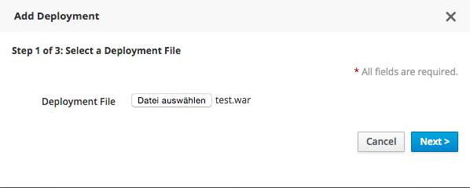
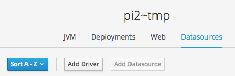

= The fifth milestone of Hawkular released
Heiko W.Rupp
2015-08-27
:jbake-type: post
:jbake-status: published
:jbake-tags: blog, hawkular, release

Hawkular, the monitoring platform, is happy to announce the release of its fourth milestone 1.0.0.Alpha5.

== Improvements in WildFly handling

It is now possible to upload deployments to managed WildFly servers

On the deployments subtab, there is now a button that triggers a wizard to upload a deployment to a managed server

[[img-server-add-deployment]]
.Wizard step to add a deployment
ifndef::env-github[]
image::/img/blog/2015/2015-09-23-add-deployment-step.png[Deployment step]
endif::[]
ifdef::env-github[]

endif::[]

There is also a new dialog to add a JDBC driver to a managed WildFly server

[[img-add-jdbc-driver]]
.Add JDBC-Driver button
ifndef::env-github[]
image::/img/blog/2015/2015-09-23-add-driver.png[Add JDBC-Driver button]
endif::[]
ifdef::env-github[]

endif::[]

And last but not least it is possible to obtain a so called 'JBoss Diagnostic Report' from a managed server, which
can then be sent to Red Hat support when a case has been opened. You will find a button at the end of the WildFly
server pages.

Full list of Jira issues fixed in this release:
link:/releasenotes/1.0.0.Alpha5.html[Release Notes - Hawkular - Version 1.0.0.Alpha5]

== Watch the demo online

Join us on
https://plus.google.com/events/crndlsuatqmk52ac9el8dbnueao

== Downloads

You can download the release here:

* http://download.jboss.org/hawkular/hawkular/1.0.0.Alpha5/hawkular-dist-1.0.0.Alpha5.zip[Hawkular 1.0.0.Alpha5 (zip)]
* http://download.jboss.org/hawkular/hawkular/1.0.0.Alpha5/hawkular-dist-1.0.0.Alpha5.tar.gz[Hawkular 1.0.0.Alpha5(tar.gz)]

== What's next?

The next Alpha is planned for October 21st, and we are looking forward to work on the following features:

* Central alert center
* Improve
* Definition of jdbc drivers and data sources
