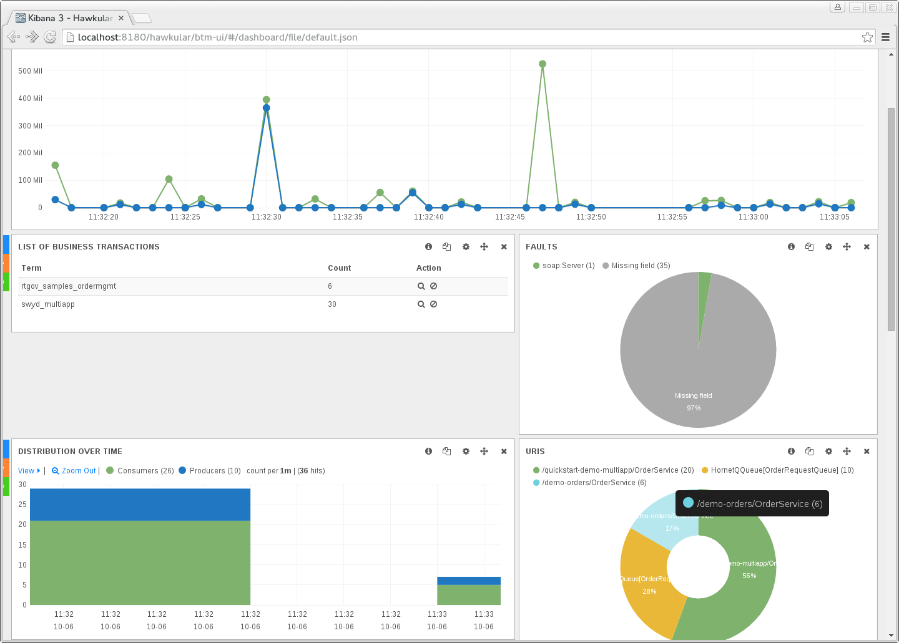

= Hawkular-BTM 0.4.0 released
Gary Brown
2015-10-06
:jbake-type: post
:jbake-status: published
:jbake-tags: blog, btm, release

I am happy to announce release 0.4.0.Final of the Hawkular Business Transaction Management project. The main focus for this release has been starting work on the server side capabilities and the introduction of an initial UI. A demo of the new functionality can be found https://youtu.be/vCIgC3QuJTI[here].

.Kibana dashboard showing response time information
ifndef::env-github[]
image::/img/blog/2015/2015-10-06-btm-kibana.png[Kibana dashboard]
endif::[]
ifdef::env-github[]

endif::[]

== Highlights of this release

* Deriving Response Time metrics from the Business Transaction Fragments

* Storing the Business Transaction Fragments, and derived Response Time metrics, in Elasticsearch

* Creating of an initial UI based around Kibana to display the Response Time metric information

Download the release from https://github.com/hawkular/hawkular-btm/releases/tag/0.4.0.Final[here].

The detailed release notes can be found https://issues.jboss.org/secure/ReleaseNote.jspa?projectId=12316120&version=12328248[here].

Feature requests and bugs should be reported in our project https://issues.jboss.org/browse/HWKBTM[jira].

