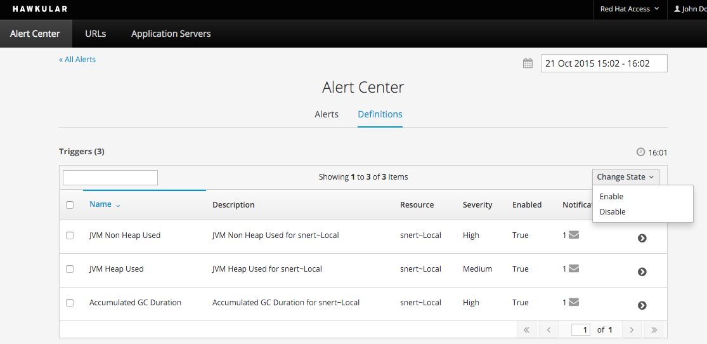

= The sixth milestone of Hawkular released
Heiko W.Rupp
2015-10-21
:jbake-type: post
:jbake-status: published
:jbake-tags: blog, hawkular, release

Hawkular, the monitoring platform, is happy to announce the release of its sixth milestone 1.0.0.Alpha6.

=== Alert Center

We have started providing the so called 'Alert Center', a place where you can see all fired alerts and alert
definitions in one place

[[img-add-jdbc-driver]]
.List of definitions in Alert Center
ifndef::env-github[]
image::/img/blog/2015/1.0.0.Alpha6_alert_center.png[Alert Center]
endif::[]
ifdef::env-github[]

endif::[]

=== Organizations

We have also started providing support for organizations, where a user may belong to
zero, one or more organizations. This to support multi-tenancy in Hawkular, so that
it could be run in a central installation, but with multiple separate departments only
seing their own resources

[[img-add-jdbc-driver]]
.List of organization members
ifndef::env-github[]
image::/img/blog/2015/1.0.0.Alpha6_orgs.png[Organizations]
endif::[]
ifdef::env-github[]
image::../../../../../assets/img/blog/2015/1.0.0.Alpha6_orgs.png[Organizations]
endif::[]

=== Creation and deletion of Data sources

There is also a new dialog to add a Datasource to a managed WildFly server

[[img-add-jdbc-driver]]
.Add Datsource button and action drop-down
ifndef::env-github[]
image::/img/blog/2015/1.0.0.Alpha6_add_ds.png[Add Datasource button]
endif::[]1
ifdef::env-github[]
image::../../../../../assets/img/blog/2015/1.0.0.Alpha6_add_ds.png[Add Datasource button]
endif::[]

=== Agent installer

We have now a little helper, the wildfly-agent installer, that makes it much easier to install
the agent inside a WildFly server.

.Run the installer
--
   java -jar target/hawkular-wildfly-monitor-installer-0.10.1.Final-SNAPSHOT-standalone.jar \
     --module=/path/to/module.zip \
     --wildfly-home=/opt/wildfly-9.0.0.Final \
     --hawkular-server-url=http://myServer:8080
--

Hawkular Agent is then installed to Wildfly Server `/opt/wildfly-9.0.0.Final` as a module and is able to
report to Hawkular Server located at `http://myServer:8080`.

Note that the installer uses a default of jdoe/password for _user/password_ that is encoded in
a properties file inside the installer jar. If you need a different value you need to edit those properties.

We will in the future (also) support the WildFly Feature packs.

=== Release notes

Full list of Jira issues fixed in this release:
link:/releasenotes/1.0.0.Alpha6.html[Release Notes - Hawkular - Version 1.0.0.Alpha6]

== Watch the demo online

Visit the recording here:

video::i2KCTAp9Cb4[youtube,width=600,height=400]

Most parts of the Ansible playbooks and roles shown are
available https://github.com/pilhuhn/hawkular-agent-ansible[on GitHub].

We will announce the next milestone demo on our
https://plus.google.com/b/100667078659222571663/+HawkularOrgProject[Google Plus page].

== Downloads

You can download the release here:

* http://download.jboss.org/hawkular/hawkular/1.0.0.Alpha6/hawkular-dist-1.0.0.Alpha6.zip[Hawkular 1.0.0.Alpha6 (zip)]
* http://download.jboss.org/hawkular/hawkular/1.0.0.Alpha6/hawkular-dist-1.0.0.Alpha6.tar.gz[Hawkular 1.0.0.Alpha6 (tar.gz)]

The Wildfly-Monitor module is available standalone from:

* http://download.jboss.org/hawkular/wildfly-monitor/0.11.1.Final/hawkular-monitor-0.11.1.Final-module.zip[WildFly monitor 0.11.1 (zip)]

Agent-installer:

* http://download.jboss.org/hawkular/wildfly-monitor/0.11.1.Final/hawkular-wildfly-monitor-installer-0.11.2.Final-standalone.jar[Agent installer 0.11.2 (zip)]

== What's next?

The next Alpha is planned for November 18th, and we are planning to work on the following features:

* More work on the alert center
* More work on the organizations
* Finish work for JDBC Drivers and Datasources
* Support agent download from server for installer purposes
* Start of an 'overview' page per app server

== Btw

There are two easter-eggs in the release :-)