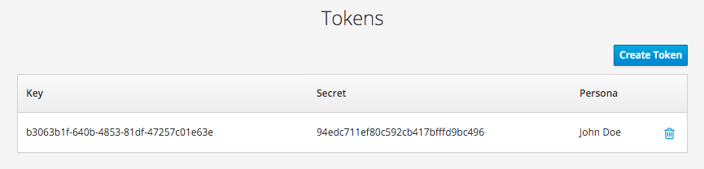
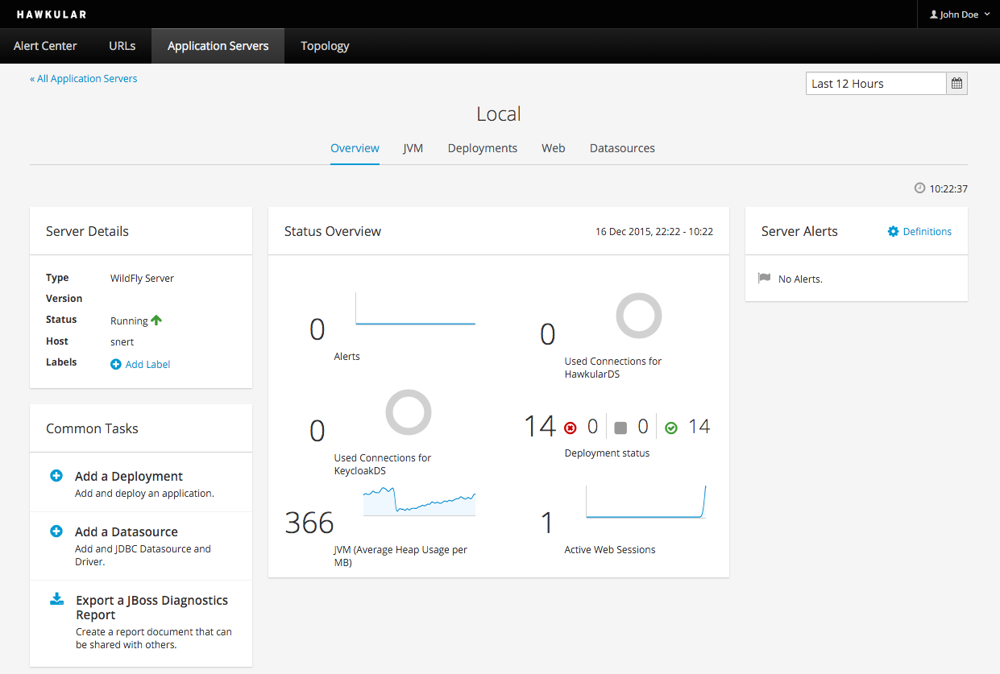
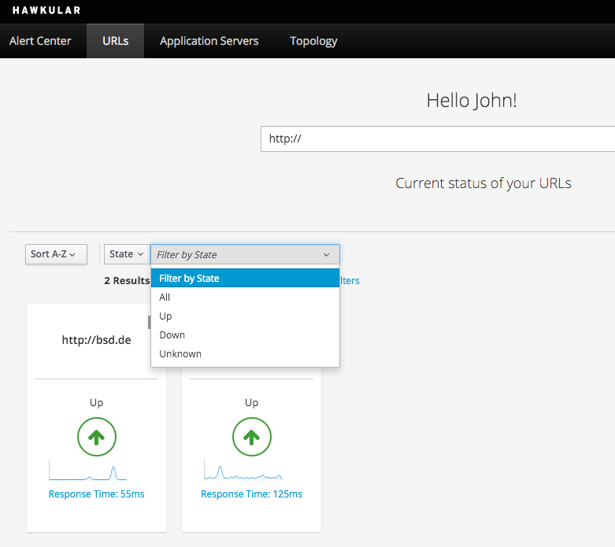

= The eigth milestone of Hawkular released
Heiko W.Rupp
2015-12-16
:jbake-type: post
:jbake-status: published
:jbake-tags: blog, hawkular, release

Hawkular, the monitoring platform, is happy to announce milestone release 1.0.0.Alpha8.

== Dealing with Keycloak

Hawkular uses Keycloak
link:http://keycloak.jboss.org[Keycloak]
as its Single Sign On and Identity Management System.

In the downloads, Keycloak is/as always running embedded and expected the Hawkular
server to run on localhost - if what was not the case the user had to edit two
files before being able to bind the server on a different (public) IP or even use
an external Keycloak server.

With Hawkular 1.0.0.Alpha 8 it is now possible to pass a command line option on
startup to point to the Keycloak server:

--
  bin/standalone.sh -Dkeycloak.server.url=http://<kc-server>:<kc-port>/auth
--

== Tokens

So far when doing REST calls from your client, via `curl` or also when using the
 agent, it was required to pass username and password, which was not optimal.

We now started supporting the use of token + secret. For this purpose there is a
new UI part in the user menu

[[img-token-screen]]
.Screen to create and list tokens
ifndef::env-github[]
image::/img/blog/2015/a8_token_screen.png[Token Screen]
endif::[]
ifdef::env-github[]

endif::[]

When you have such a token, you will be then able to access URLs via

--
curl -H 'Accept: application/json' -i -u b3063b1f-640b-4853-81df-47257c01e63e:94edc711ef80c592cb417bfffd9bc496 http://snert:8080/hawkular/accounts/personas/current
--

instead of

--
curl -H 'Accept: application/json' -i -u jdoe:password http://snert:8080/hawkular/accounts/personas/current
--

Please note that this does not yet work for all subsystems.

== Server Overview page

When you go to an indivdual application server you will now see a brand new
overview page

[[img-server-overview]]
.Server overview
ifndef::env-github[]
image::/img/blog/2015/a8_server_overview.png[Server Overview]
endif::[]
ifdef::env-github[]

endif::[]

This page is now also the default when you select an application server from the list.

== URL List

The URL list page has been revamped to show individual servers in small tiles that
include the state and also a sparkline diagram of the response time.

[[img-server-overview]]
.Server overview
ifndef::env-github[]
image::/img/blog/2015/a8_url_list.png[URL List]
endif::[]
ifdef::env-github[]

endif::[]

As you can see, it is now possible to filter the tiles shown by name
and also state.

== Release notes

Full list of Jira issues fixed in this release:
link:/releasenotes/1.0.0.Alpha8.html[Release Notes - Hawkular - Version 1.0.0.Alpha8]

=== Notes for Windows users

Windows:
To be able to perform deployments on Windows the user must hand-edit `standalone.xml` and replace:
--
blobTransferPolicy.uploadUrl=file:${org.hawkular.data.dir:${jboss.server.data.dir}}
--

with

--
blobTransferPolicy.uploadUrl=file:///${org.hawkular.data.dir:${jboss.server.data.dir}}
--

To run successfully you must start hawkular like:

--
> standalone.bat -Dorg.hawkular.data.dir=<HawkulaInstallDirUsingFORWARDSlashes>/standalone/data
--

== Watch the demo online

Visit the recording here:

video::2a5HAnt7Dik[youtube,width=600,height=400]

We will announce the next milestone demo on our
https://plus.google.com/b/100667078659222571663/+HawkularOrgProject[Google Plus page].

== Downloads

You can download the release here:

* http://download.jboss.org/hawkular/hawkular/1.0.0.Alpha8/hawkular-dist-1.0.0.Alpha8.zip[Hawkular 1.0.0.Alpha8 (zip)]
* http://download.jboss.org/hawkular/hawkular/1.0.0.Alpha8/hawkular-dist-1.0.0.Alpha8.tar.gz[Hawkular 1.0.0.Alpha8 (tar.gz)]

Agent-installer:

* http://download.jboss.org/hawkular/wildfly-monitor/0.11.1.Final/hawkular-wildfly-monitor-installer-0.11.2.Final-standalone.jar[Agent installer 0.11.2 (zip)]

== What's next?

The next Alpha is planned for January 20th, and we are planning to work on the following features:

* Stabilization work
* More work on labels
* Allow to use tokens all over the place
* Move Hawkular onto WildFly 10 (if available )
