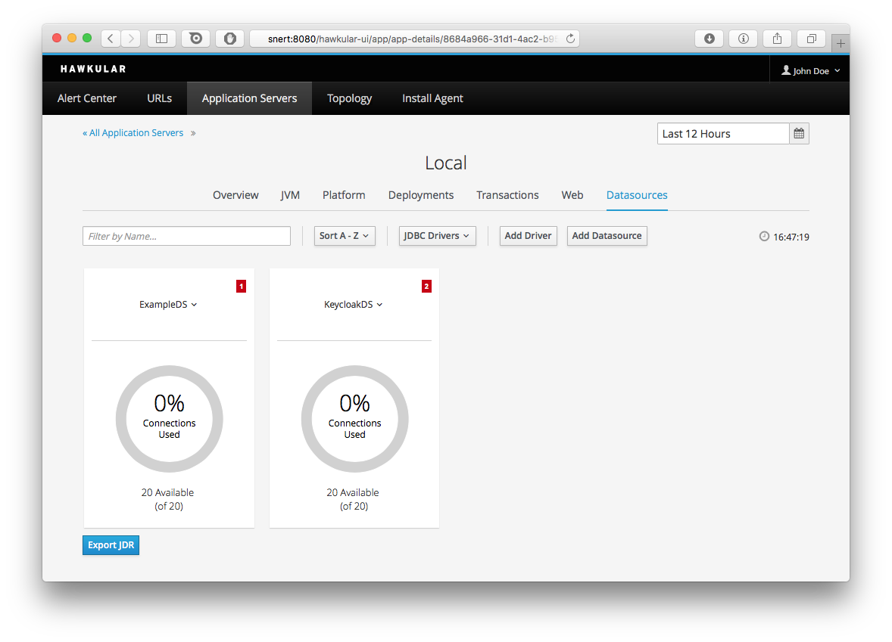
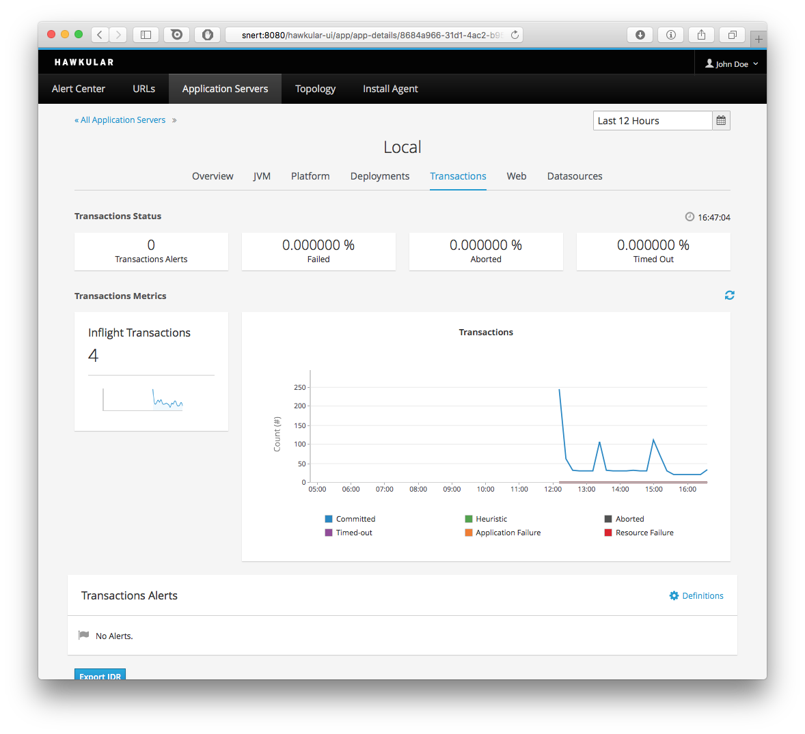

= The nineth milestone of Hawkular released
Heiko W.Rupp
2016-1-21
:jbake-type: post
:jbake-status: published
:jbake-tags: blog, hawkular, release

Hawkular, the monitoring platform, is happy to announce milestone release 1.0.0.Alpha9.

== Rebase on Wildfly 10 (CR5)

The biggest, but also least visible change of this release has been the upgrade of the underling
appserver to WildFly 10 (CR5), that also features the new AMQ Artemis messaging subsystem.
On top of that Keycloak has also been upgrade to latest and greatest.

== Agent installer screen

We made the agent installer screen generally available with the knowledge that
we are going to change and move that in the next release. This way you can
use it and the installer more easily to instrument your WildFly 10 and EAP 7 Beta
servers.

[[img-installer-screen]]
.Screen to get an agent installer from
ifndef::env-github[]
image::/img/blog/2016/1alpha9_installer.png[Installer Screen]
endif::[]
ifdef::env-github[]
image::../../../../../assets/img/blog/2016/1alpha9_installer.png[Installer Screen]
endif::[]

== Platform subtab for App servers

When you go to an individual application server you will now see a brand new
platform tab, that gives you some information about the (virtual) host, the
server is running on

[[img-platform-subtab]]
.Platform subtab
ifndef::env-github[]
image::/img/blog/2016/1alpha9_platform.png[Platform Overview]
endif::[]
ifdef::env-github[]
image::../../../../../assets/img/blog/2016/1alpha9_platform.png[Platform Overview]
endif::[]

== Tiling of Datasources

The datasources tab has been converted to show a tile view for the individual datasources.
Clickin on one then leads to the detail view.

[[img-ds-tiles]]
.Datasources view
ifndef::env-github[]
image::/img/blog/2016/1alpha9_ds.png[Datasources]
endif::[]
ifdef::env-github[]

endif::[]

== New Transactions subtab

Application servers now also show information about transactions

[[img-ts-tab]]
.Transactions subtab
ifndef::env-github[]
image::/img/blog/2016/1alpha9_tx.png[URL List]
endif::[]
ifdef::env-github[]

endif::[]

== Release notes

Full list of Jira issues fixed in this release:
link:/releasenotes/1.0.0.Alpha9.html[Release Notes - Hawkular - Version 1.0.0.Alpha9]

=== Notes for Windows users

To run successfully you must start Hawkular like:

--
> standalone.bat -Dorg.hawkular.data.dir=<HawkulaInstallDirUsingFORWARDSlashes>/standalone/data
--

== Watch the demo online

Visit the recording here:

video::jod9T7hCOGg[youtube,width=600,height=400]

We will announce the next milestone demo on our
https://plus.google.com/b/100667078659222571663/+HawkularOrgProject[Google Plus page].

== Downloads

You can download the release here:

* http://download.jboss.org/hawkular/hawkular/1.0.0.Alpha9/hawkular-dist-1.0.0.Alpha9.zip[Hawkular 1.0.0.Alpha9 (zip)]
* http://download.jboss.org/hawkular/hawkular/1.0.0.Alpha9/hawkular-dist-1.0.0.Alpha9.tar.gz[Hawkular 1.0.0.Alpha9 (tar.gz)]

== What's next?

The next Alpha is planned for February 17th, and we are planning to work on the following features:

* Move Hawkular onto WildFly 10 Final (if available )
* Improvements in agent installer
* WF state display ("reload needed") + action to reload
* Faceted filtering
* Bug fixing
* Ruby-client work
* Perf improvements
  * metrics
  * agent-inventory-sync
