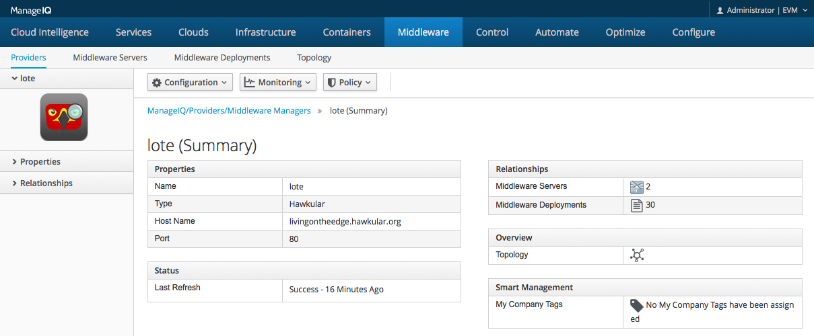

= Integration with ManageIQ
Heiko W. Rupp
2016-2-23
:jbake-type: post
:jbake-status: published
:jbake-tags: blog, announcement

When we started Hawkular some time ago, we did it under the slogan of
_"The Open Source Monitoring and Management Platform"_. And since then
we have achieved a lot and built components like our metrics store,
a powerful graph-oriented inventory or awesome alerting functionality.
And on top of all that a very nice and snappy Web 2.0 UI. +
 +
It also became clear during development that users not only want excellent Middleware
management, which is the focus of Hawkular, but also need to know if
for example slowness of the application is coming from other components
of the stack way below the application server. Which is why we are
*partnering with the ManageIQ project*.

== Collaborating with ManageIQ

http://www.manageIQ.org[ManageIQ] provides a huge amount of functionality
to manage and monitor virtual machines and containers on VMWare, EC2,
OpenStack, OpenShift, Azure, Rhevm and many more, which nicely complements
the application-centric view of Hawkular.

ManageIQ has all the knowledge
about the OS and infrastructure the Middleware servers are running on,
where Hawkular only provides some basic information. ManageIQ can be
used to provision new VMs and containers with Middleware in them, which
can then be monitored and managed by Hawkular.

ManageIQ itself operates as _manager of managers_, where it does
not directly talk to a WildFly server, a VM or a container,
but rather tells Hawkular, oVirt or Kubernetes to act on its behalf.
ManageIQ then displays the results of these actions in its UI.

The Hawkular team will, together with the ManageIQ team, build a 
so called _provider integration_ in ManageIQ. This integration
lives inside the ManageIQ code base and talks to Hawkular over the 
Hawkular-Ruby-Client gem. This integration brings to
ManageIQ the infrastructure needed to talk to the Hawkular server
as manager and thus the connected Middleware servers. This work
includes work on the ManageIQ UI to show the managed Middleware.

[[img-platform-subtab]]
.Platform subtab
ifndef::env-github[]
image::/img/blog/2016/hawk_miq_arch.png[Hawkular and ManageIQ]
endif::[]
ifdef::env-github[]
image::../../../../../assets/img/blog/2016/hawk_miq_arch.png[Hawkular and ManageIQ]
endif::[]

== First results of the new collaboration

An initial outcome of this work can already be seen in the
Hawkular-client Ruby gem, that is used by the provider to talk to
the Hawkular server.

Another big milestone is the initial version of the
Hawkular-Provider-integration inside ManageIQ master.

[[img-platform-subtab]]
.Platform subtab
ifndef::env-github[]
image::/img/blog/2016/hawk_miq.png[Middelware tab in ManageIQ]
endif::[]
ifdef::env-github[]

endif::[]

