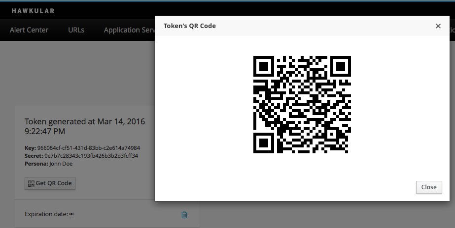
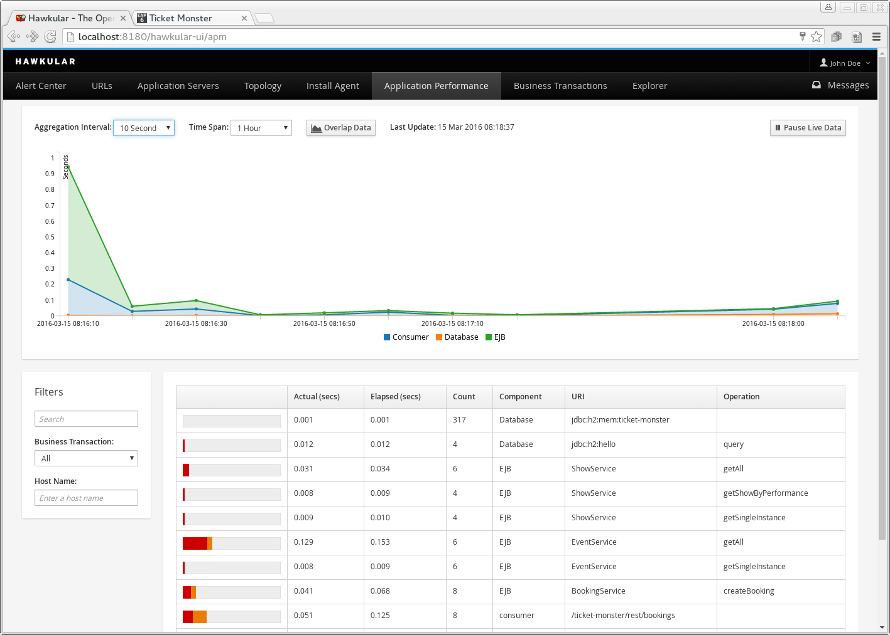
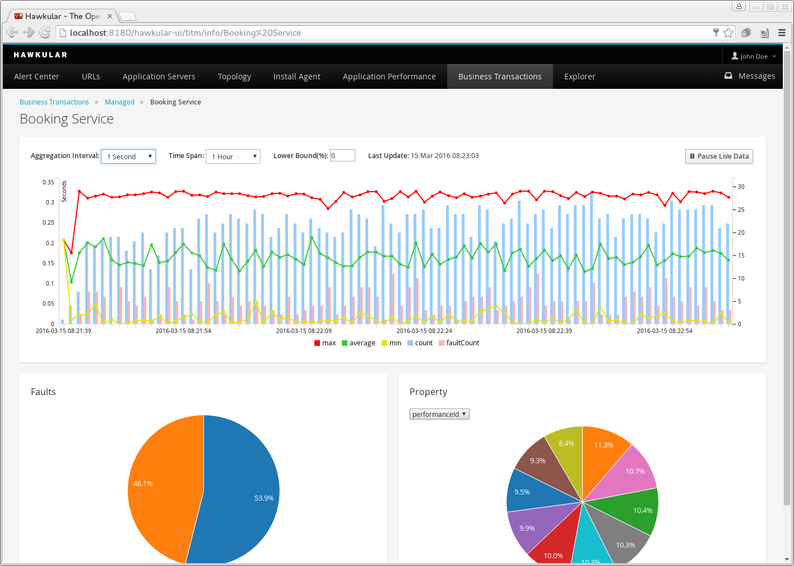

= The eleventh milestone of Hawkular released
Heiko W.Rupp
2016-3-15
:jbake-type: post
:jbake-status: published
:jbake-tags: blog, hawkular, release

Hawkular, the monitoring platform, is happy to announce milestone release 1.0.0.Alpha11.
You may perhaps wonder if you have missed Alpha 10. Don't worry, you did not miss anything.
We had an Alpha 10 build ready, but then decided to withdraw it and to bring you more features.

== Running on WildFly 10 final

As announced in the last release we have rebased to WildFly 10 Final.

== Tokens and QR Codes

It is now possible to generate tokens (combination of key and secret), that can be used
instead of username/password as credentials. Those tokens are great to be used in the
agent configuration so that no username/password is visible.

For future usage (e.g. for the Android client) it is possible to obtain a QR code, that
can be scanned and which contains the token information.

[[img-token-screen]]
.Token screen with QR code
ifndef::env-github[]
image::/img/blog/2016/1alpha11_token_qr.png[Token screen]
endif::[]
ifdef::env-github[]

endif::[]

== APM and BTM included

=== Application Performance Management (APM)

The new Application Performance tab provides a breakdown of the execution performance of each component
within applications deployed to the monitored servers.

The graph provides a summary per component type. The table provides a breakdown of the activity by component type,
URI and optionally operation. Each row shows the elapsed and actual time spent in the component, where the elapsed
time also incorporates any time spent in sub (i.e. called) components.

[[img-apm-subtab]]
.Tab for APM
ifndef::env-github[]
image::/img/blog/2016/hawka11-apm.png[APM tab]
endif::[]
ifdef::env-github[]

endif::[]

=== Business Transaction Management (BTM)

The “Business Transaction Management” capability is used to classify and monitor specific paths of execution through an
organisation’s applications and services. Rather than viewing application performance just at the component level, it
is possible to view information about end to end transactions.

[[img-btm-subtab]]
.Tab for BTM
ifndef::env-github[]
image::/img/blog/2016/hawka11-btm-overview.png[BTM Overview]
endif::[]
ifdef::env-github[]
image::../../../../../assets/img/blog/2016/hawka11-btm-overview.png[BTM Overview]
endif::[]

The Managed tab provides an overview of any configured business transactions, such as the “Booking Service” and “Events
Service” above. It shows the number of transactions per hour, completion times and the number of transactions that
ended with a fault.

Selecting a particular business transaction will provide a more detailed view.

[[img-btm-detail]]
.BTM detail view
ifndef::env-github[]
image::/img/blog/2016/hawka11-btm-details.png[BTM Details]
endif::[]
ifdef::env-github[]

endif::[]

The top graph shows statistics, aggregated over a selected time interval, related to the business transaction instances.
The details displayed are the transaction and fault counts as a bar chart, with the min, average and max completion
times as a line chart.

The left hand pie chart represents the breakdown of specific fault types associated with the completed business
transaction instances that ended in fault.

The right hand pie chart is used to display information about properties extracted from the business transaction
instances (defined when setting up a business transaction configuration). In this specific example, the
“performance id” values are being displayed.

The segments of the pie charts (fault and different properties) can be selected to filter the business transaction
instances, to refine the information being viewed.

== Inventory explorer

We have added a generic inventoy explorer, that allows you to browse through
inventory in a hierarchical way and to pick metrics that then are displayed
on the page. The metrics to be shown are stored in the browser internal database.

[[img-explorer-screen]]
.Screen with inventory explorer
ifndef::env-github[]
image::/img/blog/2016/1alpha11_explorer.png[Generic Inventory explorer]
endif::[]
ifdef::env-github[]
image::../../../../../assets/img/blog/2016/1alpha11_explorer.png[Generic Inventory explorer]
endif::[]

== Release notes

Full list of Jira issues fixed in this release:
link:/releasenotes/1.0.0.Alpha11.html[Release Notes - Hawkular - Version 1.0.0.Alpha11]

=== Notes for Windows users

To run successfully you must start Hawkular like:

--
> standalone.bat -Dorg.hawkular.data.dir=<HawkulaInstallDirUsingFORWARDSlashes>/standalone/data
--

== Downloads

You can download the release here:

* http://download.jboss.org/hawkular/hawkular/1.0.0.Alpha11/hawkular-dist-1.0.0.Alpha11.zip[Hawkular 1.0.0.Alpha11 (zip)]
* http://download.jboss.org/hawkular/hawkular/1.0.0.Alpha11/hawkular-dist-1.0.0.Alpha11.tar.gz[Hawkular 1.0.0.Alpha11 (tar.gz)]

== What's next?

You have probably seen
that link:http://www.hawkular.org/blog/2016/02/22/hawkular-manage-iq.html[Hawkular and ManageIQ are now working together].
Activities in the next time will be around that goal.