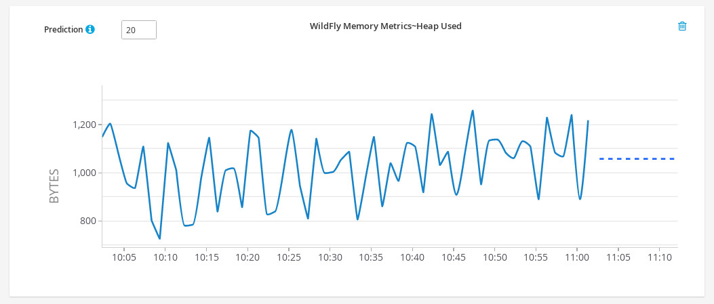

= Hawkular Data Mining 0.1.0.Final Released
Pavol Loffay
2016-04-21
:icons: font
:jbake-type: post
:jbake-status: published
:jbake-tags: blog, hawkular, datamining

I am happy to announce the first release 0.1.0.Final of the Hawkular Data Mining project. It contains several time
series models and utility classes for time series modelling.

=== Time series models
  - Simple exponential smoothing
  - Double exponential smoothing (Holt's linear trend)
  - Seasonal triple exponential smoothing (Holt Winters)
  - Simple moving average (Weighted moving average)
  - AutomaticForecaster - which automatically selects the best model
  - Parameters of all models are estimated using maximum likelihood estimation and models are designed for online
  learning

=== Time series manipulation & Statistics
  - Augmented Dickey-Fuller test
  - Autocorrelation function (ACF)
  - Time series decomposition
  - Time series lagging
  - Time series differencing
  - Automatic period identification

== Integration into Hawkular

The integration into Hawkular can be found in _datamining_ branch in the main Hawkular repository.
Predictive charts are located in Explorer tab. Predictions can be enabled for any number of steps in the future for
any metric being collected. Prediction engine automatically selects the best model for given time series. Currently it
selects from simple, double and triple exponential smoothing models. In the following charts predictions produced
by these models are showed.

[[img-datamining-triple]]
.Model Triple exponential smoothing
ifndef::env-github[]
image::/img/blog/2016/datamining-first-release-triple-ex.jpg[datamining,align="center"]
endif::[]
ifdef::env-github[]
image::../../../../../assets/img/blog/2016/datamining-first-release-triple-ex.jpg[datamining,align="center"]
endif::[]

[[img-datamining-double]]
.Model Double exponential smoothing
ifndef::env-github[]
image::/img/blog/2016/datamining-first-release-double-ex.jpg[datamining,align="center"]
endif::[]
ifdef::env-github[]
image::../../../../../assets/img/blog/2016/datamining-first-release-double-ex.jpg[datamining,align="center"]
endif::[]

[[img-datamining-simple]]
.Model Simple exponential smoothing
ifndef::env-github[]
image::/img/blog/2016/datamining-first-release-simple-ex.jpg[datamining,align="center"]
endif::[]
ifdef::env-github[]

endif::[]

Note that currently there is an issue with querying historical data from Metrics due to authentication issues. However
Data Mining still receives metrics from bus so it is important to enable predictions as soon as possible and wait for
some time to collect data (or increase collection interval). This will be fixed in the next versions.

== Next Steps

* Fix querying historical metric data
* Prediction intervals

== Links

* Github Release:
** https://github.com/hawkular/hawkular-datamining/releases/tag/0.1.0.Final
* Module documentation:
** link:../../../../docs/components/datamining/index.html[Docs]
* Module REST API:
** link:../../../../docs/rest/rest-datamining.html[REST API]

== Thanks

Thanks goes to Jiri Kremser and UI team for helping with predictive charts.
