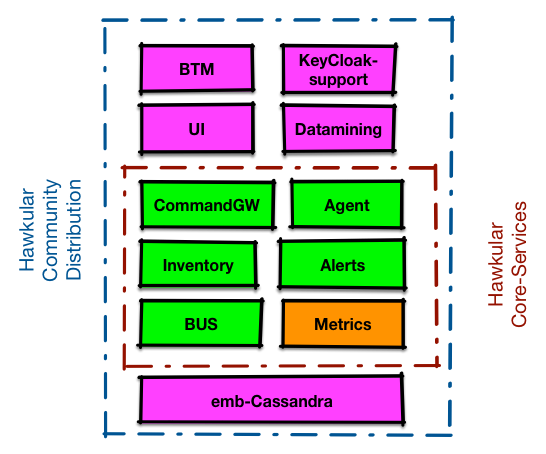

= New Hawkular packaging
Heiko W. Rupp, Stefan Negrea
2016-4-28
:jbake-type: post
:jbake-status: published
:jbake-tags: blog, manageiq, components

_[ This blog post has been sent before to the hawkular-dev mailing list ]_

With a growing community and an increasingly large number of sub-projects, it is the perfect time to rethink the
packaging of Hawkular. This post is a blueprint for changes to come to Hawkular as well as establish some patterns
for futures decisions.

== Motivation

So far we have created Hawkular "All-in-one" releases that contain everything, Hawkular server components, UI,
the agent and also embedded versions of Cassandra and KeyCloak.

It's certainly the case that for community we will still deliver an all-in-one package.
We also need to consider separate distributions for other projects that integrate with Hawkular.

The recent effort to integrate with link:blog/2016/02/22/hawkular-manage-iq.html[ManageIQ] comes with
its own set of requirements for services.
Not all of the Hawkular components are needed and required components may be configured differently.
For example the UI is supplied from within ManageIQ side and Hawkular is to be run headless. Other
components like Cassandra will not be run in embedded mode, so that there is no need to supply it in the package.
Likewise KeyCloak will not be shipped and probably not even needed because we only have technical
users that will access Hawkular services.

== Existing Components / Services

Here a list of projects that are part of Hawkular project

[horizontal]
Metrics:: scalable, asynchronous, multi tenant, long term metrics storage engine
Inventory:: registry of "things" that contains info about your applications, servers, etc. and also keeps track of
  their relationships with each other
Alerts::  alerting engine that allows trigger definitions to evaluate incoming data, generate alerts (or events), and
  react with flexible actions ond lifecycle management
CommandGW:: messaging framework for communicating between components
Bus+Nest:: messaging framework used for communicating between components
BTM:: provide capabilities to monitor the flow of a business transaction instance and enable performance analysis of
  the individual components that make up an application
Agent:: used to monitor WildFly and related projects
Accounts:: is the user/organization module that provides authentication, authorization and configuration for user accounts
Data Mining:: alert predictions based on time series data
Hawkular UI:: The current UI
Hawkular Charts:: Angular Directives for Metrics Visualization used by the current UI
Embedded Cassandra:: embedded Cassandra server specifically configured for project use

There are also various clients like the Ruby Gem or the Android client. Those are not part of this discussion.

== Options for Packages

The distribution packages need to follow product integrations with a special distribution for community.
The community package could potentially include every single package from the Hawkular organization. However,
the rest of the packages need to be created along the lines of product use and include only the minimal amount of
components, services and third-party libraries to satisfy integration requirements.

The distributions should be seen as funels, the Hawkular community creates a set of sub-projects that then get
combined into few distributions that in turn get consumed. Following this analogy, the number of packaged distributions
should also be kept to a minimum possible. For now we settled on 3 packages detailed below, all will be available
for download on JBoss.org.

With the exception of the community distribution:

. the QA team will be engaged in testing the package.
. the sub-components will strive to be aligned in terms of tech stack and maturity
. an automated test suite is required for packages that combine more than one project

=== Hawkular - Community Distribution

Will include every single service listed above. The UI is a requirement because some services are very hard to
understand or use without a friendly interface. The UI will be a community only effort at this point since there
are no plans for productization.

The current Hawkular repository will be adjusted to reflect this new mission; the current UI will be moved
to a separate repository. This package builds on Hawkular Core Services as described next.

=== Hawkular Core Services

Geared towards ManageIQ integrations and will include only the components needed for the MiQ provider.
This package uses the Metrics Distribution as described below.

Components included: Metrics, Alerts, Inventory, CommandGW, Nest and Bus as well as the agent.

Reasons for some exclusions: Keycloak (different security model), Embedded Cassandra
(only full C* deployments will be supported), and no Hawkular UI because it will use a special purpose UI for ManageIQ

=== Metrics Distribution

Geared towards usage as a pure Time Series Database (TSDB) and will be exclusively made of Hawkular Metrics service.

=== Graphical overview

This graphic visualizes the 3 packages again

[[img-packages]]
.Packages and components
ifndef::env-github[]
image::/img/blog/2016/hawkular-packaging-new.png[Packages and components]
endif::[]
ifdef::env-github[]

endif::[]

Orange is the Metrics distribution, green+orange (with the red box around it) is Hawkular-core-services and
everything in the blue box is the all-in-one community distribution

== Expansion and Contraction

Since its inception Hawkular has been growing by all metrics: projects, lines of code, binary downloads,
contributors, etc. But uncontrolled increase in some metrics can be detrimental to the organization.
This is especially true for the number of projects. We will always need new projects to experiment, but the
reverse might be true for mature and established projects.
As the packaging and requirements for each package mature we need to consider the reverse, combining projects.

== Packaging Format

This post did not touch one important aspect: physical packaging formats (rpm, zip, war, jar) for the 3 distributions.
We will follow-up with additional details in the coming weeks.

