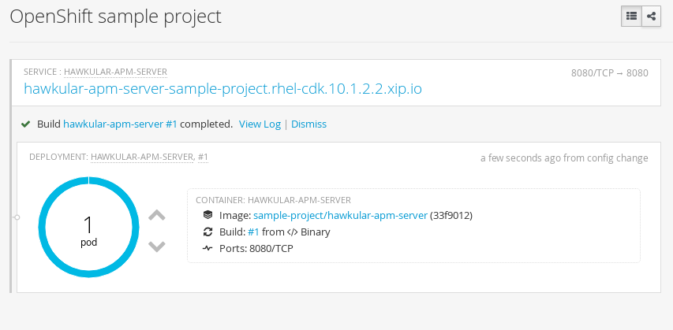
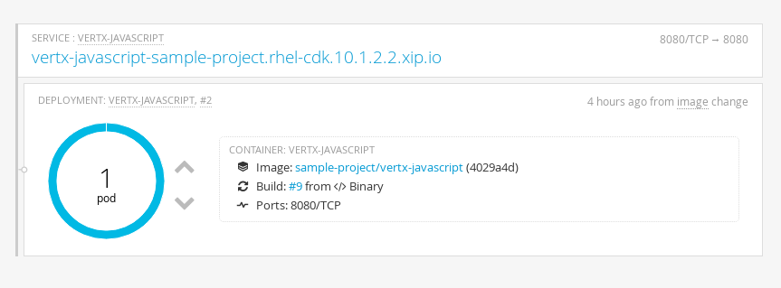

= Monitoring Application Performance within Openshift
Gary Brown
2016-07-14
:jbake-type: post
:jbake-status: published
:jbake-tags: blog, btm, apm, distributed tracing, application performance, business transactions, openshift, cloud, docker

This post will show how to use the Hawkular APM project, previously known as Hawkular BTM, to monitor an application running within Openshift. To achieve this both the Hawkular APM server, and the application (a vert.x Javascript example), will be deployed as Docker images.

We will use the Openshift CLI, and therefore will need to login. For example, to login into the Openshift CDK environment:

----
oc login 10.1.2.2:8443 -u openshift-dev -p devel
----

=== Deploy Hawkular APM Server

The first step is to deploy the Hawkular APM server. There are two ways that this can be achieved.

==== Image from Docker Hub

The Hawkular APM server has a docker image registered at https://hub.docker.com/r/jboss/hawkular-apm-server[Docker Hub]. This can be deployed to Openshift using the following commands:

----
oc new-app jboss/hawkular-apm-server
oc expose service hawkular-apm-server
----

The _new-app_ command deploys the image as a service, and the _expose_ command makes it available via a stable URI.

NOTE: If the deploy fails with an "unknown manifest" error in the openshift events log, this is due to a http://lists.openshift.redhat.com/openshift-archives/users/2016-June/msg00054.html[known docker issue related to a change between version 1.9 and 1.10]. In this case, use the local deploy approach described below.

==== Local Image

To deploy the APM server from a local build, it will be necessary to get the https://github.com/jboss-dockerfiles/hawkular/blob/8ffb752b68c0f49a2150fe345e660c53c32fb954/hawkular-apm-server/Dockerfile[_Dockerfile_]. Place this file in a suitable folder and from that location run the following:

----
oc new-build --binary --name=hawkular-apm-server
oc start-build hawkular-apm-server --from-dir=. --follow
oc new-app hawkular-apm-server
oc expose service hawkular-apm-server
----

=== Hawkular APM Server in the Openshift Console

Once either of these options has been used to deploy the Hawkular APM Server, it can be seen within the Openshift console.

.Hawkular APM Server deployed in Openshift
ifndef::env-github[]
image::/img/blog/2016/2016-07-14-osapmserver.png[Hawkular APM Server]
endif::[]
ifdef::env-github[]

endif::[]

=== Deploy Example Vert.x Javascript Application

The application that we will monitor is a Vert.x Javascript example application. Either clone the https://github.com/vert-x3/vertx-examples[github repository] or simply copy the two relevant files from the https://github.com/vert-x3/vertx-examples/tree/master/docker-examples/vertx-docker-javascript[vertx-examples/docker-examples/vertx-docker-javascript] folder.

To enable the application to be instrumented by Hawkular APM, it will be necessary to add the following lines in the _Dockerfile_, before the _EXPOSE 8080_ line:

----
ENV HAWKULAR_APM_VERSION 0.9.0.Final

ADD https://github.com/hawkular/hawkular-apm/releases/download/$HAWKULAR_APM_VERSION/hawkular-apm-agent.jar hawkular-apm-agent.jar

ENV JAVA_OPTS -javaagent:/hawkular-apm-agent.jar
----

Then, from the same folder in which these files are located, run the following:

----
oc new-build --binary --name=vertx-javascript
oc start-build vertx-javascript --from-dir=. --follow
oc new-app -e HAWKULAR_APM_URI=http://hawkular-apm-server-sample-project.rhel-cdk.10.1.2.2.xip.io -e HAWKULAR_APM_USERNAME=jdoe -e HAWKULAR_APM_PASSWORD=password vertx-javascript

oc expose service vertx-javascript
----

NOTE: The _HAWKULAR_APM_URI_ must use the URI exposed by the Hawkular APM server, as shown in the console image above.

=== Example Vert.x Javascript Application in the Openshift Console

Once these commands have been performed, the Openshift console should also now include:

.Vert.x Javascript example deployed in Openshift
ifndef::env-github[]
image::/img/blog/2016/2016-07-14-osvertx.png[Vert.x Javascript example]
endif::[]
ifdef::env-github[]

endif::[]

=== Running the Example Application

To access the example Vert.x Javascript application, simply open a browser window at the URL displayed in the console entry for the application (or just select the link which will cause a new tab to be opened). This will cause the simple Javascript application to return a response and show the message "Wild world":

.Vert.x Javascript example running within a browser
ifndef::env-github[]
image::/img/blog/2016/2016-07-14-osvertxapp.png[Vert.x Javascript example]
endif::[]
ifdef::env-github[]
image::../../../../../assets/img/blog/2016/2016-07-14-osvertxapp.png[Vert.x Javascript example]
endif::[]

Now if we access the URL associated with the Hawkular APM server, by simply selecting the link in the Openshift console, we will be presented with a login window. Enter the username _jdoe_ and password _password_, and then you will see some basic information showing the result of executing the Vert.x Javascript application - in this case the application was run multiple times by refreshing the browser page.

.Application Performance Management information captured from the example application
ifndef::env-github[]
image::/img/blog/2016/2016-07-14-osapm.png[APM info]
endif::[]
ifdef::env-github[]
image::../../../../../assets/img/blog/2016/2016-07-14-osapm.png[APM info]
endif::[]

=== Conclusion

To summarise, this blog has shown:

* How to monitor an existing application *without requiring any code changes* simply by adding a few lines to the docker configuration file. Even if it is not possible to modify the application's _Dockerfile_ (i.e. because it is obtained from Docker Hub), it is still possible to achieve the same result by deriving a new _Dockerfile_ from the image of interest, that contains the additional lines shown in this blog.

* How to deploy the Hawkular APM Server, along with the monitored application, as _Docker_ images that can be run within Openshift.

* How to visualise the response time associated with a REST call to a Vert.x Javascript application. In this particular example, a single URL was invoked multiple times - hence only a single entry. However for more complex examples, detailed component information (such as EJBs, Databases, etc) and the dependencies between remotely invoked services, may be shown.

If you have any questions please http://www.hawkular.org/community/index.html[contact us].

