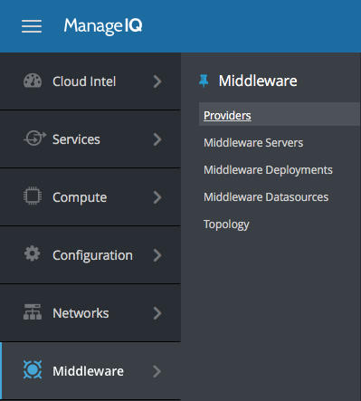
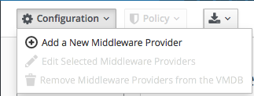
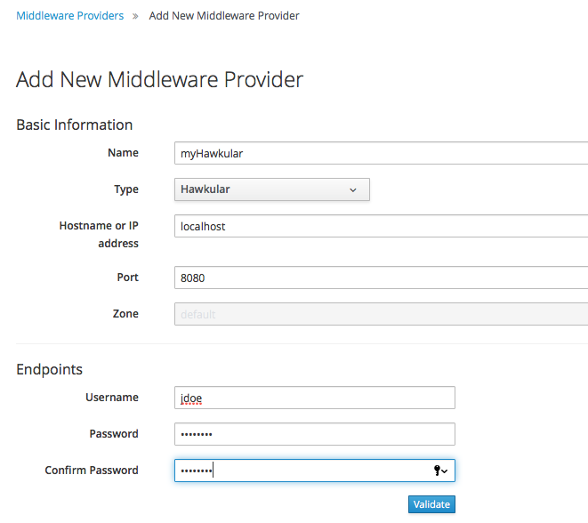
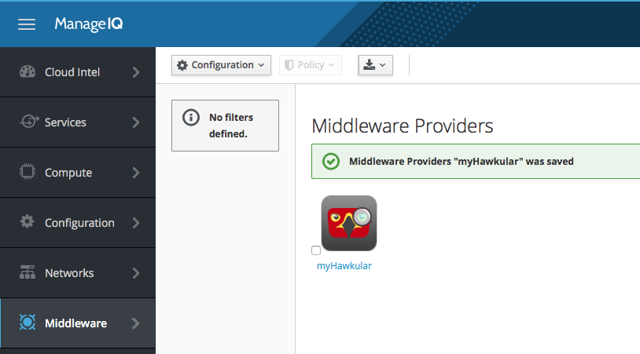
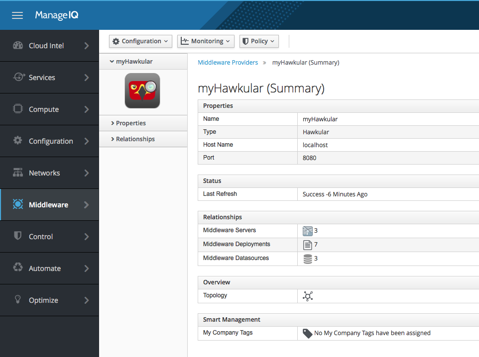

= Getting started with ManageIQ and Hawkular
Heiko W. Rupp
2016-07-14
:jbake-type: post
:jbake-status: published
:jbake-tags: blog, manageiq

This post describes the first steps to get started with ManageIQ master and Hawkular-services.

== Setup of ManageIQ

The functionality to support the Hawkular-Middleware provider is not in the Darga-Release.
You will need to build ManageIQ from their master branch.
There is a good http://manageiq.org/documentation/development/developer_setup/[guide on developer setup].

Once you have completed the instructions, you should have ManageIQ available at

`http://localhost:3000`.

== Setup of Hawkular-services

Run Hawkular-services with some WildFly servers connected. While it is possible to only run Hawkular-services with the built-in agent enabled, you will get more interesting results if you point other instrumented WildFly servers at Hawkular.

=== Docker
If you are a Docker user, you can http://pilhuhn.blogspot.de/2016/06/using-hawkular-services-via-docker.html[follow this route]. This uses Docker-compose to stand up Cassandra 3.7, Hawkular-services and a connected WildFly10 server.

=== Classical route

.NOTE You need to have Cassandra set up

The release notes for Hawkular-Services 0.0.5 have a http://www.hawkular.org/blog/2016/07/05/hawkular-services-0.0.5.Final.html#_get_started[Getting started] section that describes how to locally set up Hawkular-services along with the needed Cassandra settings.

To start the hawkular server you should also pass option `-Dhawkular.agent.enabled=true` to enable the embedded agent.

[source,bash]
.Start Hawkular server
----
"${HAWKULAR_HOME}/bin/standalone.sh" -Dhawkular.rest.user="${HAWKULAR_USERNAME}" -Dhawkular.rest.password="${HAWKULAR_PASSWORD} -Dhawkular.agent.enabled=true"
----

=== The endpoint
Going forward we assume that Hawkular-services listens on `http://localhost:8080` and has a user/password of _jdoe/password_ defined.

== Adding Hawkular as provider in ManageIQ

Log into ManageIQ at `http://localhost:3000` with _admin/smartvm_ as user/password.

Then select _Middleware_ from the menu bar on the left and then _Providers_:

[[img-main]]
.Menu in ManageIQ with Middleware section
ifndef::env-github[]
image::/img/blog/2016/2016-07-14-miq-hawk-menu.png[Menu in ManageIQ]
endif::[]
ifdef::env-github[]

endif::[]

On that page click on _Configuration_ and choose _Add new provider_:

[[img-main]]
.Add provider menu entry
ifndef::env-github[]
image::/img/blog/2016/2016-07-14-miq-hawk-add.png[Add provider button]
endif::[]
ifdef::env-github[]

endif::[]

Next thing you see is the settings page.
Here you need to choose Hawkular from the type dropdown and fill in the host and port and also the credentials. 
When you are done you need to _validate_ the credentials. If that went well, you can click on _add_ to add the Hawkular provider.

[[img-main]]
.Settings to add a new Hawkular provider
ifndef::env-github[]
image::/img/blog/2016/2016-07-14-miq-hawk-settings.png[Settings for the provider]
endif::[]
ifdef::env-github[]

endif::[]

This should take a short while and you should then see a screen with a nice Hawkular logo :-)

[[img-main]]
.Overview over middleware providers
ifndef::env-github[]
image::/img/blog/2016/2016-07-14-miq-hawk-providers.png[Overview of Middleware providers]
endif::[]
ifdef::env-github[]

endif::[]

Clicking on the provider name below the icon then leads you to the so called summary page of the provider where you can see an overivew and have links to managed servers etc.

[[img-main]]
.Hawkular provider summary
ifndef::env-github[]
image::/img/blog/2016/2016-07-14-miq-hawk-provider.png[Hawkular provider summary]
endif::[]
ifdef::env-github[]

endif::[]
