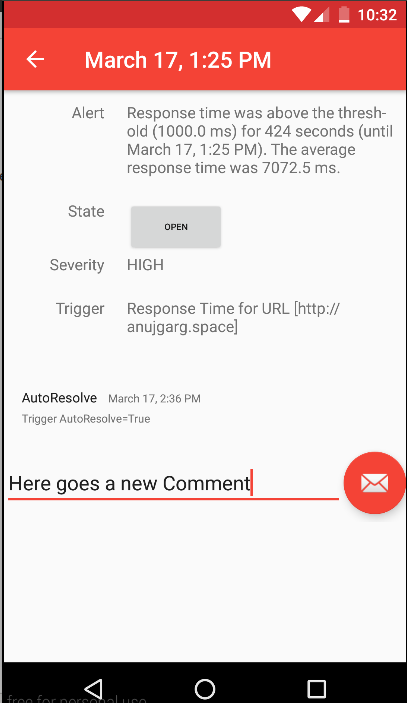
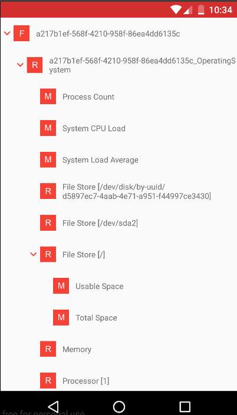

= What is new in Android Client
Anuj Garg
2016-7-19
:jbake-type: post
:jbake-status: published
:jbake-tags: blog, hawkular android client, progress, alerts, explorer

Hello to all. My last post was on March 2016 and after that a lot of things have changed. Well here is progress report of Android client.

== Stepwise short points

Below are the steps taken till now.

. Tokens are removed as Hawkular no longer use keycloak for authentication.
. Filter to allow and hide acknowledged alerts.
. Separate activity for detailed alert.
. Reading and posting comment on alert.
. Inventory explorer is added.
. Add and remove favourite metrics.
. Jump to associated metric from explorer.

== Detailed Alert Screen

Detailed screen for alert get a detailed information about alert, associated resource, trigger that caused it and state of alert etc. Now you can also add comment/note to alerts.

ifndef::env-github[]
image::/img/blog/2016/2016-07-19-android-alert_detail.png[Detailed Alert Screen]
endif::[]
ifdef::env-github[]

endif::[]

== Inventory Explorer (List view)

Inventory explorer let the user move across the the feeds, resources and metrics. User can long press to metric to add a metric from explorer view to favourite metrics, Which is then available to home screen. If a single press is made then you are directed to chart view of metric.

ifndef::env-github[]
image::/img/blog/2016/2016-07-19-android-explorer.png[Inventory Explorer]
endif::[]
ifdef::env-github[]

endif::[]

== Watch the demo online

Visit the recording here:

video::SF_3ZiUqcAY[youtube,width=600,height=400]

