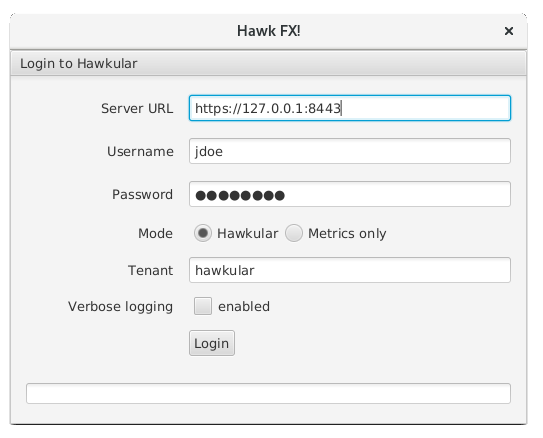

= Consuming Hawkular API over SSL with self signed certificates
Josejulio Martínez
2016-9-14
:jbake-type: post
:jbake-status: published
:jbake-tags: blog, secure, https

In this post I'll show you how to trust self-signed certificates for use with Ruby client, used on projects such as ManageIQ and HawkFX.

If you haven't already, follow this guide for
link:http://www.hawkular.org/hawkular-services/docs/installation-guide/secure-comm.html[securing communications] on your Hawkular server, because we'll make use of the files generated by that guide.

As today, there are Hawkular clients for the following programming languages:

* link:https://github.com/hawkular/hawkular-client-java[Java].
* link:https://github.com/hawkular/hawkular-client-python[Python].
* link:https://github.com/hawkular/hawkular-client-go[Go].
* link:http://github.com/hawkular/hawkular-client-ruby[Ruby].

The Hawkular Ruby client lets you connect using a secure connection. Buying a certificate from a trusted SSL vendor to host your own development server can be cost-prohibitive or just complicated.

If you are going to self-sign your own development certificates for use outside of Java, you will need to do some additional steps to tell your consumer environment to trust them.

For this you will need to:

.  Install `c_rehash`.
.  Identify where OpenSSL reads certificates and keys from.
.  Hand over your certificate to OpenSSL in PEM format and rehash.

== Install c_rehash
`c_rehash` is an OpenSSL utility to create symbolic links to files by their hash values.
This format is used by OpenSSL to find certificates.

You can install it on fedora by executing
[source, bash]
----
$ sudo dnf install openssl-perl
----

== Identify where OpenSSL reads certificates and keys from.
OpenSSL reads certificates and keys from a specific path, you will need to copy your self-signed certificates there.
You can find this path by running the following command:

[source, bash]
----
$ openssl version -d
OPENSSLDIR: "/etc/pki/tls"
----

In this case, OpenSSL files are located in `/etc/pki/tls`.

NOTE: The above output is from Fedora 24, it should be similar on other operative systems.

WARNING: It seems that if you are using RVM to manage your Ruby versions, you should ignore this
and use: $rvm_path/usr/ssl

== Hand over your certificate to OpenSSL in PEM format and rehash.
`c_rehash` specs the certificates in PEM format, so before proceeding we need make sure is in PEM format. The link:http://www.hawkular.org/hawkular-services/docs/installation-guide/secure-comm.html[guide] for securing communications on Hawkular produces the certificate in DER format it needs to be converted to PEM format.

OpenSSL can be used as follow to convert `hawkular.cert` from DER to PEM format.
[source, bash]
----
$ openssl x509 -inform der -in hawkular.cert -out hawkular.pem
----

Once created, copy your PEM certificate to `OPENSSLDIR/certs` (you will need root permissions) and run c_rehash on that dir.
[source, bash]
----
$ sudo cp hawkular.pem OPENSSLDIR/certs
$ sudo c_rehash OPENSSLDIR/certs
----

If you are using any application that relies on JRuby (such as HawkFX) you will probably need to use old-style hashes. To do that run c_rehash a second time with flags to use the old-style hash and to keep existing hashes.
[source, bash]
----
$ sudo c_rehash -old -n OPENSSLDIR/certs
----
That should be enough to let Ruby client or any application that uses it (e.g. HawkFX) to communicate with Hawkular Server over SSL.

To use on HawkFX simply put the address with https and the secure port.

ifndef::env-github[]
image::/img/blog/2016/2016-09-14-hawkfx-over-https.png[HawkFX over https]
endif::[]
ifdef::env-github[]

endif::[]