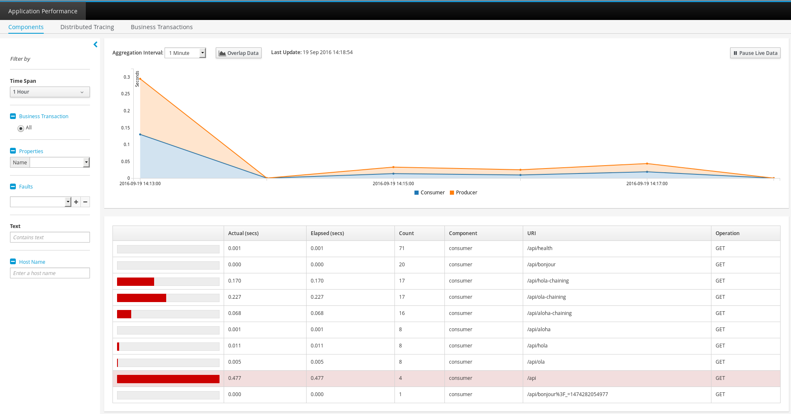
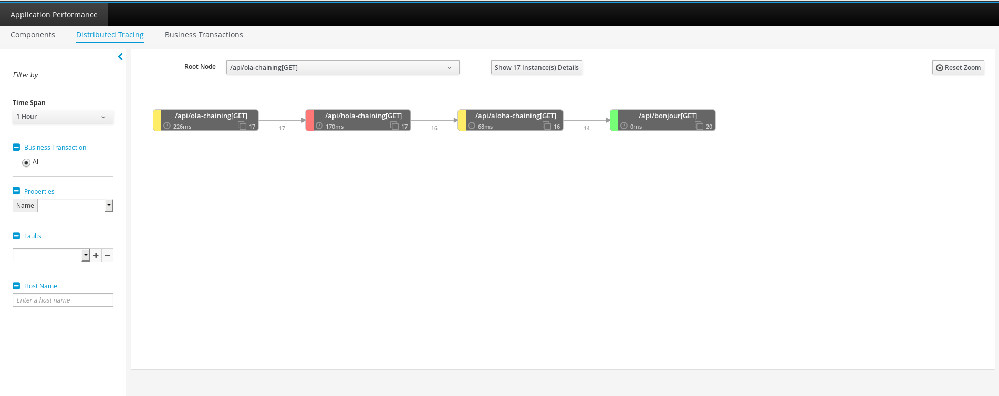
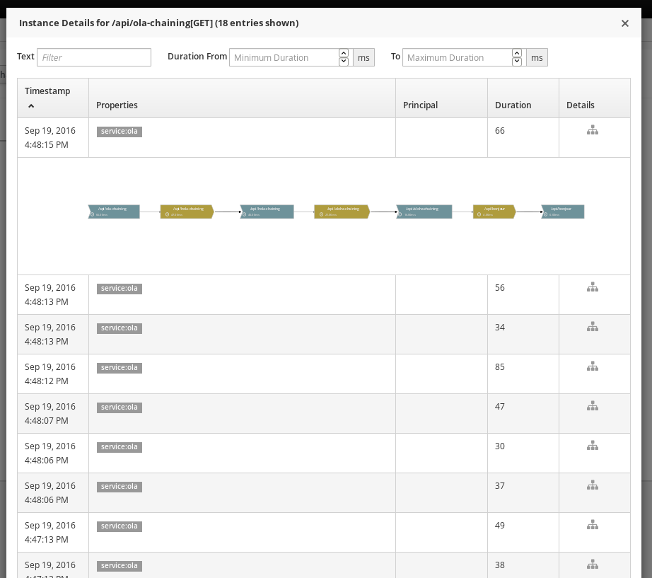
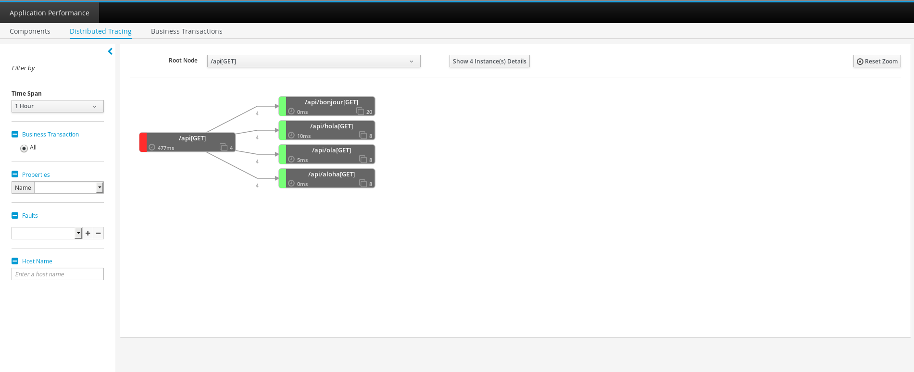
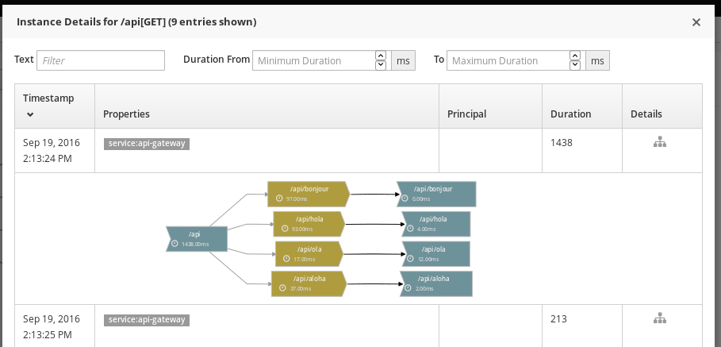

= Using Hawkular APM on Red Hat\'s Microservices Reference Architecture example
Juraci Paixão Kröhling
2016-9-19
:jbake-type: post
:jbake-status: published
:jbake-tags: blog, apm, microservice

The focus of the link:https://github.com/hawkular/hawkular-apm/releases/tag/0.10.0.Final[latest Hawkular APM release]
has been in building a compatibility layer for ZipKin-aware applications. In this blog post, we'll show how Hawkular APM can
be used as a drop-in replacement for ZipKin server and UI.

At the end of this blog post, we should see data flowing from the target applications to Hawkular APM, without any code changes
to the application themselves:

ifndef::env-github[]
image::/img/blog/2016/2016-09-19-screenshot3.png[Hawkular APM Dashboard]
endif::[]
ifdef::env-github[]

endif::[]

Red Hat offers a link:http://developers.redhat.com/products/cdk/overview/[Container Developer Toolkit], or CDK, for its customers,
allowing for a quick start on developing applications following the best practices on the microservices architecture.

Along with the CDK, Red Hat publishes also a link:https://github.com/redhat-helloworld-msa["MSA - Hello World Microservices Architecture"],
which demonstrates how applications might benefit from this architecture. It can also be used as seed for your own
projects, as it shows how activities can be accomplished by using several technology stacks, from `nodejs/express` to `Wildfly Swarm`.

For Hawkular APM, this offers a great way to test our APIs on different stacks, specially our ZipKin compatibility layer. Ideally,
one would simply point the ZipKin URL setting to a Hawkular APM server and everything would just work.

And that's what we are going to do in this post!

== Getting started with CDK and MSA

=== CDK and MSA
To setup CDK and MSA, we suggest that you follow the link:http://bit.ly/msainstructions[official instructions]. At the end of the process,
you should have all the services running. Open the "frontend" service, and click around a bit. For instance:

* Click on the "Browser as client" menu item, which will make the browser make Ajax calls directly to the API endpoints
* Click on the "API Gateway" menu item: on this case, the browser makes a single call to the API Gateway, which in turn makes single API calls
to each of the services
* Click on "Service chaining" menu item: on this case, each service calls the "next", adding the results to its own payload.
* It could be interesting to make a note about the hostnames, to later make sure that you have "new" Docker containers running.
The default output for each of the services include the hostname. Concretely, the output `ola-7-9wa31` means that the service `ola` is
running on the container with hostname `9wa31`.

Open the ZipKin interface, and make sure that data is arriving there. Check also the different visualizations for the different operations.

=== Hawkular APM
We'll use the link:http://www.hawkular.org/blog/2016/07/14/hawkular-apm-openshift.html[previous post on running Hawkular APM on OpenShift]
as base to install our Hawkular APM alongside the other MSA examples. For this blog post, we'll prepare our own image based on the official
Dockerfile for Hawkular APM. For that, fork and clone link:https://github.com/jboss-dockerfiles/hawkular[our repository] and run:

```bash
cd hawkular-apm-server
oc new-app jboss/hawkular-apm-server
oc new-build --binary --name=hawkular-apm-server -l app=hawkular-apm-server
oc start-build hawkular-apm-server --from-dir=. --follow
oc expose service hawkular-apm-server
```

Alternatively, the image from Docker Hub can be used, although it's possible that networking issues might occur. If you use this option and
the build takes more than, say, 10 minutes to finish, do a `vagrant ssh` to enter the box, and check the logs via `journalctl -f`.

```bash
oc new-app jboss/hawkular-apm-server
oc expose service hawkular-apm-server
```

This should create a new image stream, build, deployment and application.

Before anything else, make note of the admin and password credentials. Those can be seen on the build logs:
Browse → Deployments → hawkular-apm-server → Click on the latest deployment → Logs.
A sample output is as follows:

```
------------------------------------
ATTENTION ATTENTION ATTENTION ATTENTION
We automatically created an admin user for you to access the Hawkular APM web interface:
Username: adminQqyEF7i
Password: KS3mmZbkdhRZ5y7oF
------------------------------------
```

Once this is done, there should be a new service available on OpenShift's dashboard, with an URL like `http://hawkular-apm-server-helloworld-msa.rhel-cdk.10.1.2.2.xip.io`.

Now that everything is in place and working as expected, it's time to switch from ZipKin to Hawkular APM!

== Making the switch

Each one of the MSA modules has a `Dockerfile`, specifying a `ENV ZIPKIN_SERVER_URL http://zipkin-query:9411`.
From there, we have some options:

* Change each `Dockerfile` to make the env var point to `http://hawkular-apm-server:8080`
* Specify the `-e` option to Docker, to override the `ZIPKIN_SERVER_URL`
* Set an Environment Variable in the OpenShift deployment

We'll choose the last option, as we consider that as the less invasive one, inline with the Microservice idea that configuration should not
be a concern for the application.

```bash
oc env dc/aloha       ZIPKIN_SERVER_URL="http://hawkular-apm-server:8080"
oc env dc/api-gateway ZIPKIN_SERVER_URL="http://hawkular-apm-server:8080"
oc env dc/bonjour     ZIPKIN_SERVER_URL="http://hawkular-apm-server:8080"
oc env dc/hola        ZIPKIN_SERVER_URL="http://hawkular-apm-server:8080"
oc env dc/ola         ZIPKIN_SERVER_URL="http://hawkular-apm-server:8080"
```

Wait a bit until OpenShift finishes deploying the new containers, and hit "Refresh Results" on the frontend. Note that the hostnames will change, indicating
that a new container is running. At around the same time, you should see the first data flowing to Hawkular APM.

*Spoiler alert*: after the first two screenshots that we added for orientation, we also included some screenshots with the final result.

=== Overriding the environment variable on an OpenShift deployment:

ifndef::env-github[]
image::/img/blog/2016/2016-09-19-screenshot7.png[Environment variable in OpenShift deployment]
endif::[]
ifdef::env-github[]
image::../../../../../assets/img/blog/2016/2016-09-19-screenshot7.png[Environment variable in OpenShift deployment]
endif::[]

=== Hawkular APM Deployment logs on OpenShift:

ifndef::env-github[]
image::/img/blog/2016/2016-09-19-screenshot6.png[Deployment log]
endif::[]
ifdef::env-github[]
image::../../../../../assets/img/blog/2016/2016-09-19-screenshot6.png[Deployment log]
endif::[]

=== Sample of the aggregated visualization for the "Service chaining" technique:

ifndef::env-github[]
image::/img/blog/2016/2016-09-19-screenshot1.png[Service chaining]
endif::[]
ifdef::env-github[]

endif::[]

=== Details about a single instance of the "Service chaining" technique:

ifndef::env-github[]
image::/img/blog/2016/2016-09-19-screenshot5.png[Screenshot 5]
endif::[]
ifdef::env-github[]

endif::[]

=== Sample of the aggregated visualization for the "API Gateway" technique:

ifndef::env-github[]
image::/img/blog/2016/2016-09-19-screenshot2.png[API Gateway]
endif::[]
ifdef::env-github[]

endif::[]

=== Details about a single instance of the "API Gateway" technique:

ifndef::env-github[]
image::/img/blog/2016/2016-09-19-screenshot4.png[Screenshot 4]
endif::[]
ifdef::env-github[]

endif::[]
