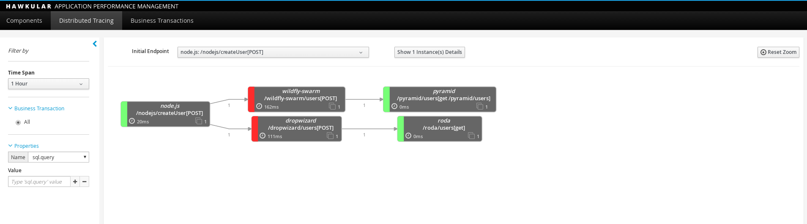
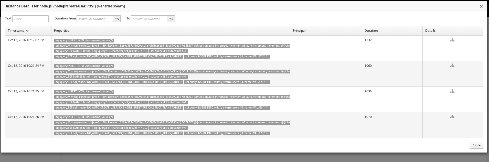
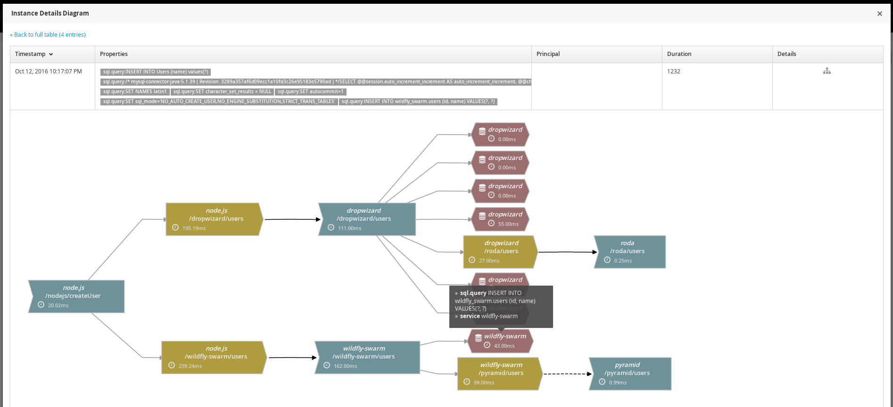
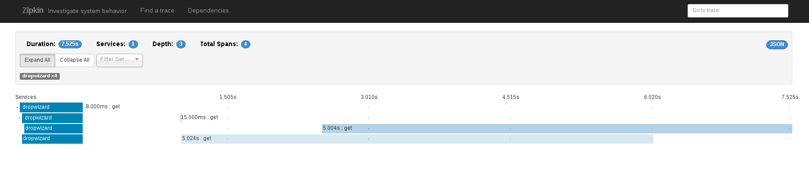
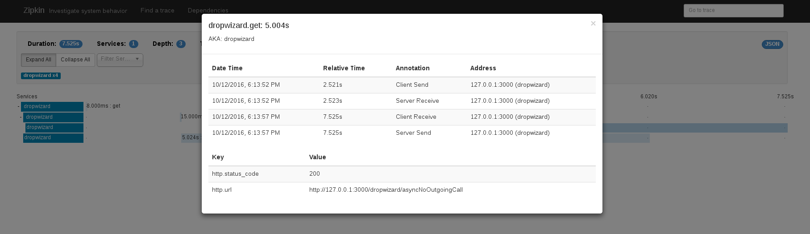

= Hawkular APM Distributed Tracing of Polyglot Application using Zipkin Instrumentations
Pavol Loffay
2016-10-14
:icons: font
:jbake-type: post
:jbake-status: published
:jbake-tags: blog, apm, Zipkin, polyglot, microservice, distributed tracing

The latest focus of Hawkular APM has been in building a compatibility layer 
for Zipkin instrumented applications. This enables Hawkular APM to leverage 
Zipkin http://zipkin.io/pages/existing_instrumentations.html[instrumentation libraries]
and instrument polyglot applications. 

In this blog post we will look how to use Zipkin instrumentation libraries to instrument 
polyglot environment and how the reported data looks in Hawkular APM and Zipkin server. 

== Polyglot Application
A typical polyglot application consists of multiple services written in different programming
languages. These services interact together to fulfill some business needs or tasks. 

The following image shows the architecture of our polyglot application.

ifndef::env-github[]
image::/img/blog/2016/apm-zipkin-polyglot-arch.png[title="Architecture of polyglot application",align="center"]
endif::[]
ifdef::env-github[]
image::../../../../../assets/img/blog/2016/apm-zipkin-polyglot-arch.png[title="Architecture of polyglot application", align="center"]
endif::[]

There are five applications written in 4 languages: Java, JavaScript, Python and Ruby. 
It uses two databases MySQL and Apache Cassandra. Applications expose various REST endpoints 
which simulate some behaviour. For example creating a user in a database or an asynchronous task.

Each application lives in a separate docker container. The whole environment can be deployed 
using one line docker-compose command. Overall there are seven containers including Apache Kafka 
to collect span data. The complete source code with instructions how to run it can be found on
https://github.com/hawkular/hawkular-apm/tree/master/examples/polyglot-zipkin[Github].

== Instrumentation Libraries
There are several http://zipkin.io/pages/existing_instrumentations.html[zipkin instrumentation libraries]. 
Developers have to choose the relevant libraries for their target language (and framework).
If there is no instrumentation for a specific framework they have to report spans to the 
server explicitly, thus having an instrumentation library for a popular web framework is a big
advantage (not limited to web).
 
In a typical microservice environment it is also necessary to add instrumentation for outgoing 
requests so one application may use two or more Zipkin compliant instrumentation libraries. 
These two implementations have to share trace context, and therefore proper initialization 
is required.

Our applications are instrumented with following instrumentations:

 * Java (JAX-RS): https://github.com/openzipkin/brave[brave]
 * Java Dropwizard (JAX-RS): https://github.com/smoketurner/dropwizard-zipkin[dropwizard-zipkin] uses brave
 * Apache Cassandra: https://github.com/thelastpickle/cassandra-zipkin-tracing[cassandra-zipkin-tracing] uses brave
 * JavaScript (express, cujoJS): https://github.com/openzipkin/zipkin-js[zipkin-js]
 * Ruby (rack): https://github.com/openzipkin/zipkin-ruby[zipkin-ruby]
 * Python (Pyramid): https://github.com/Yelp/pyramid_zipkin[pyramid_zipkin]
 * Python (Bravado): https://github.com/Yelp/swagger_zipkin[swagger_zipkin]

These libraries are typically developed by a community and therefore reported data may differ. For 
example a key of binary annotation representing HTTP URL can be `http.url` or `http.uri` or even 
`http.path`. Some of the libraries do not report HTTP status code. Name of a span often represents
HTTP method but some instrumentations put there URL or even other data (cassandra-zipkin-tracing).
It is not an invalid behaviour, just keep in mind when querying data or exporting to external systems for 
an analysis.

There are also a couple of 
https://github.com/hawkular/hawkular-apm/tree/master/examples/polyglot-zipkin#known-issues[issues] 
which can lead to an incorrect data presentation in Hawkular APM. Issues were also reported to the Zipkin project.

== Run the Polyglot Application
Follow the instructions on 
https://github.com/hawkular/hawkular-apm/tree/master/examples/polyglot-zipkin[Github] 
to run the environment and start Hawkular APM server.

Execute following requests which we will analyze in the following sections.

.Example HTTP requests
[[requests]]
-----
1. curl -ivX GET 'http://localhost:3001/nodejs/hello'
2. curl -ivX GET 'http://localhost:3000/dropwizard/A
3. curl -ivX GET 'http://localhost:3000/dropwizard/asyncTwoOutgoingCalls'
4. curl -ivX POST -H 'Content-Type: application/json' 'http://localhost:3001/nodejs/createUser' -d '{"name": "jdoe"}'
-----

== Server Comparisons
This section compares user interfaces of Hawkular APM and Zipkin server.  

=== Hawkular APM Server
In Hawkular APM user interface we are going to look at distributed tracing tab. If you run previous 
commands there should be some data to analyze. 

Following figure shows aggregated service interactions for selected initial endpoint (fourth request). 
Nodes represent endpoint with URL and edges invocation flow.
 
Nodes holds statistics information like average, minimum and maximum duration, 
total number of executions, service name and invoked URL. 
Edges contain timing information of a network latency. This screen only shows nodes with a URL. 
Databases and other components are shown in trace detail view.

For query capabilities we can specify time span, business transaction 
(currently available only for java agent instrumentation and OpenTracing provider) and properties. 
Properties represent binary annotations.

ifndef::env-github[]
image::/img/blog/2016/apm-distributed-tracing-createUser.png[title="Hawkular APM Distributed Tracing",align="center"]
endif::[]
ifdef::env-github[]

endif::[]

Next screen shows instance details. In other words a list of traces for the selected initial endpoint.
Table contains basic information as collected properties, start time, principal (for java agent instrumentation) 
and overall trace duration. Details button opens a detailed graph.

ifndef::env-github[]
image::/img/blog/2016/apm-instance-details.png[title="Hawkular APM Instance Details",align="center"]
endif::[]
ifdef::env-github[]

endif::[]

In the detailed view users can see different types of nodes: producers (client span), 
consumers (server span) and components (databases, EJBs). Tooltip is showing recorded binary annotations. 
In this case it is a CQL query for storing an user into Apache Cassandra.

This concrete graph starts with a consumer (REST handler) and produces two producers (outgoing requests). These
requests are consumed by dropwizard and wildfly-swarm application and so on.

ifndef::env-github[]
image::/img/blog/2016/apm-instance-details-createUser.png[title="Hawkular APM Instance Details",align="center"]
endif::[]
ifdef::env-github[]

endif::[]

=== Zipkin Server
Let's compare this now how the native Zipkin server shows stuff. Please start Zipkin server and 
execute requests from <<requests>>.

The first thing we are going to look at is a query capability. The user interface
offers to specify service name and names of recorded spans of a given service. 
It is possible to specify span's start time, end time and duration range. 
For a more specific query it is possible to query on binary annotations,
which is helpful if we are looking for specific spans, for example HTTP URL of invoked service.
In the following figure it can be seen that we specified URL and HTTP status code 
of invoked service.

The result of the query shows one trace which consist of 23 spans.
There is also a trace duration time and information which services were invoked within 
that trace (also with a duration if possible to calculate).

ifndef::env-github[]
image::/img/blog/2016/apm-zipkin-createUser-query.png[title="Zipkin Query",align="center"]
endif::[]
ifdef::env-github[]
image::../../../../../assets/img/blog/2016/apm-zipkin-createUser-query.png[title="Zipkin Query",align="center"]
endif::[]

The next screen is a trace instance view. It shows a timeline with timing data relative 
to the trace start time. In the following figure there is a trace view for the third call. 
It can be seen that it represent an asynchronous call. The first call ended before its
descendants.
 
ifndef::env-github[]
image::/img/blog/2016/apm-zipkin-async.png[title="Zipkin Trace Detail",align="center"]
endif::[]
ifdef::env-github[]

endif::[]

When you click on a specific span it shows a span detail view with events recorded within
the span. There are also recorded binary annotations which denotes information like HTTP URL 
or HTTP status code. Instrumented application can add custom binary annotations.

ifndef::env-github[]
image::/img/blog/2016/apm-zipkin-async-span-detail.png[title="Zipkin Span Detail",align="center"]
endif::[]
ifdef::env-github[]

endif::[]

The last Zipkin screen is showing dependencies between services. When you click on a specific 
service it shows how many calls were triggered from a service to a service. The more calls to 
the service the wider arrow.

ifndef::env-github[]
image::/img/blog/2016/apm-zipkin-dependencies.png[title="Zipkin Service Dependencies",align="center"]
endif::[]
ifdef::env-github[]
image::../../../../../assets/img/blog/2016/apm-zipkin-dependencies.png[title="Zipkin Service Dependencies",align="center"]
endif::[]

== Conclusion
We have seen a brief comparison of Hawkular APM and Zipkin server. Both of these projects 
display data differently. Hawkular APM is doing more high level aggregations based on user 
specific filter with calculation of statistics. On the other side Zipkin displays spans in
"RAW" fashion. There are definitely advantages and disadvantages for both of these approaches. 

We are always interested to hear feedback from users on how the information presentation may be 
improved to provide a powerful tool to analyze timing data of distributed applications.

== Links
* Polyglot example: https://github.com/hawkular/hawkular-apm/tree/master/examples/polyglot-zipkin
* Zipkin instrumentations: http://zipkin.io/pages/existing_instrumentations.html
* Hawkular APM: https://github.com/hawkular/hawkular-apm
* Zipkin: https://github.com/openzipkin/zipkin
