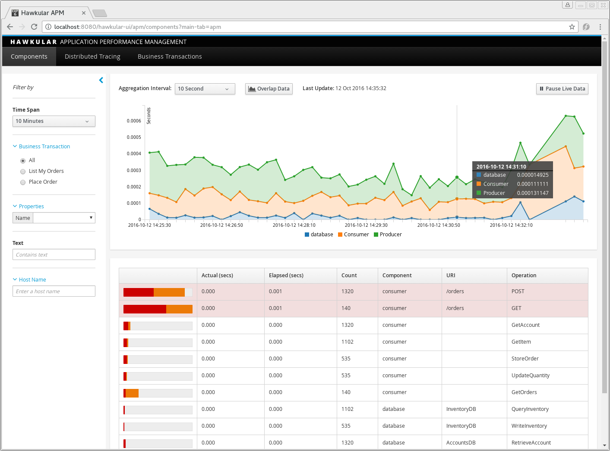
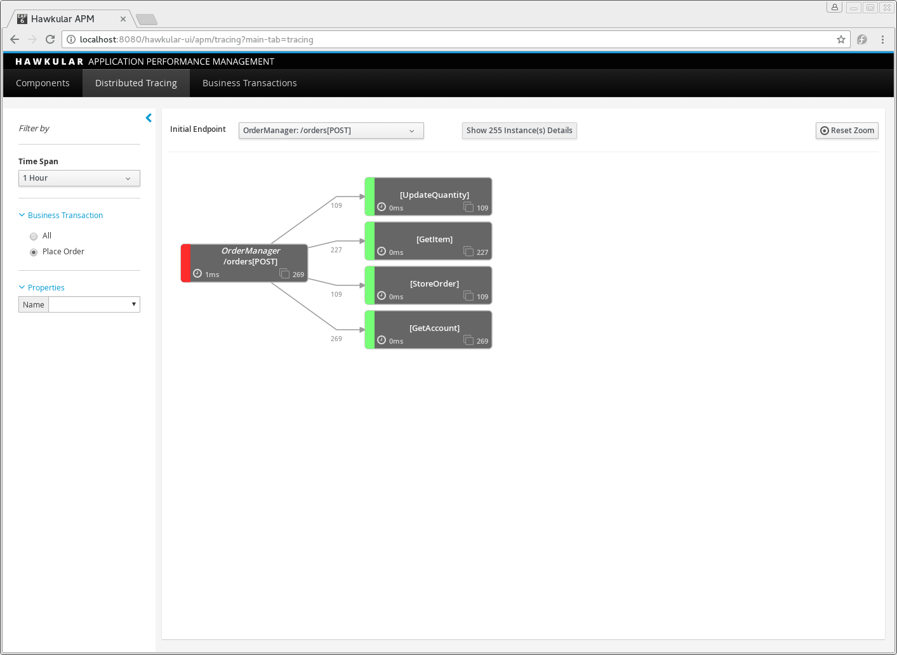
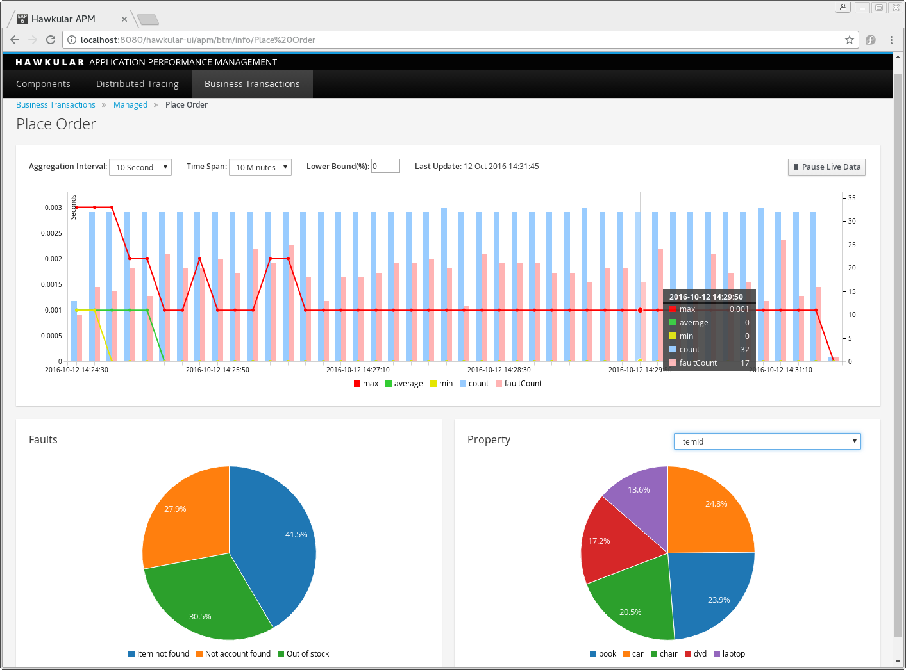

= Hawkular APM supports OpenTracing and Alerts
Gary Brown
2016-10-17
:jbake-type: post
:jbake-status: published
:jbake-tags: blog, apm, opentracing, microservice, vertx

The link:https://github.com/hawkular/hawkular-apm/releases/tag/0.11.0.Final[latest Hawkular APM release] includes two new features, a Java based http://opentracing.io/[OpenTracing] provider and integration with http://www.hawkular.org/community/docs/developer-guide/alerts.html[Hawkular Alerts].

A video demonstrating these new features can also be viewed https://youtu.be/HSWSiww07RE[here]. The video starts with an explanation of how a vertx application is instrumented using OpenTracing. If you want to skip that explanation, then start https://youtu.be/HSWSiww07RE?t=7m47s[here for an explanation of the alert trigger] or start https://youtu.be/HSWSiww07RE?t=9m20s[here for the actual demo].

=== An Example Vertx Application instrumented using OpenTracing

As explained on the http://opentracing.io/[OpenTracing Website], it is _"A vendor-neutral open standard for distributed tracing"_.

The project has been established to provide a consistent API, across multiple languages, to enable applications to be independent of any particular tracing solution. The currently supported languages are Java, Javascript, Go, Python, Objective-C and C++.

As part of the most recent https://github.com/hawkular/hawkular-apm/releases/tag/0.11.0.Final[Hawkular APM release (version 0.11)] we have implemented a Java based OpenTracing provider. To help demonstrate its use, we have instrumented an example http://vertx.io/[Vert.x] application that uses an asynchronous programming style with different interaction patterns (request/response and publish/subscribe). The code for the example can be found on https://github.com/hawkular/hawkular-apm/tree/0.11.0.Final/examples/vertx-opentracing[GitHub].

Adding OpentTracing instrumentation to an application essentially involves creating a set of spans to demarcate significant points in your application that you wish to monitor. When a service receives a request from a client, it should first attempt to extract any existing state information from the client request before creating the top level span for the service:

```
        SpanContext spanCtx = tracer.extract(Format.Builtin.TEXT_MAP,
                new HttpHeadersExtractAdapter(routingContext.request().headers()));

        Span ordersConsumerSpan = tracer.buildSpan("POST")
                .asChildOf(spanCtx)
                .withTag("http.url", "/orders")
                .withTag("service", "OrderManager")
                .withTag("transaction", "Place Order")
                .start();
```

So in this case, we are receiving a request to place an order via a RESTful endpoint (i.e. POST /orders). The first statement extracts any trace state from the HTTP headers and stores them in a _SpanContext_ which is then used when creating a _childOf_ relationship for the top level span.

The additional tags we have specified are for information purposes. The `http.url` is used to identify two things, that the endpoint type is HTTP, and secondly the URL is _/orders_. The `service` tag is used to add information on the dependency graph, and finally the `transaction` enables the trace instance to be classified as belonging to this business transaction.

As this service is then making calls out to other services, we want to create a span to encapsulate the service invocation, and identify it as being a child span of the previously created span (i.e. to make it clear that this service invocation is being performed in the scope of the existing trace instance). The follow span represents the call out to the _AccountManager_ to get account information.

```
        Span getAccountSpan = tracer.buildSpan("GetAccount")
                .asChildOf(ordersConsumerSpan)
                .start();

        tracer.inject(getAccountSpan.context(), Format.Builtin.TEXT_MAP,
                new VertxMessageInjectAdapter(order));

        eb.send("AccountManager.getAccount", order, acctresp -> {
            getAccountSpan.finish();
            ....
```

After creating the span, the second statement is used to _inject_ the trace state into the message being sent to the _AccountManager_. This is necessary to ensure that the activities that occur within the account manager are linked to the same trace instance.

```
        response.putHeader("content-type", "application/json")
                .setStatusCode(202).end(order.encodePrettily());

        ordersConsumerSpan.setTag("orderId", order.getString("id"));
        ordersConsumerSpan.setTag("itemId", order.getString("itemId"));
        ordersConsumerSpan.setTag("accountId", order.getString("accountId"));

        ordersConsumerSpan.finish();
```

Finally, once the order has been confirmed, we associate some additional information with the top level span, before calling the `finish()` method.

This gives a brief insight into how an application can be instrumented to use the OpenTracing API. The _OrderManager_ example is slightly more complex, in that it also instruments a subsequent publish of the order confirmation on the event bus, and relates the instrumentation back to the original trace using the _FOLLOWS_FROM_ reference type. For more information please see the https://github.com/hawkular/hawkular-apm/tree/0.11.0.Final/examples/vertx-opentracing[code].


=== Analysing the Captured Information

When starting the Hawkular APM console, the first page that is displayed shows details for the spans associated with the tracing information that has been captured from the application. The spans can represent _Consumers_ that receive service requests, _Producers_ that make service requests, or internal _Components_ (e.g. databases).

As you can see, the values in the _Operation_ column have the same values that were used when building the spans in the vertx application.

ifndef::env-github[]
image::/img/blog/2016/2016-10-17-apm-vertx-components.png[Application component details]
endif::[]
ifdef::env-github[]

endif::[]

On the *Distributed Tracing* page, we can view the dependencies between the services that were involved in placing the order (i.e. we have selected the _Place Order_ business transaction). We could also filter based on individual properties to further refine the trace instances that are aggregated into this view.

ifndef::env-github[]
image::/img/blog/2016/2016-10-17-apm-vertx-dt.png[Service dependencies]
endif::[]
ifdef::env-github[]

endif::[]

If we then select the *Show 'n' instance details* button, and select an instance from the table, you can view the flow of the individual trace instance:

ifndef::env-github[]
image::/img/blog/2016/2016-10-17-apm-vertx-instance.png[Trace instance for placing an order]
endif::[]
ifdef::env-github[]
image::../../../../../assets/img/blog/2016/2016-10-17-apm-vertx-instance.png[Trace instance for placing an order]
endif::[]

In this diagram, you can see how the order is first passed to the _AccountManager_ to check the account id is known, followed by the _InventoryManager_ to check the stock level. At this point the order confirmation is created and returned to the client application.

However this is not the end of the trace, as the Vertx application then publishes the order confirmation on the event bus, which is consumed by two services (_OrderLog_ and _InventoryManager_) - which demonstrates tracing a publish/subscribe interaction. This behaviour is represented by a dotted line, as it is being performed concurrently, outside the scope of the main request/response interaction with the client application.

The following screenshot is the *Business Transaction* page, which shows a summary of the business transactions being managed by the server. In previous releases, the business transactions were configured on the server, based on information captured using the non-intrusive agent based approach.

With the explicit instrumentation of applications using the OpenTracing API, we have added the ability for the application to directly specify the name of the business transaction, which is then propagated with the trace state between interacting services. This means that business transactions don't need to be configured on the server when specified via the OpenTracing API.

ifndef::env-github[]
image::/img/blog/2016/2016-10-17-apm-vertx-btxnsummary.png[Summary of business transactions]
endif::[]
ifdef::env-github[]
image::../../../../../assets/img/blog/2016/2016-10-17-apm-vertx-btxnsummary.png[Summary of business transactions]
endif::[]

When a business transaction is selected from the summary page, it shows the detailed information:

ifndef::env-github[]
image::/img/blog/2016/2016-10-17-apm-vertx-btxn-placeorder.png[Place order business transaction information]
endif::[]
ifdef::env-github[]

endif::[]

This screenshot shows how information specified via tags on the OpenTracing spans can be used to show faults and properties for the business transaction. Selecting the segments in the fault and properties pie charts can be used to further filter the information displayed on this page.


=== Summary

In this blog and accompanying video we have shown how Hawkular APM can be used with an application instrumented using the standard OpenTracing API. The video also shows how trace information captured and reported to the Hawkular APM server can be used to trigger alerts defined using Hawkular Alerts.


