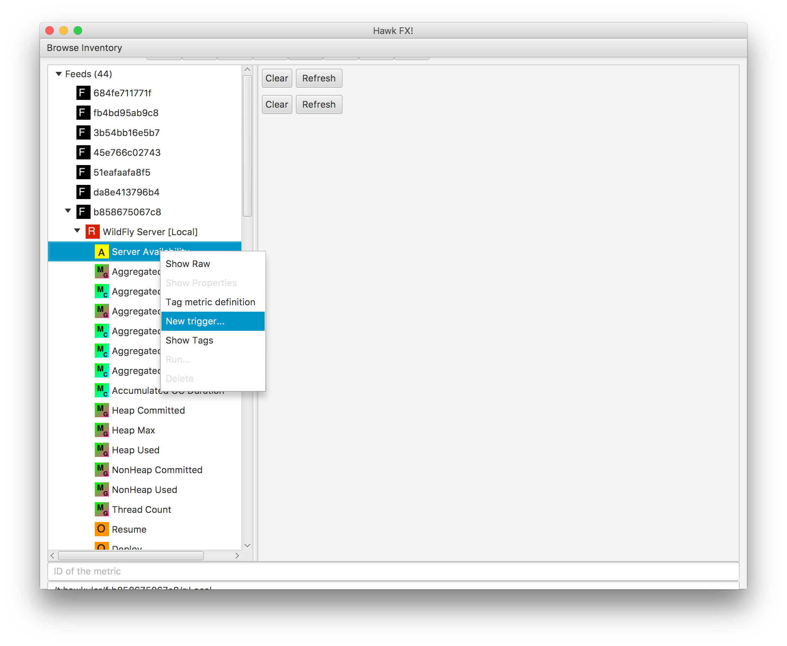
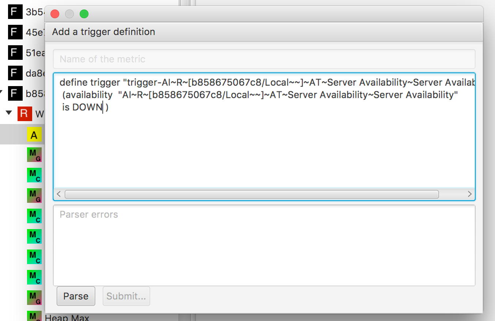

= Define Alert Triggers via HawkFX
Heiko W. Rupp
2016-10-24
:jbake-type: post
:jbake-status: published
:jbake-tags: blog, ruby, jruby, javafx, alerts

HawkFX is an explorer for Hawkular. It is a pet project of mine and https://github.com/pilhuhn/hawkfx[hosted on
Github]. It now has the ability to define alerting triggers.

Hawkular-services and now also Hawkular-Metrics standalone have the ability to fire alerts when certain conditions
are met. To define those conditions, one creates a _trigger_ via
the http://www.hawkular.org/docs/rest/rest-alerts.html[Hawkular-Alerts api]. The alerting team has also written a
http://www.hawkular.org/community/docs/developer-guide/alerts.html[developer guide] that explains the concepts and
terms behind Hawkular-Alerts.

HawkFX now has the ability to directly insert new triggers. For this purpose I have created a
http://pilhuhn.blogspot.de/2016/10/a-dsl-for-alert-trigger-definitions-in.html[DSL] to allow to define triggers
in a more 'natural language'. More on this below.

[[img-main]]
.Context menu
ifndef::env-github[]
image::/img/blog/2016/hawkfx-trigger-menu.png[HawkFX trigger context menu,300]
endif::[]
ifdef::env-github[]

endif::[]

When you right-click on a metric in the HawkFX list of metrics, there is now a new context menu item 'New trigger',
that leads you to the insert screen, where you can insert the definition. This will contain a canned definition
to start with.

[[img-main]]
.Alert trigger insert screen
ifndef::env-github[]
image::/img/blog/2016/hawkfx-trigger-insert-box.png[HawkFX trigger insert,600]
endif::[]
ifdef::env-github[]

endif::[]

When you are done writing the definition, you can click on the _parse_ button at the bottom to check the definition.

== Examples

.Simple threshold trigger for gauges
----
define trigger "MyTrigger"
 ( threshold "myvalue" > 3 )
----

.and for counters
----
define trigger "MyTrigger"
( threshold counter "myvalue" > 3 )
----

You can see from the previous two examples that gauges are the default for _threshold_ triggers, so you can omit that
 keyword.

.Trigger for availability, with high severity that is initially disabled
----
define trigger "MyTrigger"
  disabled
  severity HIGH
  ( availability "mymetric" is DOWN )
----

.Trigger that fires when two conditions are true
----
define trigger "MyTrigger"
  AND(
    ( threshold counter "mycount" < 5 )
    ( string "mymetric" CO "ERROR" )
  )
----

.Trigger that disables itself after firing
----
define trigger "MyTrigger"
 ( threshold "myvalue" > 3 )
 auto-disable
----

== State of the DSL

The DSL is in flux and will be augmented and refined. So far it only contains a basic set of instructions.

The DSL tries to make life easy by trying to set sensible defaults (e.g. a trigger is enabled by default - you have
to provide the _disable_ command explicitly).

If you are interested in the grammar behind the DSL, visit the
https://github.com/pilhuhn/hawkfx/blob/master/lib/alert_trigger.treetop[definition file].
For examples about supported usage, you can have a look at
the https://github.com/pilhuhn/hawkfx/blob/master/spec/alert_trigger_parser_spec.rb[spec].

I hope to be able to extend the DSL going forward and get it into a state where it is useful for people.
At least it makes it easy for me to get triggers defined when working on Hawkular.

Going forward it could also be possible to offer DSLs that mimic if-this-then-that or Zabbix rules, so that users of
those systems can (re-)use their existing rules.

As http://hawkular.org/blog/2016/07/13/hawkfx.html[written before], HawkFX is a Pet project of mine and comes with no
support.