= Monitoring Microservices with OpenShift, Hawkular Metrics and Grafana
Joel Takvorian
2016-10-24
:jbake-type: post
:jbake-status: published
:jbake-tags: blog, metrics, microservice, vertx, openshift, grafana

OpenShift, Hawkular Metrics and Grafana are three great tools that we can combine to build a powerful monitoring system for microservices.

- Grafana is the visualization layer that enables building custom and dynamic dashboards.

- Hawkular Metrics is the robust and flexible layer that is used for metrics storage and querying.

- And OpenShift 3 is the new container platform from Red Hat built on top of Docker and Kubernetes.

Let's see how to make them work together and visualize our microservices metrics in Grafana.

=== Preparing OpenShift

I assume you already have access to a running OpenShift Origin (1.0.8 or later), but if you don't, you can link:https://github.com/openshift/origin[follow the installation steps]. Or if you're a lazy boy/girl like me, you can use link:https://github.com/jimmidyson/minishift[MiniShift] to get it running very quickly. Just make sure you assign enough memory and CPU resources to the VM; I could get everything running fine with 2 cores and 4GB, of course that will depend on your hardware.

Then follow the link:https://github.com/openshift/origin-metrics[origin-metrics installation steps] to deploy Hawkular Metrics in OpenShift.

Note that Grafana will not work on an insecure SSL connection to Hawkular. So you will have to provide your own certificates when creating the secret:

``` bash
$ oc secrets new metrics-deployer hawkular-metrics.pem=/path/to/hm.pem \
hawkular-metrics-ca.cert=/path/to/hm-ca.cert -n openshift-infra
```

=== Deploying a Microservice

You will need to deploy some application in OpenShift. For this article I'll use some parts of the link:https://htmlpreview.github.io/?https://github.com/redhat-helloworld-msa/helloworld-msa/blob/master/readme.html#_deploy_aloha_vert_x_microservice[Red Hat Helloworld MSA] to deploy "Aloha", and later "Bonjour".

For example:
``` bash
$ oc login -u ... -p ...
# The project name you choose here matters, because it will be the tenant ID in Hawkular
$ oc new-project test
$ git clone https://github.com/redhat-helloworld-msa/aloha
$ cd aloha/
$ oc new-build --binary --name=aloha -l app=aloha
$ mvn package; oc start-build aloha --from-dir=. --follow
$ oc new-app aloha -l app=aloha,hystrix.enabled=true
$ oc expose service aloha
```

You can open the OpenShift web console to see when Aloha is correctly deployed. And scale it up to 2 pods. The web console should show something like this:

ifndef::env-github[]
image::/img/blog/2016/2016-10-17-aloha-openshift.png[Aloha in OpenShift]
endif::[]
ifdef::env-github[]
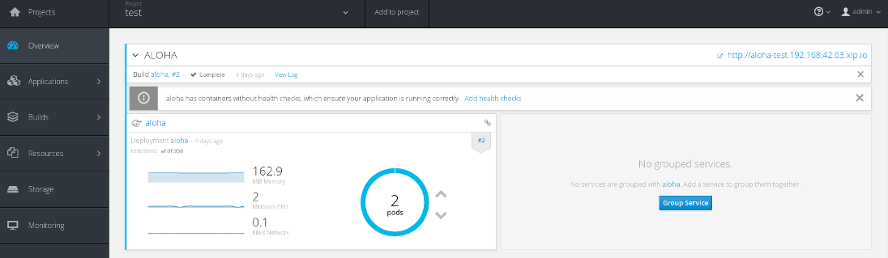
endif::[]

=== Setup Hawkular Datasource in Grafana

So now, let's have a look at Grafana. For this article I've installed a recent version (3.1.1) and the link:https://github.com/hawkular/hawkular-grafana-datasource[Hawkular Datasource plugin] (1.0.2).

In Grafana, to configure the Hawkular Datasource, set the URL of the Metrics service in OpenShift, ending with _/hawkular/metrics_. You should have something similar to _https://metrics.192.168.42.63.xip.io/hawkular/metrics_. Access mode must be _Proxy_. The tenant must be the name of the project in OpenShift where we've created our sample application; so for my example here, it's just "test". And finally, put the bearer token for the OpenShift API access. To generate a token, you can navigate to _/oauth/token/request_ from your OpenShift base path (something like _https://192.168.42.63:8443/oauth/token/request_).

ifndef::env-github[]
image::/img/blog/2016/2016-10-17-grafana-hawkular-datasource.png[Hawkular Datasource configuration]
endif::[]
ifdef::env-github[]
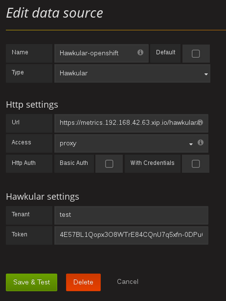
endif::[]

=== Create the Dashboard

Now we can create a new dashboard. And a template variable, which will be the cornerstone of our dynamic dashboards.

ifndef::env-github[]
image::/img/blog/2016/2016-10-17-grafana-templating.png[Open templating]
endif::[]
ifdef::env-github[]
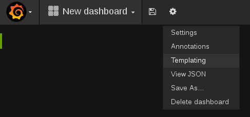
endif::[]
_Open dashboard templating screen_

Create a variable named _app_, select your Hawkular datasource and type in query: _tags/container_name:*_

As you can guess, it will search all known values of the tag _container_name_. Once you've typed the query, you should see your application names displayed at the bottom of the page.

Ticking _Multi-value_ and _Include All option_ is recommended as it will enable better filtering.

ifndef::env-github[]
image::/img/blog/2016/2016-10-17-grafana-edit-variable.png[Editing variables]
endif::[]
ifdef::env-github[]
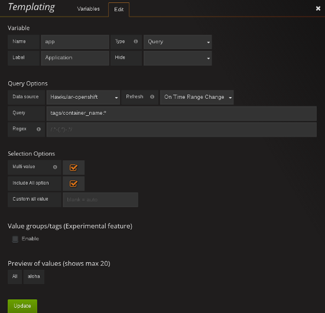
endif::[]

With this single variable, you will already be able to build a nice dynamic dashboard.

TIP: If you want to see the list of available tags created in OpenShift, you can fetch the metrics definitions with the following command: ```curl -X GET https://yourserver/hawkular/metrics/metrics -H "Content-Type: application/json" -H "Hawkular-Tenant: your-tenant" -H "Authorization: Bearer your-bearer-token"```

Now, time to see nice charts! In the first row, we create a new panel of type Graph. In General tab, set "Memory usage" as the graph title. In Metrics tab, select your Hawkular datasource. Create a series of type Gauge, searching by tag, and give the following tags:

- _container_name_: _$app_

- _descriptor_name_: _memory/usage_

These tagged metrics are provided to Hawkular by OpenShift.

ifndef::env-github[]
image::/img/blog/2016/2016-10-17-grafana-memory-usage.png[Memory usage]
endif::[]
ifdef::env-github[]
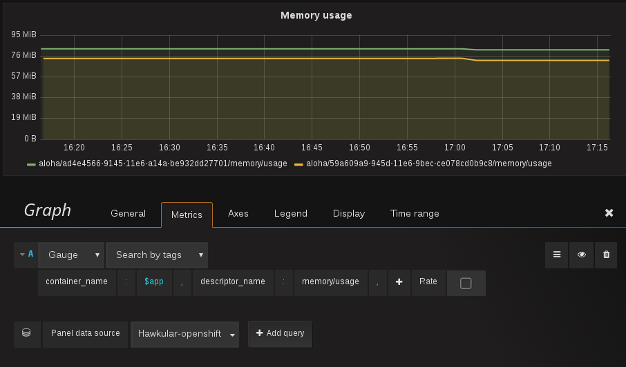
endif::[]

From now on, you can see the memory usage by pod instance and for all your applications. There are 2 series because we scaled the service to 2 pods earlier.

You can edit the Graph Axes to set Y-Unit "Data > Bytes" and Y-min 0. Note that you can also show stacked values from the Display tab. This is useful when you want to see the total amount of memory.

Next, we will show some aggregated stats. But before that, go back editing the Graph panel and, in the General tab, set span to 6.

From the Row menu create a new _Singlestat_ panel. Name it _"Average, all pods"_, span 2, height 100px. In the Metrics tab, select your Hawkular datasource. _Search by tags_ using the same tags as before: _container_name_: _$app_, _descriptor_name_: _memory/usage_.

As you can see, there's some new options when querying from a Singlestat panel: Multiple series aggregation and Time aggregation.

ifndef::env-github[]
image::/img/blog/2016/2016-10-17-grafana-singlestat.png[Singletat query]
endif::[]
ifdef::env-github[]
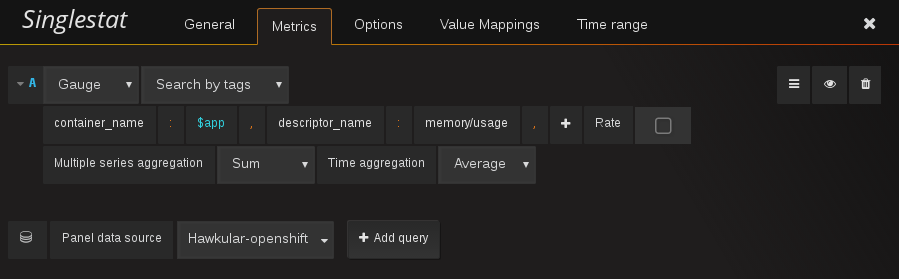
endif::[]

When a standard query by tag is submitted to Hawkular Metrics, the response may contain several series of data points, depending on the matching tags. Since we want here to get a single number, we will ask the plugin to perform a two-steps aggregation: a "vertical" aggregation that merges all series into a single one, and an "horizontal" aggregation that extracts a single stat from a time-series.

As you can see, when the _Multiple series aggregation_ is left to _None_, Grafana reports a _Multiple Series Error_. This is because the Singlestat panel doesn't know how to merge multiple series, so let's ask the Hawkular plugin to do it. Select _Sum_ instead of _None_, and keep _Average_ for the time aggregation.

Now switch to the Options tab and change Unit to "Data > bytes". Here, you can define thresholds to highlight high memory levels.

NOTE: Usually, Grafana's Singlestat panel performs time aggregation by itself, through the _value_ field on the _Big value_ row. But since the Hawkular plugin does it on its own, setting whatever value in this field won't have any effect.

ifndef::env-github[]
image::/img/blog/2016/2016-10-17-grafana-one-singlestat.png[A singlestat]
endif::[]
ifdef::env-github[]
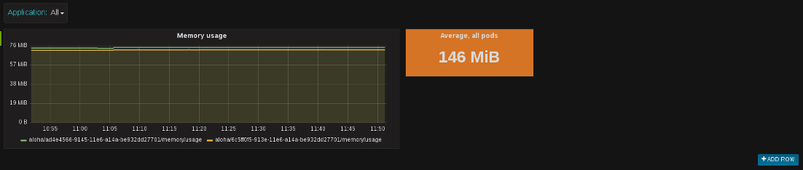
endif::[]

To finalize this dashboard setup for an application, click on the Singlestat panel title and duplicate 5 times. Edit each of the duplicates with the following names and queries:

- "Max, all pods": set _Time aggregation_ to _Max_

- "Live, all pods": set _Time aggregation_ to _Live_

- "Average per pod": set _Multiple series aggregation_ to _Average_

- "Max per pod": set _Multiple series aggregation_ to _Average_ and _Time aggregation_ to _Max_

- "Live per pod": set _Multiple series aggregation_ to _Average_ and _Time aggregation_ to _Live_

ifndef::env-github[]
image::/img/blog/2016/2016-10-17-grafana-6-singlestats.png[6 singlestats]
endif::[]
ifdef::env-github[]
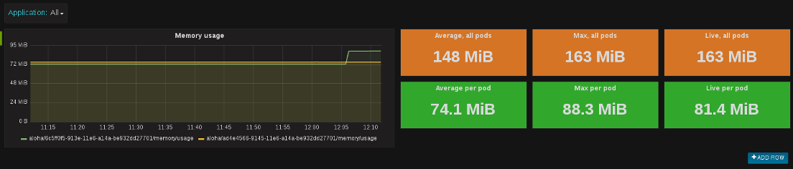
endif::[]

=== Adding Another Application

Now we have a pretty nice dashboard for tracking memory usage on an application. Let's see what happens if we add a new application in OpenShift, under the same project.

This time I'll use _link:https://htmlpreview.github.io/?https://github.com/redhat-helloworld-msa/helloworld-msa/blob/master/readme.html#_deploy_bonjour_nodejs_microservice[Bonjour from Helloworld MSA]_, which is a Node.js microservice. After adding it to OpenShift, and again scaling it to 2 pods, see how it looks like:

ifndef::env-github[]
image::/img/blog/2016/2016-10-17-grafana-apps-merged.png[Merged applications]
endif::[]
ifdef::env-github[]
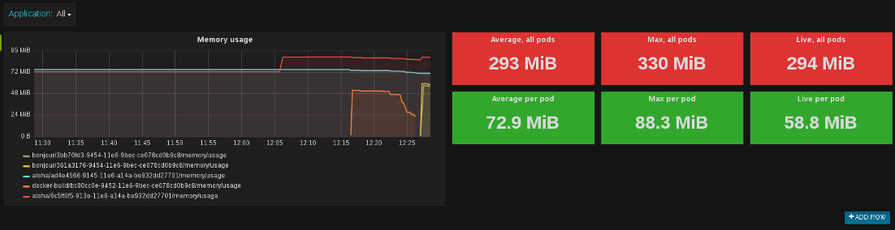
endif::[]

Hmm, interesting. Our panels show new series: two for the _Bonjour_ microservice and one _docker-build_. The later is caused by the build I triggered when I created _Bonjour_. The sequence of the events is quite obvious when looking at the graphs. We don't necessarily want to monitor that, but it's nice to see how far we can go with Hawkular and OpenShift. Anyway, we can filter it out using the top combo box _Application_.

But still, this is probably not what we would expect. What happens here is that the _$app_ variable we set up in queries is resolved into as many _container_name_ as there are, and result in the same number of series in a single graph. We can change that behaviour very easily thanks to a nice feature of Grafana: on the existing row, to the left, open the Row editor and in _Templating options_ activate duplication from variable _app_. Save and refresh the browser.

ifndef::env-github[]
image::/img/blog/2016/2016-10-17-grafana-apps-rows.png[Applications per row]
endif::[]
ifdef::env-github[]
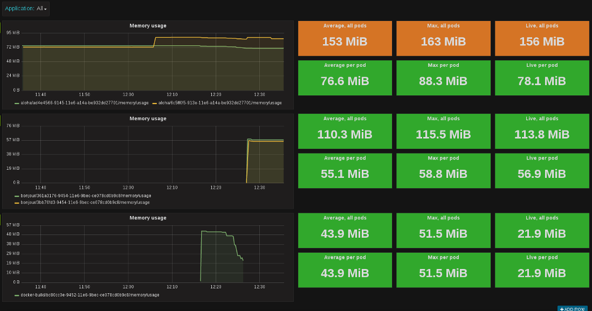
endif::[]

That's better! By turning on row duplication based on our variable, Grafana has created 3 rows, and for each one it provides to the Hawkular plugin just one value of _$app_ at a time.

Now we can monitor our microservices quite easily! If we don't want to see the _docker-build_ instance, just filter it out with the top combo.

We will just add a little enhancement to the dashboard, to make easier to understand which row is for which app. On the first row, add a new _Text_ panel, set its title empty, span 2, height 100px, mode HTML and content:
```
<center><p style='font-size: 40pt'>$app</p></center>
```

It will display the microservice name. After some layout arrangement, here is the final result:

ifndef::env-github[]
image::/img/blog/2016/2016-10-17-grafana-apps-rows-2.png[Applications per row bis]
endif::[]
ifdef::env-github[]
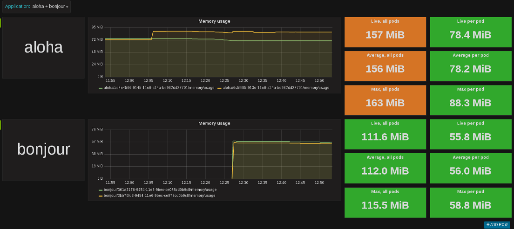
endif::[]

You can play around with OpenShift. Scale some pods up and down, and you'll get the metrics updated in Grafana. Just note that on downscaling, you'll have to wait a little bit (5 minutes) before seeing the _Live_ metrics on the _Singlestat_ panel being updated. This is because we're not sure if the absence of data is due to a pod being shut down, or a simple delay between measurements.

=== It's Just a Beginning

Thanks to the metrics provided in OpenShift, you can build more elaborate dashboards. Just change the _desciptor_name_ tag and see what's interesting for you, there are metrics on memory, CPU, network and filesystem.

But that's just the starting kit! link:http://www.hawkular.org/hawkular-clients/[The Hawkular Metrics ecosystem] is rich and keeps growing, including a Wildfly agent, a Vert.x plugin, a DropWizard reporter, etc. And if that's not enough for you, it's very easy to integrate your own metrics: either through the client libraries or by directly calling the link:http://www.hawkular.org/docs/rest/rest-metrics.html[Metrics REST API].

A good practice, when you define your own metrics, is to tag them with some pod-discriminant values. It can be through the environment variables set by Kubernetes/OpenShift, but it could also be the hostname since it's generated specifically for a pod. With that in mind, you will be able to monitor every part of your microservices architecture.

TIP: You can download this dashboard link:https://github.com/hawkular/hawkular-grafana-datasource/blob/master/dashboards/openshift-memory-example.json[here on GitHub] and import it in Grafana.
