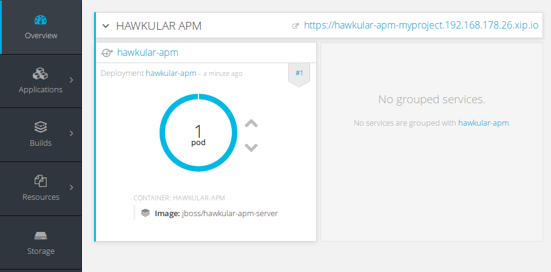
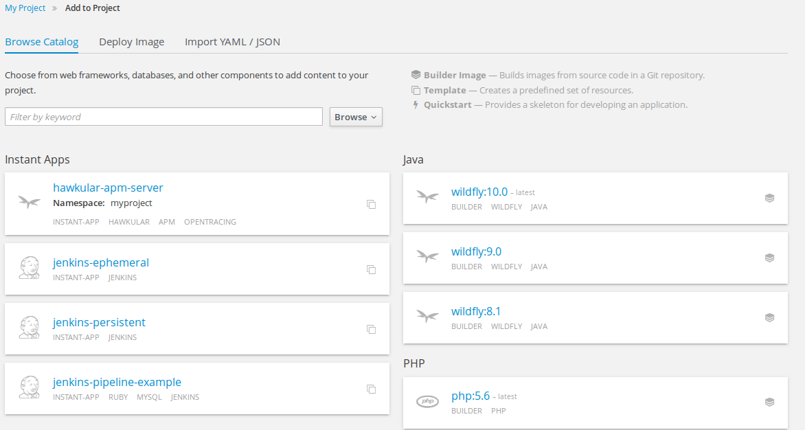
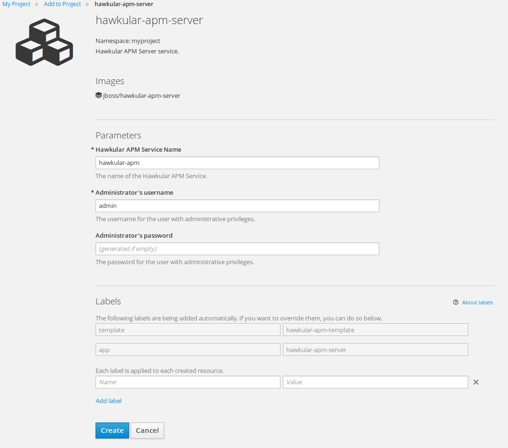

= Using Hawkular APM on OpenShift
Juraci Paixão Kröhling
2016-11-25
:jbake-type: post
:jbake-status: published
:jbake-tags: blog, apm, microservice

During the past few weeks, we've been improving how Hawkular APM can be used in OpenShift, making it easier after each iteration. At the
moment, it's possible to get a complete Hawkular APM server instance with a single command, if you already have a running OpenShift instance.

There are two files available at the moment that can be used in conjunction with OpenShift:

* https://github.com/jboss-dockerfiles/hawkular-apm/blob/master/openshift-templates/hawkular-apm-server-deployment.yml[hawkular-apm-server-deployment.yml]
* https://github.com/jboss-dockerfiles/hawkular-apm/blob/master/openshift-templates/hawkular-apm-server.yml[hawkular-apm-server.yml]

The first creates a complete deployment of Hawkular APM, including the required services and routes, as well as a
default user (`admin`/`password`).
The second creates a "template", which can be used to create new services, and it's commonly known as "instant app".

If you just want to give Hawkular APM a shot, the first file is your best option.
If you are a service provider and want to let your users deploy APM on demand, on their own namespaces and possibly
customizing the deployment, then the second should be used.

== Deploying a Hawkular APM instance into OpenShift

In short, if you already have a working OpenShift installation, this is all that should be required to get a Hawkular APM server running:

```
oc create -f https://raw.githubusercontent.com/jboss-dockerfiles/hawkular-apm/master/openshift-templates/hawkular-apm-server-deployment.yml
```

[TIP]
==================
On Fedora 24 or newer, you can get a complete OpenShift environment ready by running the following commands:
```bash
docker-machine create -d virtualbox --virtualbox-memory 8192 --virtualbox-cpu-count 4 --engine-insecure-registry 172.30.0.0/16 openshift
oc cluster up --docker-machine=openshift
```
==================

After a few seconds, you should see a new service on your OpenShift project, like the one on the following image:

ifndef::env-github[]
image::/img/blog/2016/2016-11-25-apm-deployed-openshift.png[APM Deployed on OpenShift]
endif::[]
ifdef::env-github[]

endif::[]

You can open the Hawkular APM web UI by clicking on the link, shown as "https://hawkular-apm-myproject.192.168.178.26.xip.io" on
the image above. The username is `admin`, and the password is `password`.

== Deploying a Hawkular APM template into OpenShift

We https://www.youtube.com/watch?v=GwnmX_NkyeA[recorded] a demo with this option, showing also a bit of one of our
OpenTracing examples.

You might also choose to deploy a template into your OpenShift infrastructure. This would allow your users to deploy
their own instances of Hawkular APM, within their own namespaces.

To do that, the following command can be used:

```
oc login -u system:admin
oc create -n openshift -f https://raw.githubusercontent.com/jboss-dockerfiles/hawkular-apm/master/openshift-templates/hawkular-apm-server.yml
```

Note that the command above installs the template into the `openshift` namespace, meaning that it's available to every user
on your OpenShift cluster. If you want to restrict this template to a single project, remove the `-n openshift` option.

ifndef::env-github[]
image::/img/blog/2016/2016-11-25-apm-template.png[APM template on OpenShift]
endif::[]
ifdef::env-github[]

endif::[]

The first option on the image shows our Hawkular APM as an instant app. Click on it, and the following screen is shown,
allowing the customization of the Hawkular APM instance.

ifndef::env-github[]
image::/img/blog/2016/2016-11-25-apm-template-customization.png[APM template on OpenShift]
endif::[]
ifdef::env-github[]

endif::[]

== Conclusion

At this point, your Hawkular APM server is ready to start processing data from applications instrumented with OpenTracing providers,
Hawkular APM agent or even ZipKin clients. Check out our https://github.com/hawkular/hawkular-apm/tree/master/examples[examples]
and use them as reference to integrate in your own projects, or browse our https://hawkular.gitbooks.io/hawkular-apm-user-guide/content/[documentation].

If you want to check out what our UI can offer, the easiest way is to run our
https://github.com/hawkular/hawkular-apm/tree/master/tests/app/vertx-opentracing[vertx OpenTracing example], the same we used in our
https://www.youtube.com/watch?v=GwnmX_NkyeA[recorded demo]. Refer to the example's documentation on how to run it and generate data on the server.
