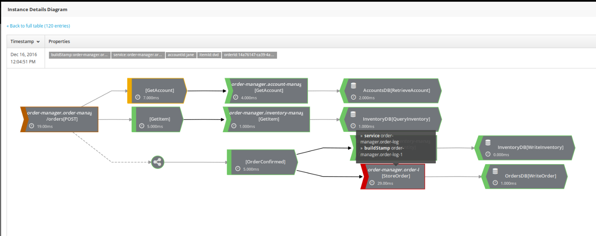

= Hawkular APM improvements for OpenShift
Juraci Paixão Kröhling
2016-12-16
:jbake-type: post
:jbake-status: published
:jbake-tags: blog, apm, opentracing, vertx, openshift

In our last release, we added a few improvements for applications deployed in
OpenShift, such as an automatic way to recognize the name of the service. The
name consists of the OpenShift's build name for the application,
prepended with the namespace to avoid clashes. For instance, if you have
the "Order Manager" application deployed in OpenShift under the build name
`order-manager-1`, under a project (namespace) called `my-project`, the service
name that is visible on Hawkular APM is `my-project.order-manager`. In addition,
we are recording also the build stamp, such as `my-project.order-manager-1` for
the first build of the service `my-project.order-manager`.

ifndef::env-github[]
image::/img/blog/2016/2016-12-16-service-name.png[Service name from environment]
endif::[]
ifdef::env-github[]

endif::[]

We also improved our Vert.x OpenTracing, promoting it to the https://github.com/hawkular/hawkular-apm/tree/master/examples[examples]
directory on the main Hawkular APM source code repository. We refactored it and
prepared an Ansible playbook, so that it can be deployed in just a few minutes,
preparing the whole OpenShift infrastructure as needed. Do give it a try!

On a Fedora 25 with Docker, OpenShift Origin Clients and Ansible, all that
it's required is this:
```bash
ansible-playbook vertx-opentracing.yml
```

Once the playbook finishes running, you'll have an OpenShift cluster running
with Hawkular APM on it and our Eclipse Vert.x example "Order Manager",
instrumented using OpenTracing APIs. Refer to the https://github.com/hawkular/hawkular-apm/tree/master/examples/vertx-opentracing#opentracing---microservices-with-vertx[README]
file on the example's source code directory for more info on how to access the
OpenShift console and Hawkular APM UI.

[TIP]
==================
For a completely fresh install on Fedora 25, the whole environment can be
created with the following commands:

```bash
sudo dnf install -y docker origin-clients ansible maven
sudo sh -c "echo \"INSECURE_REGISTRY='--insecure-registry 172.30.0.0/16'\" >> /etc/sysconfig/docker"
sudo systemctl start docker
mkdir -p /opt/hawkular-apm/ ; cd /opt/hawkular-apm/
git clone https://github.com/hawkular/hawkular-apm.git .
mvn clean install -Dcheckstyle.skip=true -Dlicense.skip=true -Dxml.skip=true -DskipTests -Dnoui
cd examples/vertx-opentracing
ansible-playbook vertx-opentracing.yml
```
==================

If you need any assistance, feel free to join us via IRC at `#hawkular`
on Freenode.
