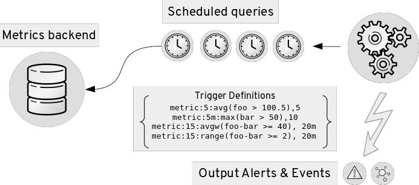
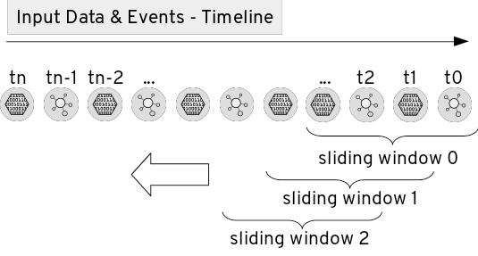

= Extending Complex Event Processing in Hawkular Alerting
Lucas Ponce
2017-01-13
:jbake-type: post
:jbake-status: published
:jbake-tags: blog, alerts, complex, events, processing, stream, polling

== Stream Processing versus Polling Processing

Hawkular Alerting uses different techniques to detect behaviours by defining rules.

The main implementation is based in a Stream Processing design.
Hawkular Alerting analyzes streams of data and events ordered in a timeline searching for conditions matches.
This technique is also known as Event Processing (or Complex Event Processing) especially when the processing of incoming data might need multiple conditions.

ifndef::env-github[]
image::/img/blog/2017/stream-processing.png[Stream Processing]
endif::[]
ifdef::env-github[]
image::../../../../../assets/img/blog/2017/stream-processing.png[Stream Processing]
endif::[]

This method is particularity good to identify meaningful happenings on complex scenarios and respond to them as quickly as possible.

Hawkular Alerting also supports an _Alerter_ based Polling technique that allows periodic processing of defined queries against a backend.

ifndef::env-github[]
image::/img/blog/2017/polling-processing.png[Polling Processing]
endif::[]
ifdef::env-github[]

endif::[]

This Polling technique is also good in non real time scenarios, for example, to compare historical values in
large range time intervals using statistical operators like averages, medians or percentiles.

== Sliding Windows on Complex Event Processing

An interesting aspect in the logic of detection behaviours is the combination of Stream and Polling processing characteristics.

A Sliding Window is a way to define a scope in the stream of data and events received in the timeline.
This Sliding Window lets us define special rules that apply only on the scoped data and events.

ifndef::env-github[]
image::/img/blog/2017/sliding-windows.png[Sliding Windows]
endif::[]
ifdef::env-github[]

endif::[]

A powerful use case is when we can aggregate the scoped events and define expressions on them. +
For example, let's examine the high level scenarios

    - *Marketing* +
    _Detect when a customer buys several items in a short period of time_

    - *Fraud* +
    _Alert when a customer buys from several locations in a short period of time_

    - *Customer loyalty* +
    _Detect specific transactions to offer premium discounts to customers_

All of these scenarios need some sort of aggregation (i.e. aggregate events by customer/transaction id),
define expressions on aggregated fields and scope these events using a Slide Window.

== Events Aggregation Extension

Hawkular Alerting has introduced a new _Extension_ called _EventsAggregation_. +
_Extensions_ is a new mechanism to pre-process data or events before they are processed by the core Alerting Engine.

The _EventsAggregation_ _Extension_ allows us to scope Sliding Windows on Events and define expressions on aggregated data.
This new feature can be used on _Triggers_ with _ExternalCondition_ and _EventsAggregation_ alerter.

For example, we can define a _Trigger_ that represents the *Marketing* scenario previously described:

[source,json]
{
  "triggers":[
    {
      "trigger":{
        "id": "marketing-scenario",
        "name": "Marketing Scenario",
        "description": "Detect when a customer buys several items in a short period of time",
        "severity": "HIGH",
        "enabled": true,
        "actions":[
          {
            "actionPlugin": "email",
            "actionId": "notify-to-marketing"
          }
        ],
        "tags":{
            "HawkularExtension":"EventsAggregation"
        }
      },
      "conditions":[
        {
          "triggerMode": "FIRING",
          "type": "EXTERNAL",
          "alerterId":"EventsAggregation",
          "dataId": "marketing",
          "expression": "event:groupBy(context.accountId):window(time,10s):having(count > 2)"
        }
      ]
    }
  ],
  "actions":[
    {
      "actionPlugin": "email",
      "actionId": "notify-to-marketing",
      "properties": {
        "to": "marketing@hawkular.org"
      }
    }
  ]
}

The expression used can be described as follows:

[source]
groupBy(context.accountId)      Group window events by context "accountId" field
window(time,10s)                Define a sliding time window of 10 seconds
having(count > 2)               Define an expression on the grouped events

In other words, this condition will be true, each time that there are more than two events with the same _accountId_ for a 10 seconds window.

In a similar way, we can describe the *Fraud* scenario previously described with the expression:

[source,json]
"event:groupBy(tags.accountId):window(time,10s):having(count > 1, count.tags.location > 1)"

Where

[source]
groupBy(context.accountId)                    Group window events by context "accountId" field
window(time,10s)                              Define a sliding time window of 10 seconds
having(count > 1, count.tags.location > 1)    Define an expression on the grouped events

This condition will be true when there are more than 1 events with more than one _location_ tag, so detecting when
events for the same _accountId_ happens from different places.

The two previous expressions groups all events of the timing window.
We might have scenarios where only specific events should be grouped.

For these cases we can add filters into the expressions like in the following example:

[source,json]
"event:groupBy(tags.traceId):filter((category == \"Credit Check\" && text == \"Exceptionally Good\") || (category == \"Stock Check\" && text == \"Out of Stock\")):having(count > 1, count.tags.accountId == 1)"

This expression will group events filtered by a expression

[source]
filter(
    (category == \"Credit Check\" && text == \"Exceptionally Good\") ||
    (category == \"Stock Check\" && text == \"Out of Stock\")
)

Note that this expression doesn't define an explicit sliding time window, so it will use a default expiration window.

=== Use cases

Stream Processing and Polling Processing might be used for similar scenarios.

The EventsAggregation Extension groups Events in memory so it is designed for real time scenarios with relatively short sliding windows.

== Conclusion

EventsAggregation Extension is a useful addition to Hawkular Alerting that will extend the scenarios and type of behaviours that can be detected.

In our future work we will enhance this extension covering more use cases (potential aggregation of data).

We hope this short introduction helps to show how the EventsAggregation Extension provides powerful new CEP capabilities for Hawkular Alerting.

Comments and questions are welcome, here or in http://webchat.freenode.net/?channels=hawkular[#hawkular] room on freenode.

== References

.EventsAggregation Expression syntax:

https://github.com/hawkular/hawkular-alerts/blob/master/hawkular-alerts-engine-extensions/hawkular-alerts-events-aggregation/src/main/java/org/hawkular/alerts/extensions/Expression.java

.EventsAggregation examples:

https://github.com/hawkular/hawkular-alerts/blob/master/hawkular-alerts-engine-extensions/hawkular-alerts-events-aggregation/src/test/java/org/hawkular/alerts/extensions/ExpressionTest.java

https://github.com/hawkular/hawkular-alerts/blob/master/hawkular-alerts-rest-tests/src/test/groovy/org/hawkular/alerts/rest/EventsAggregationExtensionITest.groovy

