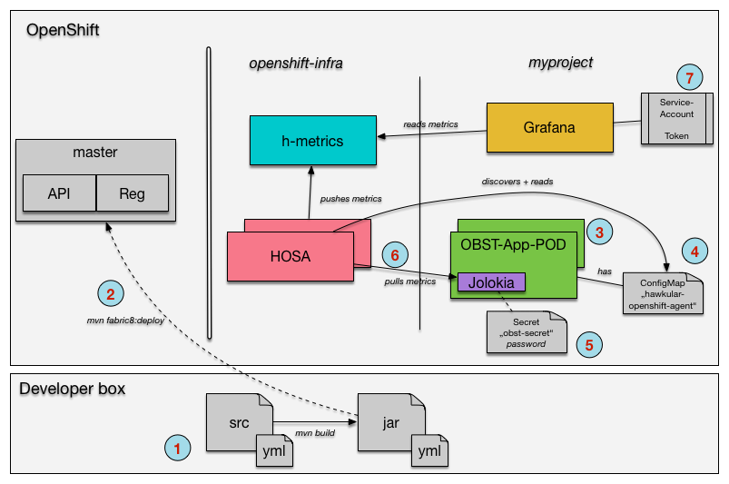

= Monitoring Microservices on OpenShift with HOSA
Heiko W. Rupp
2017-01-17
:jbake-type: post
:jbake-status: published
:jbake-tags: blog, openshift, agent, obsidian-toaster, fabric8

== Monitoring Microservices on OpenShift with the Hawkular OpenShift Agent

Monitoring Microservices on orchestrated platforms like OpenShift is a very different endeavor than the classical monitoring of monoliths on their dedicated servers. The biggest two differences are that the services can just be deployed by the schedule on any available server node and that it is possible to have many instances of a single service run in parallel

The Hawkular project is now introducing the Hawkular OpenShift Agent (HOSA), which is deployed in OpenShift as infrastructure level component. Hosa runs on each node to monitor pods for the node and sends the retrieved metrics to Hawkular-Metrics. Hosa may eventually replace Heapster in the longer run.

=== The monitoring scenario

The following drawing shows the scenario that I am going to describe below

.The Scenario
ifndef::env-github[]
image::/img/blog/2017/OBST-Monitoring-HOSA.png[Scenario overview]
endif::[]
ifdef::env-github[]

endif::[]

The numbers in the round blue circles will be referenced below as _(n)_.

As example we are taking Microservices created by the https://github.com/obsidian-toaster[Obsidian Toaster] generators and deploy them with the help of the https://github.com/fabric8io/fabric8-maven-plugin[Fabric8 Maven Plugin] into OpenShift.

NOTE: It is not necessary to retrieve the source code from Obsidian Toaster. Any source that can be
deployed to OpenShift via the Fabric8 Maven plugin will do.

After getting the source code from the generator, run the respective
`mvn clean package` goals as described in the README of the source _(1)_. If that works well, you can then deploy the result into OpenShift via `mvn fabric8:deploy -Popenshift` _(2)_. This will create a so called Source to Image (S2I) build in OpenShift which takes the provided artifacts and config files, creates images and deploys them in a pod with associated service etc _(3)_.

The latter is driven by some internal settings of the maven plugin, which also merges in files from `src/main/fabric8/`. More on that below.

For each JVM that the Fabric8 plugin deploys, it also puts a https://jolokia.org[Jolokia] agent in the VM, as you can see in _(3)_. This agent exposes internal JMX metrics via the Jolokia-REST protocol, on a pre-defined port with a default user name and a random password. The data of this pod is also exposed via the API-proxy, so that you can click on the _Open Java Console_ link in the next figure to get to a JMX browser.

.A pod in OpenShift
ifndef::env-github[]
image::/img/blog/2017/OBST-Pod.png[Pod in Openshift]
endif::[]
ifdef::env-github[]

endif::[]

=== The Hawkular OpenShift Agent

The https://github.com/hawkular/hawkular-openshift-agent[Hawkular OpenShift Agent](Hosa) runs as part of the OpenShift infrastructure inside the _openshift-infra_ namespace on a per node basis, monitoring eligible pods on that node. The GitHub account has pretty good information on how to compile and deploy it (there are also pre-created Docker images available). 

In order for Hosa to know which pods to monitor and what metrics to collect, it looks as pods and checks if they have a _ConfigMap_ with a name of `hawkular-openshift-agent` mounted.

.Config Map for Hosa, _(4)_
[source,yml]
----
kind: ConfigMap
apiVersion: v1
metadata:
  name: obs-java-hosa-config.yml  # <1>
  namespace: myproject
data:
  hawkular-openshift-agent: | # <2>
    endpoints:
    - type: jolokia # <3>
      collection_interval_secs: 60
      protocol: "https"
      port: 8778
      credentials:
        username: jolokia
        password: secret:hosa-secret/password  # <4>
      path: /jolokia/
      tags:
        name: ${POD:label[project]} # <5>
      metrics: # <6>
      - name: java.lang:type=Threading#ThreadCount
        id: the_thread_count
        type: gauge
----
<1> Name of the map
<2> Configuration for the agent to monitor matching pods
<3> This is a Jolokia-kind of endpoint
<4> This is the password used to talk to Jolokia, which we obtain from a _secret_ -- more below.
<5> Each metric is tagged with a label `name=<project name>`
<6> Definition of the metrics to be collected

You can save the above ConfigMap into a file and deploy it into Openshift via `oc create -f <configmap.yml>`.

Now the question is how do we tell our deployment to use this config map? In Figure 2 you see, that this got mounted as a volume. In order to do so, we need to go back to our local source code and add a new file `deployment.yml` into `src/main/fabric8/` and re-deploy our source with `mvn fabric8:deploy -Popenshift`. And as we are doing this, we also want to make sure that the password for Jolokia is not hard coded, but will be obtained from an OpenShift _secret_ 

.deployment.yml
[source,yml]
----
# This gets merged into the main openshift.yml's deployment config via f8 plugin
spec:
  template:
    spec:
      volumes:
        - name: hawkular-openshift-agent # <1>
          configMap:
            name: obs-java-hosa-config.yml # <2>
      containers:
        - env:
          - name: AB_JOLOKIA_PASSWORD_RANDOM # <3>
            value: "false"
          - name: AB_JOLOKIA_PASSWORD # <4>
            valueFrom:
              secretKeyRef: # <5>
                name: hosa-secret
                key: password
----
<1> The magic name of the volume so that Hosa can find it
<2> The name of the config map to use. See (1) in _Config Map for Hosa_ above.
<3> Tell Jolokia not to create a random password
<4> Make OpenShift set the password, which it gets from a _secret_
<5> The secret to query is named _hosa-secret_ and we want the entry with the name _password_.

Hosa is getting noticed once you redeploy the application, and will see the volume and will try to start monitoring the pod. Which leaves us with the OpenShift _secret_.

==== Creating the secret, _(5)_

To create a secret that holds our password we need to do two things. First we need to encode the password in base 64 format.

.Base64 encoing of the password
[source,shell]
----
$ echo "test4hawkular" | base64
dGVzdDRoYXdrdWxhcgo=
----

And then we need to create a yml file for the secret.

.hosa-secret.yml
[source,yml]
----
apiVersion: v1
kind: Secret
metadata:
  name: hosa-secret # <1>
type: Opaque
data:
  password: dGVzdDRoYXdrdWxhcg== # <2>
----
<1> Name of the secret
<2> Key is 'password', value is password from previous step

You can deploy that secret with `oc create -f hosa-secret.yml`.

=== Display data with Grafana

Now that we have the agent collecting data and storing in Hawkular-Metrics we can look at them with the help of Grafana.
Joel Takvorian has http://www.hawkular.org/blog/2016/10/24/hawkular-metrics-openshift-and-grafana.html[described this pretty well], so I am not going to repeat the setup here. 
The only thing I want to mention is setting up a service account _(7)_ instead of using a token, as  tokens can expire.

==== Create a service account, _(4)_
.ServiceAccount, view-metrics-sa.json
[source,json]
----
{
  "apiVersion": "v1",
  "kind": "ServiceAccount",
  "metadata": {
    "name": "view-metrics" # <1>
  }
}
----
<1> Just the name of this service account

Deploy this to OpenShift via `oc create -f view-metris-sa.json`

When you look at it with `oc describe sa/view-metrics`, it shows a list of tokens at the end:

[source, shell]
----
$ oc describe sa/view-metrics
Name:		view-metrics
Namespace:	myproject
Labels:		<none>

Image pull secrets:	view-metrics-dockercfg-rmnee

Mountable secrets: 	view-metrics-dockercfg-rmnee
                   	view-metrics-token-vowtw

Tokens:            	view-metrics-token-t98qw # <1>
                   	view-metrics-token-vowtw
----
<1> One of the tokens

Those tokens are actually secrets, that were populated by OpenShift. Inspecting one of the tokens then reveals a token string, that we can use inside of Grafana

----
$ oc describe secret view-metrics-token-vowtw
Name:		view-metrics-token-vowtw
Namespace:	myproject
[...]
Data
====
namespace:	9 bytes
service-ca.crt:	2186 bytes
token:		eyJhbGciOiJS... # <1> 
----
<1> Long token string

.Using the token from the ServiceAccount
ifndef::env-github[]
image::/img/blog/2017/OBST-Grafana1.png[Using the token from the ServiceAccount]
endif::[]
ifdef::env-github[]

endif::[]

