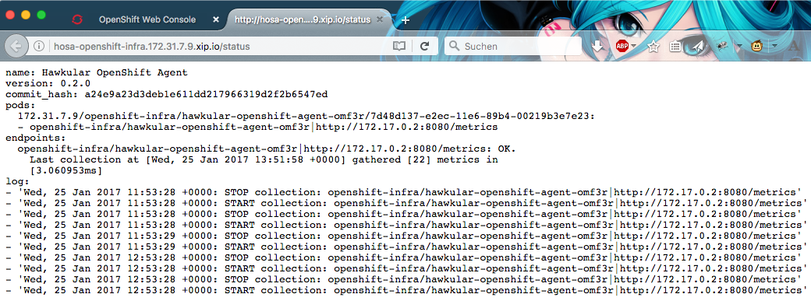

= Getting the status of Hosa
Heiko W. Rupp
2017-01-25
:jbake-type: post
:jbake-status: published
:jbake-tags: blog, openshift, agent

== Getting the status of the Hawkular OpenShift Agent

In a previous blog post I talked about the http://www.hawkular.org/blog/2017/01/17/obst-hosa.html[Hawkular OpenShift Agent and how to use it to monitor Microservices].

While setting up the agent and the config maps is not complicated, it is always possible to make a typo. Hosa luckily has a status endpoint that exposes what it is currently doing.

There are two options available:

- Run some commands on the command line
- Expose the Hosa status endpoint to a browser

Let's have a look at both, command line first

=== Hand out the rights to do this

Before continuing, you need to ensure that the current OpenShift user has the rights to do so (the user needs to be able to see things in the _openshift-infra_ project). You can do that with the following command for some user or just use system:admin for this purpose.
We will continue here with a user called `admin`. 

.Give user admin super powers
[source, shell]
----
$ oc login -u system:admin
$ oc adm policy add-cluster-role-to-user cluster-admin admin
----

=== Via command line

Now we can log in as _admin_ and get the status:

.Get the status
[source, shell]
----
$ login -u admin -p admin
$ curl -k -H "Authorization: Bearer `oc whoami -t`" `oc version | grep 'Server ' | awk '{print $2;}'`/api/v1/namespaces/openshift-infra/pods/`oc get pods -n openshift-infra --selector metrics-infra=agent --no-headers | awk '{print $1;}'`:8080/proxy/status
name: Hawkular OpenShift Agent
version: 0.2.0 # <1>
commit_hash: a24e9a23d3deb1e611dd217966319d2f2b6547ed
pods: <2>
  172.31.7.9/openshift-infra/hawkular-openshift-agent-omf3r/7d48d137-e2ec-11e6-89b4-00219b3e7e23:
  - openshift-infra/hawkular-openshift-agent-omf3r|http://172.17.0.2:8080/metrics
endpoints: <3>
  openshift-infra/hawkular-openshift-agent-omf3r|http://172.17.0.2:8080/metrics: OK.
    Last collection at [Wed, 25 Jan 2017 13:56:58 +0000] gathered [22] metrics in
    [2.940328ms]
log: <4>
- 'Wed, 25 Jan 2017 11:53:29 +0000: STOP collection: openshift-infra/hawkular-openshift-agent-omf3r|http://172.17.0.2:8080/metrics'
- 'Wed, 25 Jan 2017 11:53:29 +0000: START collection: openshift-infra/hawkular-openshift-agent-omf3r|http://172.17.0.2:8080/metrics'
[...]
----
<1> Version of the agent (and the commit hash it was built from)
<2> List of pods it is monitoring with the endppoint it talks to
<3> List of endpoints it monitors + result of last collection
<4> Latest log messages of the agent.

If you don't give the appropriate right, the command will fail:

.Running without cluster rights
[source,shell]
----
$ login -u developer -p developer
$ curl -k -H [... as above ...]
Error from server (Forbidden): User "developer" cannot list pods in project "openshift-infra"
----

TIP: When you have the agent source  https://github.com/hawkular/hawkular-openshift-agent[checked out from git], you can just run `make openshift-status` instead of the longish `curl` command shown above.

=== By exposing Hosa status endpoint

The other option is to expose Hosa, which is deployed as a pod only as service and with a route to be able to visit the `/status` url of it

.Definition for service and route, `hosa-service-route.yml`
[source,yml]
----
apiVersion: v1
kind: Service
metadata:
  name: hawkular-openshift-agent
  labels:
    metrics-infra: agent
spec:
  ports:
    - protocol: TCP
      port: 8080 # <1>
  selector:
    name: hawkular-openshift-agent
---
apiVersion: v1
kind: Route
metadata:
  name: hosa
  namespace: openshift-infra
  labels:
    metrics-infra: agent
spec:
  path: /status # <2>
  to:
    kind: Service
    name: hawkular-openshift-agent
    weight: 100
----
<1> Expose port 8080
<2> Put the status endpoint in the url, so that it opens when clicking in the OpenShift console

You can then deploy this into OpenShift via 

[source, shell]
----
$ oc project openshift-infra
$ oc create -f hosa-service-route.yml
----

OpenShift will then expose a route in the format `http://hosa-openshift-infra.<nodeip>.xip.io/status`.

Navigate to it in the browser and you will get out put like the one on the command line.

.Status display in browser
ifndef::env-github[]
image::/img/blog/2017/1-hosa-status.png[Status in browser]
endif::[]
ifdef::env-github[]

endif::[]

TIP: Future versions of Hosa will set up service and route when you run `make openshift-deploy` from within the source code.