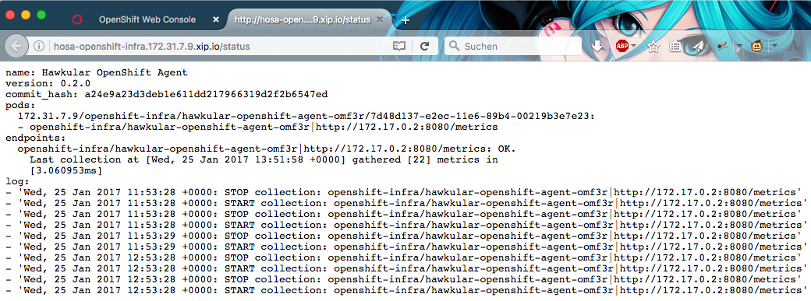

= Getting the status of Hosa
Heiko W. Rupp
2017-01-27
:jbake-type: post
:jbake-status: published
:jbake-tags: blog, openshift, agent

== Getting the status of the Hawkular OpenShift Agent

In a previous blog post I talked about the http://www.hawkular.org/blog/2017/01/17/obst-hosa.html[Hawkular OpenShift Agent and how to use it to monitor Microservices].

While setting up the agent and the config maps is not complicated, it is always possible to make a typo. Hosa luckily has a status endpoint that exposes what it is currently doing.

.Status display in browser
ifndef::env-github[]
image::/img/blog/2017/1-hosa-status.png[Status in browser]
endif::[]
ifdef::env-github[]

endif::[]

The endpoint is secured by basic authentication. We will see below how to set this up.

=== Exposing the Hosa status endpoint

It is possible to expose the agent's status endpoint, which is deployed as a pod only, as service and with a route to be able to visit the `/status` url of it.

TIP: When you have checked out the agent source code and deployed the agent via `make openshift-deploy` you can skip the following, as the make command already did the setup. 

We will create a Yaml definition for the service and route and also a secret.

.Definition for service and route, `hosa-service-route.yml`
[source,yml]
----
apiVersion: v1
kind: Service
metadata:
  name: hawkular-openshift-agent
  labels:
    metrics-infra: agent
spec:
  ports:
    - protocol: TCP
      port: 8080 # <1>
  selector:
    name: hawkular-openshift-agent
---
apiVersion: v1
kind: Route
metadata:
  name: hosa
  namespace: openshift-infra
  labels:
    metrics-infra: agent
spec:
  path: /status # <2>
  to:
    kind: Service
    name: hawkular-openshift-agent
    weight: 100
---
apiVersion: v1
kind: Secret
metadata:
  name: hawkular-openshift-agent-status
    labels:
      metrics-infra: agent
  data:
    username: ZGV2  # <3>
    password: Y2hhbmdlbWU= # <4>
----
<1> Expose port 8080
<2> Put the status endpoint in the url, so that it opens when clicking in the OpenShift console
<3> Username _dev_ as base64
<4> Password _changeme_ as base64

You can then deploy this into OpenShift via 

[source, shell]
----
$ oc project openshift-infra
$ oc create -f hosa-service-route.yml
----

OpenShift will then expose a route in the format `http://hosa-openshift-infra.<nodeip>.xip.io/status`.

When you navigate to it then you will be prompted for basic authentication. In above example use _dev/changeme_ for the credentials.

==== Using a different password above

When you want to use a different password in the above, you have to supply it in Base64-encoding

.Base64 encoding of the password
[source,shell]
----
$ echo -n "test4hawkular" | base64
dGVzdDRoYXdrdWxhcgo== # <1>
----
<1> Copy this onto the password line of `hosa-service-route.yml`

==== Use a different password later on

When you have already installed the secret and want to change the password, you need to delete and re-create the secret with the new values:

.Install the new password
[source, bash]
----
$ oc project openshift-infra
$ oc delete secret hawkular-openshift-agent-status
$ oc secret new-basicauth hawkular-openshift-agent-status \ # <1>
    --username=dev \ 
    --password=changeme2 # <2>
----
<1> Name of the secret
<2> New password. No Base64 encoding is needed; OpenShift will take care.

Unfortunately this is not enough as OpenShift does not trigger reloads of pods upon changes of secrets (unlike e.g. for ConfigMaps), so we have to explicitly terminate the running agent to have a new instance pick up the new secret:

.Make the agent pick up the new password
[source, bash]
----
$ oc project openshift-infra
$ oc get pods | grep agent
hawkular-openshift-agent-upubo   1/1       Running     0          2m
$ oc delete pod hawkular-openshift-agent-upubo
pod "hawkular-openshift-agent-upubo" deleted
----

=== Lets have a look at the output

Now let's have a quick look at the output of the status endpoint. I will use the `curl` command for this. The output is similar to what is shown in Figure1 above.

.Get the status
[source, shell]
----
$ curl -u dev:changeme2 http://hawkular-openshift-agent-openshift-infra.172.31.7.9.xip.io/status
name: Hawkular OpenShift Agent
version: 1.0.1.Final-SNAPSHOT # <1>
commit_hash: 4655b5cb8363b046e80c052c5fe08723770088ea
pods: <2>
  172.31.7.9/openshift-infra/hawkular-openshift-agent-omf3r/7d48d137-e2ec-11e6-89b4-00219b3e7e23:
  - openshift-infra/hawkular-openshift-agent-omf3r|http://172.17.0.2:8080/metrics
  172.31.7.9/myproject/obs-demo-3-x9hkg/9ad38a87-e3e5-11e6-a3c6-00219b3e7e23:
  - myproject/obs-demo-3-x9hkg|https://172.17.0.6:8778/jolokia/
endpoints: <3>
  openshift-infra/hawkular-openshift-agent-omf3r|http://172.17.0.2:8080/metrics: OK.
    Last collection at [Wed, 25 Jan 2017 13:56:58 +0000] gathered [22] metrics in
    [2.940328ms]
myproject/obs-demo-3-x9hkg|https://172.17.0.6:8778/jolokia/: 'Failed to collect
    metrics from [myproject/obs-demo-3-x9hkg|https://172.17.0.6:8778/jolokia/] at
    [Thu, 25 Jan 2017 13:57:06 +0000]. err=Failed to collect metrics from Jolokia
    endpoint [https://172.17.0.6:8778/jolokia/]. err=Post https://172.17.0.6:8778/jolokia/:
    x509: cannot validate certificate for 172.17.0.6 because it doesn''t contain any
    IP SANs' <4>
log: <5>
- 'Wed, 25 Jan 2017 11:53:29 +0000: STOP collection: openshift-infra/hawkular-openshift-agent-omf3r|http://172.17.0.2:8080/metrics'
- 'Wed, 25 Jan 2017 11:53:29 +0000: START collection: openshift-infra/hawkular-openshift-agent-omf3r|http://172.17.0.2:8080/metrics'
[source,java]
[...]
----
<1> Version of the agent (and the commit hash it was built from)
<2> List of pods it is monitoring with the endppoint it talks to
<3> List of endpoints it monitors + result of last collection
<4> This one shows an error because the endpoint is on https, but the certificate check fails and we have not disabled this check
<5> Latest log messages of the agent.

TIP: When you have the agent source  https://github.com/hawkular/hawkular-openshift-agent[checked out from git], you can just run `make openshift-status` instead of the `curl` command shown above.

