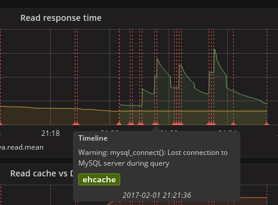
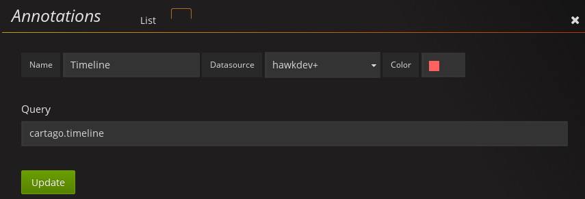
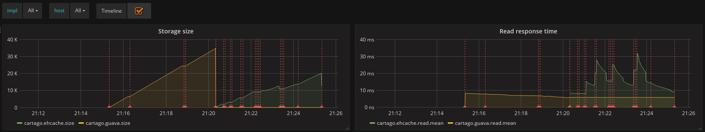
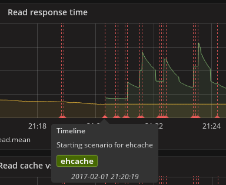

= Display custom events in Grafana
Joel Takvorian
2017-02-03
:jbake-type: post
:jbake-status: published
:jbake-tags: blog, metrics, grafana, events

The latest release of the link:https://github.com/hawkular/hawkular-grafana-datasource/releases/tag/v1.0.7[Hawkular Grafana plugin] (1.0.7) introduced a new feature, implementing link:http://docs.grafana.org/reference/annotations/[Grafana Annotations].

ifndef::env-github[]
image::/img/blog/2017/2017-02-03-annotations-tooltip-2.png[Logged error]
endif::[]
ifdef::env-github[]

endif::[]
_A logged error, associated with a tag_

In Grafana, annotations allow to display vertical bars on charts to illustrate an event in time, with a dedicated tooltip containing a custom text and eventually tags. All annotations are shared across graphs in a given dashboard.

In hawkular-metrics, events can be stored in link:http://www.hawkular.org/hawkular-metrics/docs/user-guide/#_metric_types[String metrics]. You can send string datapoints, just like you would send gauge or counter datapoints on other metrics. Simply note that these strings are currently limited to 2 KB weight.

As a concrete example, we will reuse the sample application that I described link:http://www.hawkular.org/blog/2017/01/16/hawkular-metrics-with-dropwizard.html[in a previous post], which creates metrics through dropwizard with the pretext of a small benchmarking scenario.
It will be modified to generate some events: scenario steps and error logs.

The scenario consisted in running two cache implementations (guava and ehcache), backed by a fake database, on which _get_ accesses are being monitored. We'll introduce random errors in DB access, that will be caught and logged to Hawkular.

To log events in Hawkular, we create a simple function that posts the event (ie. a timestamp plus a string) to a string metric, named here _"cartago.timeline"_. It also sets a tag that refers to the cache implementation that originated the event.

For simplicity, most configurable items are hard-coded here:

``` java
    private void logHawkularEvent(String text, String impl) {
        HttpClient client = HttpClientBuilder.create().build();
        HttpPost post = new HttpPost("http://127.0.0.1:8080/hawkular/metrics/strings/cartago.timeline/raw");
        post.setHeader("Hawkular-Tenant", "com.hawkular.sample");
        post.setHeader("Content-type", "application/json");
        post.setEntity(new StringEntity("[{\"timestamp\": " + Clock.defaultClock().getTime()
                + ", \"value\": \"" + text + "\", \"tags\": {\"impl\": \"" + impl
                + "\"}}]", Charset.defaultCharset()));
        try {
            client.execute(post);
        } catch (IOException e) {
            e.printStackTrace();
        }
    }
```

And the whole scenario:

``` java
    void runScenario(List<String> keys, Backend backend, String name) {
        // Log starting scenario
        logHawkularEvent("Starting scenario for " + name, name);

        // Init/register metrics
        registry.register(name + ".size", (Gauge<Long>) backend::count);
        Timer readTimer = registry.timer(name + ".read");

        // Scenario (which consists in getting values from cache during 5 minutes)
        ThreadLocalRandom rnd = ThreadLocalRandom.current();
        Stopwatch watch = Stopwatch.createStarted();
        while (watch.elapsed(TimeUnit.MINUTES) < 5) {
            try {
                int pos = rnd.nextInt(0, keys.size());
                final Timer.Context ctx = readTimer.time();
                try {
                    backend.get(keys.get(pos));
                } finally {
                    ctx.stop();
                }
            } catch (Exception e) {
                // Log any error to Hawkular
                logHawkularEvent(e.getMessage(), name);
            }
        }

        // Log ending scenario
        logHawkularEvent("Ending scenario for " + name, name);
    }
```

It's pretty much everything for our sample application.

Now let's switch to Grafana. From the _manage dashboard_ menu you can access the _Annotations_ settings to add a new one.
From there you can select your Hawkular datasource and provide in _query_ the name of the _String_ metric used in the applications:

ifndef::env-github[]
image::/img/blog/2017/2017-02-03-annotations-setup.png[Annotations setup]
endif::[]
ifdef::env-github[]

endif::[]

And that's it. Events sent to _cartago.timeline_ will be displayed on all charts of this dashboard:

ifndef::env-github[]
image::/img/blog/2017/2017-02-03-annotations-charts.png[Annotations charts]
endif::[]
ifdef::env-github[]

endif::[]

When passing the cursor over the events, a tooltip is displayed:

ifndef::env-github[]
image::/img/blog/2017/2017-02-03-annotations-tooltip-1.png[Starting scenario]
endif::[]
ifdef::env-github[]

endif::[]
_"Starting the scenario" event, with ehcache tag displayed_

So as you can see, annotations are a very simple way to show valuable information in Grafana.
In this example we send all our events on the same string metric, but of course it's possible to dispatch them on several ones, and thus configure several annotation queries in Grafana with different colors.
