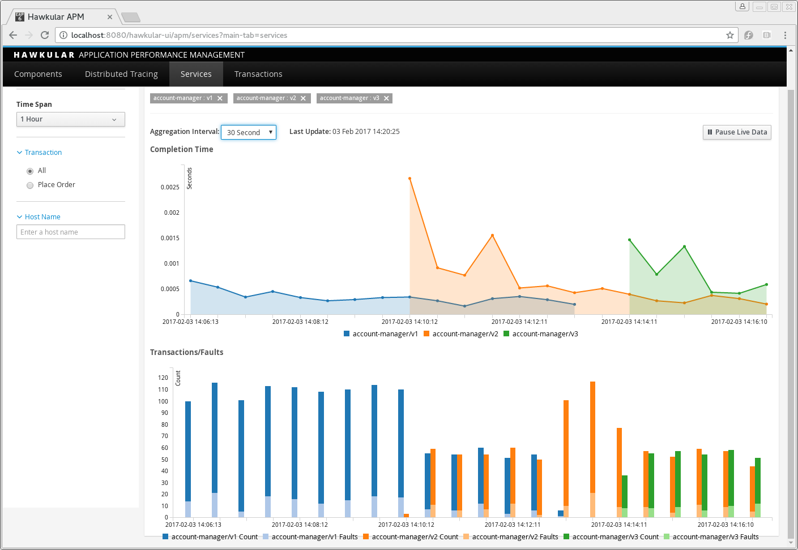

= Hawkular APM: Comparing performance of service versions
Gary Brown
2017-02-04
:jbake-type: post
:jbake-status: published
:jbake-tags: blog, apm, opentracing, openshift

With the release of https://github.com/hawkular/hawkular-apm/releases/tag/0.14.0.Final[0.14.0.Final on Hawkular APM] we have introduced a new feature in support of continuous deployment of microservices.
When a new version of a service is deployed, potentially as part of a deployment strategy (such as Canary, A/B, Blue/Green), it is important
to be able to assess the impact the new version of the service has in comparison to existing/previous versions.

The new "Services" tab in the UI provides just such a feature. When trace data is reported by the Hawkular APM OpenTracing provider (Java
or JavaScript), it identifies the service name and optional version (known as a buildStamp). When the services are deployed within OpenShift
the details are automatically obtained from the environment - however when running services outside of OpenShift, these values can be provided
as environment variables (_HAWKULAR_APM_SERVICE_NAME_ and _HAWKULAR_APM_BUILDSTAMP_ respectively).

At the top of the new page, you can select the service name and then a particular version (or _All_) to see the performance of that service/version
over the defined time span. The number of transactions and faults are also shown. Once the 'Add' button is pressed, the details will be displayed.

To perform a comparison with either the same service, but different version, or between different services - simply select their details and press
'Add' again. The combined information will be shown in the same charts, allowing direct comparison of their information.

The following image shows the deployment of three versions of the Account Manager service from the OpenTracing vertx example.
The first version of the service (shown in blue) is being used for a while before the second version (shown in orange) is introduced. After a while of running these versions together the first version is stopped. Then a third version (shown in green) is started and runs along side the second version.

The top chart shows that after the initial spikes when the new versions are first introduced, they settle down and perform at approximately the same levels.

The bottom chart shows the number of transactions, and the subset that resulted in a fault, for each of the three versions. As you can see, when the new versions are introduced, the invocations are split between available versions indicating the services are sharing the load. Using this technique, it would be possible to see whether a newer version is suffering from a greater level of errors than a precedessor.

ifndef::env-github[]
image::/img/blog/2017/2017-02-04-apm-service-deployment.png[Comparison of service/version information]
endif::[]
ifdef::env-github[]

endif::[]

If you need any assistance, feel free to join us via IRC at `#hawkular`
on Freenode.
