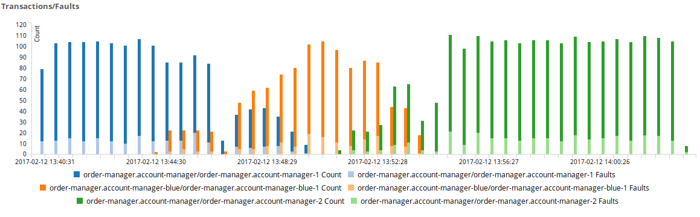
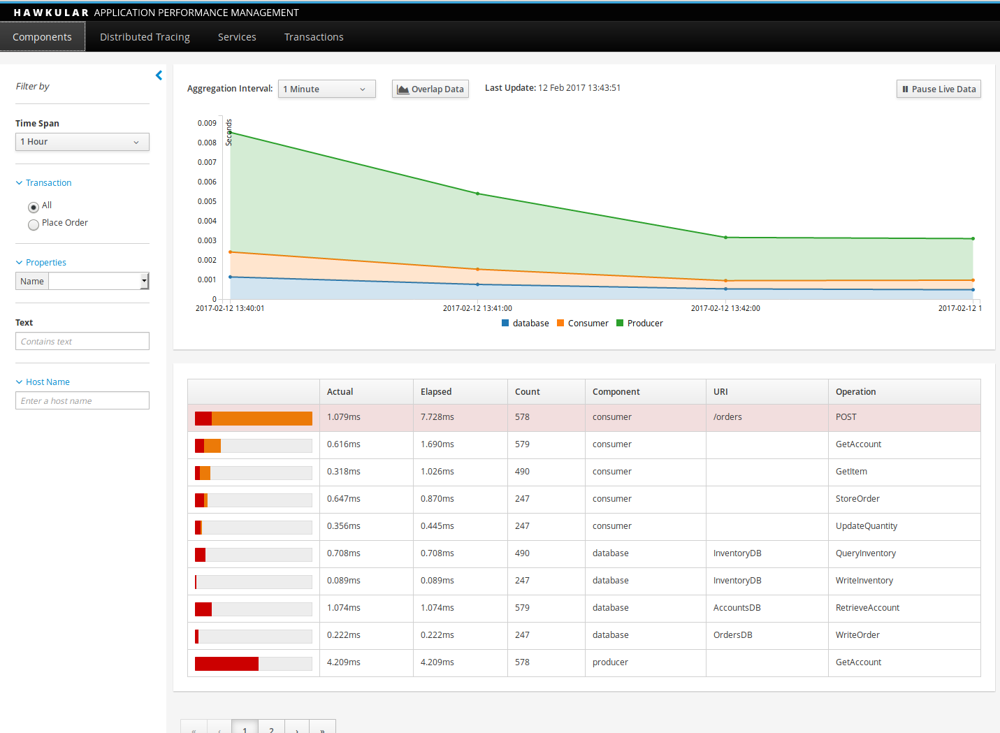
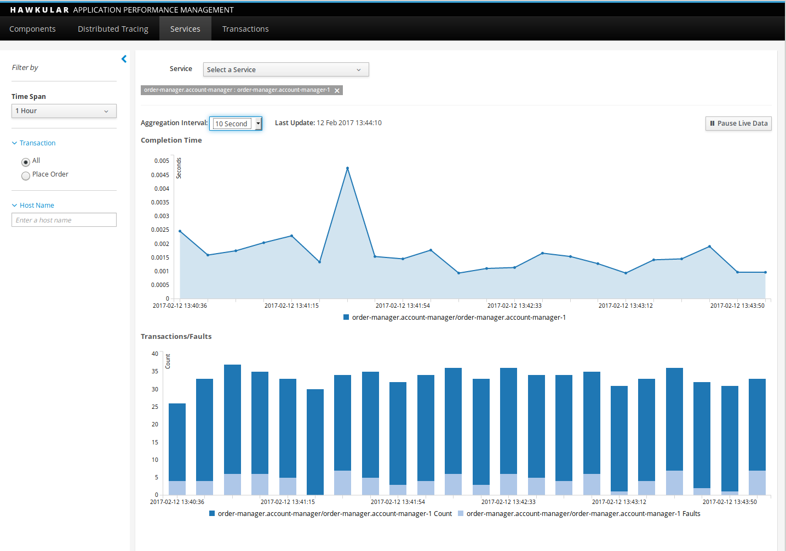
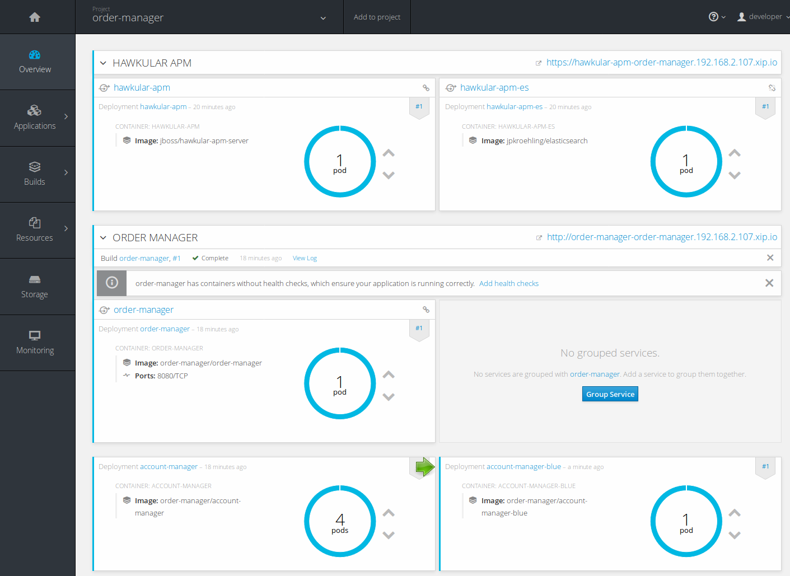
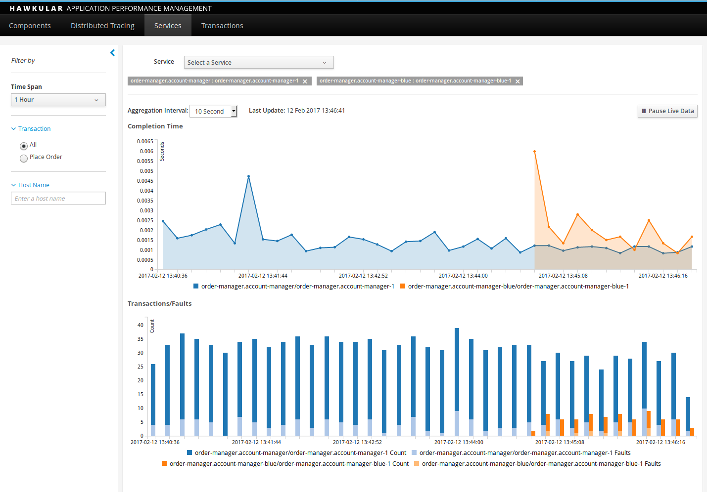
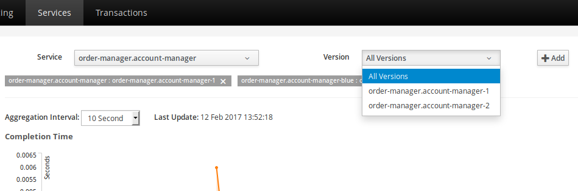
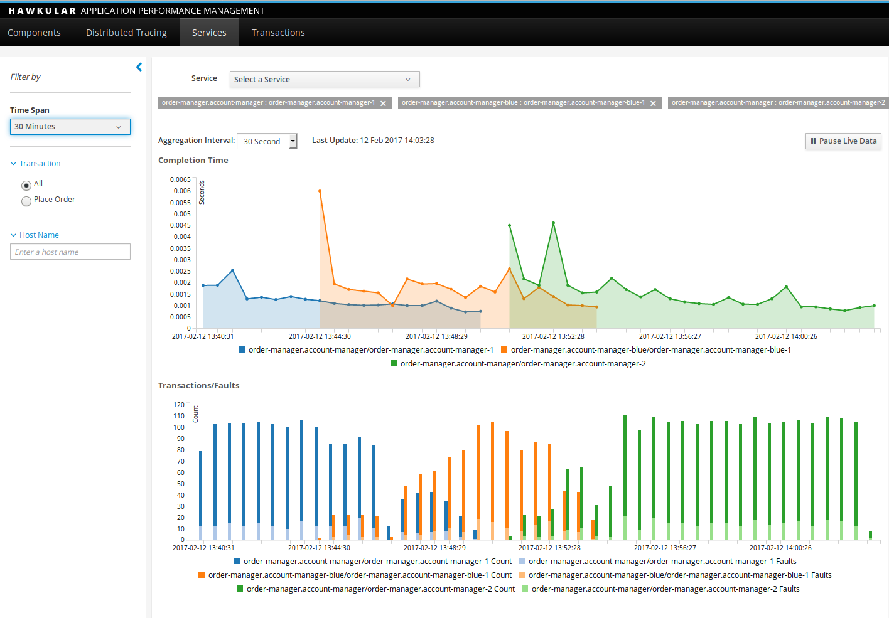

= Monitoring Canary Releases with Hawkular APM
Juraci Paixão Kröhling
2017-02-13
:jbake-type: post
:jbake-status: published
:jbake-tags: blog, apm, opentracing, vertx, openshift

In our last release, link:/blog/2017/02/04/hawkular-apm-service-deployments.html[we built a Services screen]
on top of a feature added a couple of releases ago, the "service name" and "build
stamps". These properties can be specified as an environment variable or system
property, and are automatically detected when the monitored application runs on
OpenShift.

ifndef::env-github[]
image::/img/blog/2017/2017-02-13-teaser.png[Bars comparing performance of different service versions]
endif::[]
ifdef::env-github[]

endif::[]

In this blog post, we'll show you how to use that screen to monitor a Canary release
scenario. https://martinfowler.com/bliki/CanaryRelease.html[A Canary] release
is a technique used to minimize downtime (and risk) between deployments by preparing
the new version on a completely different production environment and, once this new
version is ready to serve requests, redirect _some_ traffic from the "old" version
to the "new" version. If this new version looks good, it gradually replaces the
old version, eventually taking over all traffic. This technique builds on top of
the https://martinfowler.com/bliki/BlueGreenDeployment.html[Blue-Green] deployment
technique.

=== Getting the example running

We'll use our https://github.com/hawkular/hawkular-apm/tree/master/examples/vertx-opentracing[Vert.x OpenTracing example]
for this demo. First, let's deploy the example into OpenShift, along with Hawkular APM,
by running the following Ansible playbook:

```bash
$ ansible-playbook vertx-opentracing.yml
```

After a few minutes, it should print out the address for the Order Manager microservice,
like this:

```
TASK [Print out the order-manager address] *************************************
ok: [localhost] => {
    "msg": "The hostname for the Order Manager service is: http://order-manager-order-manager.192.168.2.107.xip.io"
}
```

At this point, change the `genorders.sh` script, to use this host instead of the
original `http://localhost:8180` on the `curl` command. It should then read:
`curl -X POST -H "Content-Type: application/json" -d "$data" http://order-manager-order-manager.192.168.2.107.xip.io/orders`.
Note that your hostname might be different than our example. You can then run
the `genorders.sh` script, which will simulate some random requests to the Order
Manager. The script will execute until it's cancelled with `Ctrl+C`, and should
have an output similar to this:

```
Creating an order for account=brian item=laptop quantity=3
{
  "accountId" : "brian",
  "itemId" : "laptop",
  "quantity" : 3,
  "id" : "d3f09a97-6f87-45c5-98c8-b592b6beb501"
}

Creating an order for account=sarah item=car quantity=4
Not account found

Creating an order for account=steve item=car quantity=2
{
  "accountId" : "steve",
  "itemId" : "car",
  "quantity" : 2,
  "id" : "7f095b1e-94a2-4398-8480-01aaea43e021"
}
```

Hawkular APM should be located under the service name `hawkular-apm`, so, the URL
follows the pattern: `https://hawkular-apm-order-manager.YOUR-IP.xip.io`. Note
that you'll need to change the `YOUR-IP` part.

After a few minutes with our `genorders.sh` script running, the following can be
seen:

ifndef::env-github[]
image::/img/blog/2017/2017-02-13-initial-apm-screen-with-data.png[Hawkular APM Dashboard with Data]
endif::[]
ifdef::env-github[]

endif::[]

Let's open the _Services_ tab, select the service _order-manager.account-manager_
and the _order-manager.account-manager-1_ version. These names are derived automatically
from the service name and deployment number provided by OpenShift. Let's select
an _Aggregation Interval_ of 10 seconds.

ifndef::env-github[]
image::/img/blog/2017/2017-02-13-single-service.png[Hawkular APM Services Tab with One Service]
endif::[]
ifdef::env-github[]

endif::[]

=== Introducing the Blue Deployment and the Canary Release

Now, we'll create a new build and new application for our "Blue" deployment. We
first set the current deployment to have 4 replicas, so that we'll have 80% of
the traffic going to the old version, and 20% going to the new one.

```bash
cd account-manager/
oc scale deploymentconfig account-manager --replicas=4
oc new-build --binary --name=account-manager-blue -l app=account-manager-blue
oc start-build account-manager-blue --from-dir=. --follow
oc new-app \
  account-manager-blue \
  -l app=account-manager-blue \
  HAWKULAR_APM_URI='http://hawkular-apm' \
  HAWKULAR_APM_USERNAME='admin' \
  HAWKULAR_APM_PASSWORD='password'
```

This is the expected output for the previous command:
```
--> Found image 3f61c6a (37 seconds old) in image stream account-manager-blue under tag "latest" for "account-manager-blue"

    * This image will be deployed in deployment config "account-manager-blue"
    * The image does not expose any ports - if you want to load balance or send traffic to this component
      you will need to create a service with 'expose dc/account-manager-blue --port=[port]' later

--> Creating resources with label app=account-manager-blue ...
    deploymentconfig "account-manager-blue" created
--> Success
    Run 'oc status' to view your app.
```

We should also have a new service displayed on OpenShift console. Note the new
_account-manager-blue_ deployment, with 1 pod.

ifndef::env-github[]
image::/img/blog/2017/2017-02-13-openshift-account-manager-services.png[OpenShift with Blue/Green deployments for Account Manager]
endif::[]
ifdef::env-github[]

endif::[]

Our Account Manager microservice is a Vert.x Verticle, and reacts on messages sent
to `AccountManager.getAccount`. As we are using a clustered event bus, our new
_account-manager-blue_ service will join the cluster and start replying to those
messages. The Vert.x clustered bus will take care of load balancing the processing
of the messages for us.

Because of that, we should already have some data being captured and reported to
our Hawkular APM server. On the _Services_ screen, add the new service _order-manager.account-manager-blue_,
version _order-manager.account-manager-blue-1_ to the graphic. It should then look similar
to this:

ifndef::env-github[]
image::/img/blog/2017/2017-02-13-account-manager-blue-added.png[Hawkular APM Services Tab with Blue and Green services]
endif::[]
ifdef::env-github[]

endif::[]

We should see the bar for our _blue_ deployment (orange bar on the image) to be
around a quarter the size of the old version (blue bar on the image). As the number
of errors is in line with what we expect, we can now reduce the traffic to the old
version by adding more replicas to the new version and decreasing replicas from
the old one:

```bash
oc scale deploymentconfig account-manager-blue --replicas=3
oc scale deploymentconfig account-manager --replicas=2
```

Let's leave it running for a minute or so, and we should see that the new version
is now responsible for processing around 60% of the traffic, while the old version
is now processing around 40%. If it still looks good, we'll make it 80%/20%:

```bash
oc scale deploymentconfig account-manager-blue --replicas=4
oc scale deploymentconfig account-manager --replicas=1
```

Eventually, we would want to decommission the old version:

```bash
oc scale deploymentconfig account-manager-blue --replicas=5
oc scale deploymentconfig account-manager --replicas=0
```

Let's now simulate a new build for our _Account Manager_ microservice, to be deployed
on the _green_ service (_account-manager_):

```bash
cd account-manager/
oc start-build account-manager --from-dir=. --follow
```

Once it's finished, we can direct some of the traffic to this new version:

```bash
oc scale deploymentconfig account-manager --replicas=1
oc scale deploymentconfig account-manager-blue --replicas=4
```

After a few seconds, we should see the new version as a valid option on our _Services_
screen:

ifndef::env-github[]
image::/img/blog/2017/2017-02-13-new-version-available.png[New Green version]
endif::[]
ifdef::env-github[]

endif::[]

Let's add it to the graphic, and watch the errors. If this version looks sane,
we can direct more traffic to it:

```bash
oc scale deploymentconfig account-manager --replicas=3
oc scale deploymentconfig account-manager-blue --replicas=2
```

And eventually, direct all traffic to it:
```bash
oc scale deploymentconfig account-manager --replicas=5
oc scale deploymentconfig account-manager-blue --replicas=0
```

On the next screenshot, we can infer the following from the graphic:

* We started with 100% traffic on _order-manager.account-manager-1_ (green deployment, blue bar)
* We directed some traffic to _order-manager.account-manager-blue-1_ (blue deployment, orange bar)
* We switched off _order-manager.account-manager-1_ (green deployment, blue bar)
* We deployed the new version _order-manager.account-manager-2_ (green deployment, green bar)
* We directed some traffic to _order-manager.account-manager-2_ (green deployment, green bar)
* We switched off _order-manager.account-manager-blue-1_ (blue deployment, orange bar)

ifndef::env-github[]
image::/img/blog/2017/2017-02-13-final.png[Final Result]
endif::[]
ifdef::env-github[]

endif::[]

=== Closing notes

On a real world scenario, the manual steps we did would be automated, potentially
making your Continuous Deployment scripts read data from Hawkular APM in order
to decide whether to scale up or down a canary release. Thanks to Vert.x, we were
able to completely abstract the load balancer, controlling the percentage of traffic
by adjusting the number of replicas on the Green/Blue deployments, but it's also
possible to achieve similar effects with other stacks. The http://bit.ly/msa-instructions[OpenShift Hello World Microservices Architecture]
shows another way this can be achieved.

Thanks to OpenShift, we were able to instantly see the performance of new versions,
comparing it with previous versions. Outside of OpenShift, we would be able to get
the same effect by properly setting the environment variables _HAWKULAR_APM_SERVICE_NAME_
and _HAWKULAR_APM_BUILDSTAMP_.

Try it out and let us know about your experiments! Should you face any issues, or
if you want to talk to us, join us at `#hawkular` on `irc.freenode.net`.
