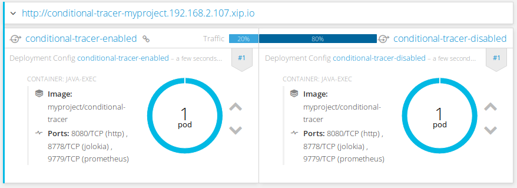
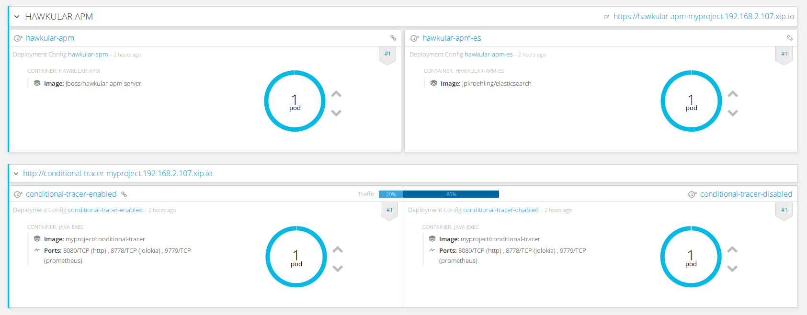
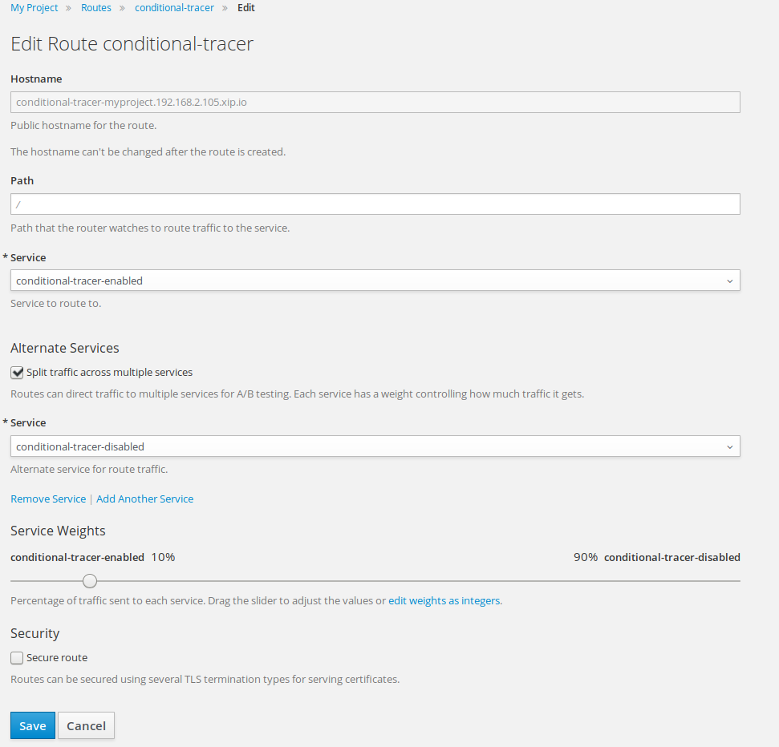

= Adjusting sampling rates for Hawkular APM on OpenShift
Juraci Paixão Kröhling
2017-03-22
:jbake-type: post
:jbake-status: published
:jbake-tags: blog, apm, opentracing, vertx, openshift, obsidian toaster

When doing distributed tracing of a busy application, it's a good practice
to limit the amount of data being collected or stored. The techniques for that
are diverse, ranging from a simple "percentage based sampling" of the
incoming requests, up to complex heuristics to keep/discard traces based on the
code path.

ifndef::env-github[]
image::/img/blog/2017/2017-03-22-teaser.png[Final result]
endif::[]
ifdef::env-github[]

endif::[]

It's also a good practice to empower the admin, or an automated monitoring system,
with the capability of adjusting the sampling based on the current conditions.
For instance, we'd probably want to get more traces from a
link:/blog/2017/02/13/monitoring-canary-deployments.html[newly deployed version]
of an existing application. We might want to compare the performance and adjust
the percentage in steps. Similarly, if we are experiencing traffic peaks and need
every resource available, we might enable tracing only to a small percentage of
the incoming requests.

For the simple scenario, let's call it "percentage based sampling", we have a few
alternatives on how to implement it:

=== Application-based decision

In this scenario, we embed the logic into the application, using the percentage
as the probability a random number is within a range. In other words: 20% sampling
would be 20% chance that a number is lower or equal to 2 on a range of 1-10.
Anything more complex than that would be "too much" for our scenario.

As hinted before, we want to externalize the percentage so that an external
actor can change this. One solution is to store this percentage number into an
environment variable on the Deployment Configuration (DC). This will, however,
rollout a new deployment after every change, which might not be desirable in some
scenarios.

Another solution is to externalize this into a Configuration Map (ConfigMap),
but then, we also need to let our application listen to events related to this
ConfigMap. For a microservice, we might end up with a bunch of unrelated
dependencies, just to decide whether or not to trace a request.

=== OpenShift-based decision

In this scenario, we delegate the decision to our runtime environment. Similar
to a simple A/B testing scenario, our deployment architecture would allow for
quick changes in the routing decision. It does require a simple change to our
application, but it's a small compromise for the benefits it provides.

For that, we'll use one single Image Stream (`is`) with our code, two Deployment
Configurations (`dc`), two Services (`svc`) and one Route object. Each one of our
`dc` objects would have a different value for an environment variable called
`TRACER_ENABLED`. Each `svc` has its own `dc`, and the router sends a
percentage of the requests to each of the `svc` instances. The main advantage of
this approach is that the application image is the same for both `tracing-enabled`
and `tracing-disabled` scenarios.

= Doing it!

Enough talk, let's start doing it. The first step is to create an OpenShift
cluster. The following commands will give us a recent version of OpenShift Origin
and will deploy Hawkular APM on it:

```bash
$ oc cluster up --version=latest
$ oc create -f https://raw.githubusercontent.com/jboss-dockerfiles/hawkular-apm/master/openshift-templates/hawkular-apm-server-deployment.yml
```

We'll now bootstrap a vert.x application from scratch via
link:http://start.prod-preview.openshift.io/[Obsidian Toaster]. For our example,
click on "... selecting a runtime project framework", select "Vert.x" and give
it a name like `conditional-tracer` (leave the package name as `com.example`
and the version as `1.0.0-SNAPSHOT`). On the next step, set the Vert.x version
to `3.3.3` and select `Vert.x Web`. Scroll down the list and click `Finish` and
download the ZIP file.

NOTE: Obsidian Toaster is still in alpha. If it's not working for some reason,
we have a ZIP file ready for you to download link:
ifndef::env-github[]
link:/data/blog/2017/2017-03-22-conditional-tracer.zip[conditional-tracer.zip]
endif::[]
ifdef::env-github[]
link:../../../../../assets/data/blog/2017/2017-03-22-conditional-tracer.zip[conditional-tracer.zip]
endif::[]

Let's add our Hawkular APM dependencies to our new project by adding the following
lines to the `pom.xml`:

```xml
<dependency>
  <groupId>org.hawkular.apm</groupId>
  <artifactId>hawkular-apm-trace-publisher-rest-client</artifactId>
  <version>0.14.2.Final</version>
</dependency>
<dependency>
  <groupId>org.hawkular.apm</groupId>
  <artifactId>hawkular-apm-client-opentracing</artifactId>
  <version>0.14.2.Final</version>
</dependency>
<dependency>
  <groupId>com.fasterxml.jackson.core</groupId>
  <artifactId>jackson-core</artifactId>
  <version>2.6.0</version>
</dependency>
<dependency>
  <groupId>com.fasterxml.jackson.core</groupId>
  <artifactId>jackson-annotations</artifactId>
  <version>2.6.0</version>
</dependency>
<dependency>
  <groupId>com.fasterxml.jackson.core</groupId>
  <artifactId>jackson-databind</artifactId>
  <version>2.6.0</version>
</dependency>
```

NOTE: we need to override the Jackson dependencies because of incompatibilities
between the version Hawkular APM uses and the one Vert.x uses.

We now remove the `src/main/fabric8/svc.yml`:

```bash
$ rm src/main/fabric8/svc.yml
```

We'll create two service files instead:

`src/main/fabric8/no-tracer-svc.yml`
```yaml
apiVersion: v1
kind: Service
metadata:
  name: conditional-tracer-disabled
  labels:
    tracer: disabled
spec:
  ports:
    - protocol: TCP
      port: 8080
      targetPort: 8080
  selector:
    group: com.example
    project: conditional-tracer
    tracer: disabled
  type: ClusterIP
```

`src/main/fabric8/tracer-svc.yml`
```yaml
apiVersion: v1
kind: Service
metadata:
  name: conditional-tracer-enabled
  labels:
    tracer: enabled
spec:
  ports:
    - protocol: TCP
      port: 8080
      targetPort: 8080
  selector:
    group: com.example
    project: conditional-tracer
    tracer: enabled
  type: ClusterIP
```

We now create our two `dc` objects:

`src/main/fabric8/no-tracer-dc.yml`
```yaml
apiVersion: v1
kind: DeploymentConfig
metadata:
  labels:
    group: com.example
    project: conditional-tracer
    tracer: disabled
  name: conditional-tracer-disabled
spec:
  replicas: 1
  selector:
    group: com.example
    project: conditional-tracer
    tracer: disabled
  template:
    metadata:
      labels:
        group: com.example
        project: conditional-tracer
        tracer: disabled
    spec:
      containers:
      - env:
        - name: HAWKULAR_APM_URI
          value: http://hawkular-apm
        - name: HAWKULAR_APM_USERNAME
          value: admin
        - name: HAWKULAR_APM_PASSWORD
          value: password
        - name: TRACER_ENABLED
          value: false
        - name: JAVA_APP_DIR
          value: /deployments
        - name: JAVA_MAIN_CLASS
          value: io.vertx.core.Launcher
        name: java-exec
        ports:
        - containerPort: 8080
          name: http
          protocol: TCP
      dnsPolicy: ClusterFirst
  triggers:
  - type: ConfigChange
  - imageChangeParams:
      automatic: true
      containerNames:
      - java-exec
      from:
        kind: ImageStreamTag
        name: conditional-tracer:latest
    type: ImageChange
```

`src/main/fabric8/tracer-dc.yml`
```yaml
apiVersion: v1
kind: DeploymentConfig
metadata:
  labels:
    group: com.example
    project: conditional-tracer
    tracer: enabled
  name: conditional-tracer-enabled
spec:
  replicas: 1
  selector:
    group: com.example
    project: conditional-tracer
    tracer: enabled
  template:
    metadata:
      labels:
        group: com.example
        project: conditional-tracer
        tracer: enabled
    spec:
      containers:
      - env:
        - name: HAWKULAR_APM_URI
          value: http://hawkular-apm
        - name: HAWKULAR_APM_USERNAME
          value: admin
        - name: HAWKULAR_APM_PASSWORD
          value: password
        - name: TRACER_ENABLED
          value: true
        - name: JAVA_APP_DIR
          value: /deployments
        - name: JAVA_MAIN_CLASS
          value: io.vertx.core.Launcher
        name: java-exec
        ports:
        - containerPort: 8080
          name: http
          protocol: TCP
      dnsPolicy: ClusterFirst
  triggers:
  - type: ConfigChange
  - imageChangeParams:
      automatic: true
      containerNames:
      - java-exec
      from:
        kind: ImageStreamTag
        name: conditional-tracer:latest
    type: ImageChange
```

And finally, we change our `route.yml` to alternate the requests among the
services:

`src/main/fabric8/route.yml`
```
apiVersion: v1
kind: Route
metadata:
  name: conditional-tracer
spec:
  alternateBackends:
  - kind: Service
    name: conditional-tracer-disabled
    weight: 80
  to:
    kind: Service
    name: conditional-tracer-enabled
    weight: 20
```

The only remaining change is within our Java code, to use a `NoopTracer` by
default, using a concrete tracer (`APMTracer`) if the environment variable
`TRACER_ENABLED` parses to `true`:

`src/main/java/com/example/MainVerticle.java`
```java
public class MainVerticle extends AbstractVerticle {
    private Tracer tracer = NoopTracerFactory.create();

    @Override
    public void start() {
        boolean tracerEnabled = Boolean.parseBoolean(System.getenv("TRACER_ENABLED"));
        if (tracerEnabled) {
            tracer = new APMTracer();
        }
        vertx.createHttpServer()
                .requestHandler((req) -> {
                    Span span = tracer.buildSpan("hello-world-request").start();
                    span.setTag("enabled", tracerEnabled);
                    req.response().end(String.format("Hello World! Are we tracing this request? %s", System.getenv("TRACER_ENABLED")));
                    span.finish();
                })
                .listen(8080);
    }
}
```

At this point, we are ready to test it! As we already have an OpenShift cluster
running with our Hawkular APM server, we just need to run:

```bash
$ mvn clean fabric8:deploy
```

Once the build finishes running, we should see the following on OpenShift's Web
Console:

ifndef::env-github[]
image::/img/blog/2017/2017-03-22-final-result.png[Final result]
endif::[]
ifdef::env-github[]

endif::[]

To check whether our tracing is working, we can use a script like this:

```bash
$ export URL="http://conditional-tracer-myproject.192.168.2.107.xip.io"
$ for i in `seq 1 10` ; do curl ${URL} 2>/dev/null | awk '{print $NF}' ; done | sort | uniq -c
```

An output similar to this one should be printed out:

```
8 false
2 true
```

This means that 8 didn't have their traces published and two requests had
their traces published to Hawkular APM. You can check that by logging into Hawkular
APM (username: `admin`, password: `password`) and looking into the
`Distributed Tracing` screen. There should be only two traces there.

TIP: You might be tempted to try opening the URL in your browser and hitting
refresh, but you'll notice that the OpenShift router tries to send you to the same
backend service all the time. For this reason, it makes more sense to test on
the command line with `curl`.

From this point and on, we can adjust the percentage by changing the route. One
way to do that is by issuing the command `oc edit route conditional-tracer`,
or by navigating on the UI to `Applications - Routes - conditional-tracer -
Actions - Edit`:

ifndef::env-github[]
image::/img/blog/2017/2017-03-22-edit-route.png[Final result]
endif::[]
ifdef::env-github[]

endif::[]

== Wrapping up

Deciding whether a transaction should be traced or not is a decision that should
be outsourced as much as possible to the underlying Tracer, possibly with data
coming from different sources. Having a simple switch on the code loading the
Tracer, however, might prove invaluable to admins in determined situations.
Given the simplicity of this solution, there's no reason not to have it!

The full source code for this example can be found at
link:https://github.com/hawkular/conditional-tracer[github.com/hawkular/conditional-tracer].
