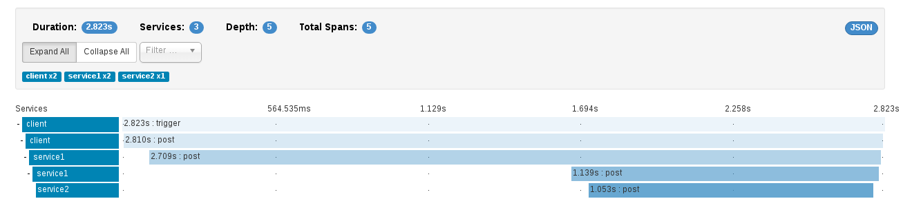

= Distributed Tracing with Apache Camel and OpenTracing
Gary Brown
2017-03-24
:jbake-type: post
:jbake-status: published
:jbake-tags: blog, apm, opentracing, apache, camel

In this post we will discuss how the http://opentracing.io/[OpenTracing standard] is being supported in the upcoming release of Apache Camel (version 2.19).

OpenTracing is the vendor neutral open standard for distributed tracing, supported across many languages and with a growing number of tracer implementations and framework integrations.

ifndef::env-github[]
image::/img/blog/2017/2017-03-24-camel-loanbroker-jms-instance.png[caption="Figure 1: ", title="Distributed trace for the Camel Loan Broker JMS example"]
endif::[]
ifdef::env-github[]

endif::[]

=== How to Instrument a Camel Application

The first thing to note is that it is not necessary to modify the Camel routes to have them instrumented using an OpenTracing compliant Tracer. The only requirement is to add some relevant dependencies and initialize the tracer on the `CamelContext`.

This can be achieved in three ways:

==== Explicit initialization

The dependencies required to explicitly initialize OpenTracing are

```xml
    <dependency>
      <groupId>org.apache.camel</groupId>
      <artifactId>camel-opentracing</artifactId>
    </dependency>
```

and any other dependencies specific to the OpenTracing compliant Tracer implementation being used.

Then either add the initialization of the tracer to the spring configuration,

```xml
  <bean id="tracer" class="..."/>

  <bean id="ottracer" class="org.apache.camel.opentracing.OpenTracingTracer">
    <property name="tracer" ref="tracer"/>
  </bean>
```

or create an observer on the `CamelContextStartingEvent` to trigger the initialization of the tracer,

```java
@ContextName("....")
public class MyApplication {
    public void setupCamel(@Observes CamelContextStartingEvent event) {
	// Location for initializing the Tracer if not implicitly loaded
        OpenTracingTracer ottracer = new OpenTracingTracer();
        ottracer.init(event.getContext());
    }
}
```


See the https://github.com/apache/camel/tree/master/examples/camel-example-opentracing/client[camel-opentracing example client application] for an example.

==== Spring Boot Annotation

The dependencies required to use OpenTracing in a Spring Boot application are simply

```xml
    <dependency>
      <groupId>org.apache.camel</groupId>
      <artifactId>camel-opentracing-starter</artifactId>
    </dependency>
```

and any other dependencies specific to the OpenTracing compliant Tracer implementation being used. Then simply annotate the application using `CamelOpenTracing`:

```java
@SpringBootApplication
@CamelOpenTracing
public class MyApplication {
    public static void main(String[] args) {
	// Location for initializing the Tracer if not implicitly loaded
        SpringApplication.run(MyApplication.class, args);
    }
}
```

See the https://github.com/apache/camel/tree/master/examples/camel-example-opentracing/service1[camel-opentracing example service1 application] for an example.

==== Java Agent

This approach uses a `javaagent` to handle the initialization, so does not require any code/configuration changes. The dependencies required are:

```xml
    <dependency>
      <groupId>org.apache.camel</groupId>
      <artifactId>camel-opentracing</artifactId>
    </dependency>
    <dependency>
      <groupId>io.opentracing.contrib</groupId>
      <artifactId>opentracing-agent</artifactId>
      <scope>provided</scope>
    </dependency>
```

Changes are also required in the `pom.xml` to download the `opentracing-agent.jar` and then execute the application supplying the java agent on the command line.

See the https://github.com/apache/camel/tree/master/examples/camel-example-opentracing/service2[camel-opentracing example service2 application] for an example.

=== Instrumenting Some Examples

This section will show how two examples can be instrumented using two different OpenTracing compliant Tracer implementations.

The first is a new example introduced to demonstrate the three ways a Camel application can be instrumented with OpenTracing, and will be updated to use the http://zipkin.io/[Zipkin] project.

The second shows how an existing example (Loan Broker JMS) can be instrumented using the http://www.hawkular.org/hawkular-apm/[Hawkular APM] project.

'''

==== Camel OpenTracing Example

This section will show how the new example, which uses a simple _logging_ tracer implementation by default, can be changed to use Zipkin.

First edit each of the client/service1/service2 `pom.xml` files to:

* Add properties

```xml
  <properties>
    ...
    <version.brave.opentracing>0.18.3</version.brave.opentracing>
    <version.zipkin.reporter>0.6.12</version.zipkin.reporter>
  </properties>
```

* Replace the `camel-example-opentracing-loggingtracer` dependency with:

```xml
    <dependency>
      <groupId>io.opentracing.brave</groupId>
      <artifactId>brave-opentracing</artifactId>
      <version>${version.brave.opentracing}</version>
    </dependency>
    <dependency>
      <groupId>io.zipkin.reporter</groupId>
      <artifactId>zipkin-sender-urlconnection</artifactId>
      <version>${version.zipkin.reporter}</version>
    </dependency>
```

* Common code for ClientApplication Service1Application and ServiceApplication

```java
import brave.opentracing.BraveTracer;
import io.opentracing.Tracer;
import io.opentracing.contrib.global.GlobalTracer;
import zipkin.Span;
import zipkin.reporter.AsyncReporter;
import zipkin.reporter.Reporter;
import zipkin.reporter.urlconnection.URLConnectionSender;

....

    public static void initTracer() {
        System.out.println("Using Zipkin Tracer");
        String zipkinServerUrl = String.format("%s/api/v1/spans", System.getenv("ZIPKIN_SERVER_URL"));
        Reporter<Span> reporter = AsyncReporter.builder(URLConnectionSender.create(zipkinServerUrl)).build();
        brave.Tracer tracer = brave.Tracer.newBuilder().localServiceName("client").reporter(reporter).build();
        GlobalTracer.register(BraveTracer.wrap(tracer));
    }
```

* Invoking the `initTracer` method

** In `ClientApplication.java` it should be called at the end of the `setupCamel` method.

** In `Service1Application.java` it should be called before the `SpringApplication.run` method.

** In `Service2Application.java` it should be called as the first statement in the `main` method.


Once the changes have all been made, compile the example using `mvn compile` from the `examples/camel-example-opentracing` folder. Next step is to start the Zipkin server:

```bash
docker run -p 9411:9411 openzipkin/zipkin
```

Then follow the instructions in the REAMDE.md for running the three applications. Before running each command, you will need to run:

```bash
export ZIPKIN_SERVER_URL=http://localhost:9411
```

After the example has executed, start up the http://localhost:9411/[Zipkin UI] in a brower. Select the `client` service and you should see some traces:

ifndef::env-github[]
image::/img/blog/2017/2017-03-24-camel-opentracing-example-zipkin.png[caption="Figure 2: ", title="Zipkin trace instance showing communication between client, service1 and service2"]
endif::[]
ifdef::env-github[]

endif::[]

'''

==== Camel Loan Broker JMS Example

The standard example can be found in `examples/camel-example-loan-broker-jms` folder within the Apache Camel source code. To enable tracing, against the Hawkular APM server, you still need to edit the `pom.xml` based on the
ifndef::env-github[]
link:/data/blog/2017/2017-03-24-loanbroker-apm.patch[differences shown here]
endif::[]
ifdef::env-github[]
link:../../../../../assets/data/blog/2017/2017-03-24-loanbroker-apm.patch[differences shown here]
endif::[]
. This patch file can be used to quickly update the example.

These differences are can be broken down into three main changes:

* Added dependencies, including the `camel-opentracing` component, `opentracing-agent` and `hawkular-apm` (OpenTracing client and REST client publisher)
* Retrieval of the `opentracing-agent.jar`, which is placed in a local `lib` folder for subsequent use
* Changes to the `exec-maven-plugin` configuration to enable the services to be started with the `opentracing-agent.jar` (using `mvn exec:exec` instead of `mvn exec:java`)

To try out the example, it is first necessary to start the Hawkular APM server:

```bash
docker run -p 8180:8080 jboss/hawkular-apm-server-dev
```

The next step is to open up two command windows and setup the environment variables in each:

```bash
export HAWKULAR_APM_USERNAME=admin
export HAWKULAR_APM_PASSWORD=password
export HAWKULAR_APM_URI=http://localhost:8180
```

Then run the following in the first window:

```bash
mvn compile
mvn exec:java -PQueue.LoanBroker
```

Once fully started, then run the following in the second window:

```bash
mvn exec:java -PQueue.Client
```

After the client has finished, open a http://localhost:8180[browser window] and log in using username `admin` password `password`, and view the _Distributed Tracing_ page to view the dependencies between the JMS endpoints:

ifndef::env-github[]
image::/img/blog/2017/2017-03-24-camel-loanbroker-jms-dependencies.png[caption="Figure 3: ", title="Service endpoint dependencies for the loan broker JMS example"]
endif::[]
ifdef::env-github[]

endif::[]

Selecting the _Show 1 Instance(s) Details_ button will show the trace instance shown in Figure 1 above.

'''

=== Summary

This post has shown how OpenTracing can be used to provide distributed tracing capabilities for Camel applications. This capability will be introduced in version 2.19 of Apache Camel, but we would encourage anyone interested in this functionality to obtain a snapshot version to try it out. If you find any issues, or would like additional capabilities prior to the release, then please get in touch.


