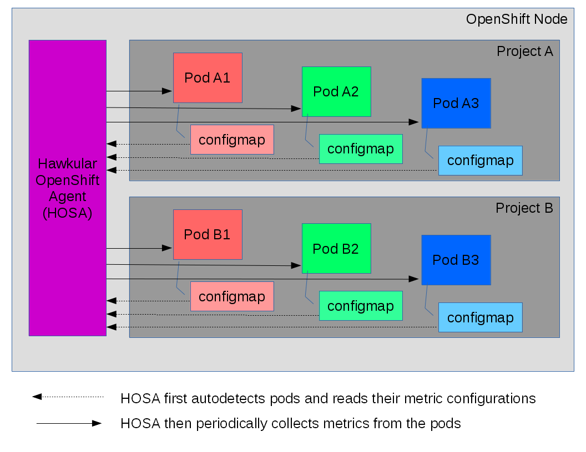
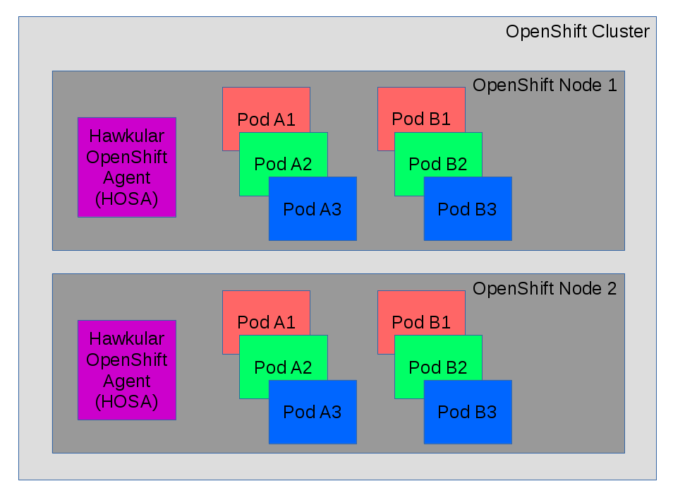
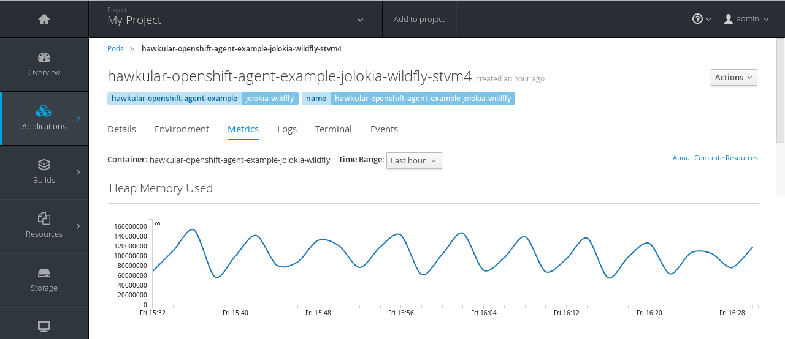

= Collecting Application Metrics Within OpenShift
John Mazzitelli
2017-03-25
:jbake-type: post
:jbake-status: published
:jbake-tags: blog, agent, metrics, openshift, hosa, prometheus, jolokia

== Introducing Hawkular OpenShift Agent

Hawkular supports the collection of application metrics within an OpenShift cluster via the Hawkular OpenShift Agent (HOSA). Metrics are stored in the OpenShift-provided Hawkular-Metrics storage facility providing out-of-box, scalable long term storage of metric data allowing for future analytics of your performance data in additional to graphing recent data within the OpenShift UI Console. Alerting on metric data is also provided via the Hawkular-Alerts component within Hawkular-Metrics.

HOSA provides ease-of-use for end customers of OpenShift since once HOSA is deployed in a node, the only thing pod developers need to do to collect and store their metrics as well as display them in the OpenShift console is to publish a configmap declaring what metrics that pod wants collected.

HOSA dynamically discovers pods when they are deployed in the node (regardless of what project they are in). HOSA will automatically begin collecting metrics from the discovered pods. Metric collection is opt-in - only those pods that declare a specific config map containing HOSA metric configuration will have their metrics collected by HOSA. This allows pod developers to choose what they want to collect and how often they want them collected.

Pods may expose their metric data as either Prometheus endpoints (using either the binary or text formats), Jolokia/JMX endpoints (using Jolokia's REST API), or as simple JSON documents (as is how, for example, Go's expvar data is exposed).

HOSA tags each metric with name/value pairs for easy querying and graphing. In addition to the tags defined specifically by HOSA itself, pod developers can attach their own custom tags to their metrics allowing for further customization of the metadata attached to each metric.

ifndef::env-github[]
image::/img/blog/2017/2017-03-25-hosa-on-openshift-node.png[caption="Figure 1: ", title="Hawkular OpenShift Agent Monitoring Pods on an OpenShift Node"]
endif::[]
ifdef::env-github[]

endif::[]

ifndef::env-github[]
image::/img/blog/2017/2017-03-25-hosa-on-openshift-cluster.png[caption="Figure 2: ", title="Hawkular OpenShift Agent Monitoring Pods on an OpenShift Cluster"]
endif::[]
ifdef::env-github[]

endif::[]

== Installation

To install HOSA, you can use the latest release published on https://hub.docker.com/r/hawkular/hawkular-openshift-agent/tags/[Docker Hub]. HOSA can be deployed in your OpenShift node as a daemon set. For example, here is an https://github.com/hawkular/hawkular-openshift-agent/blob/master/deploy/openshift/hawkular-openshift-agent.yaml[OpenShift YAML template] along with its https://github.com/hawkular/hawkular-openshift-agent/blob/master/deploy/openshift/hawkular-openshift-agent-configmap.yaml[config map configuration] which you can use to deploy HOSA.

HOSA requires additional roles in order to function - you must have the rights to give HOSA its additional roles. Without these additional roles, HOSA will not operate properly.

To deploy HOSA:

1. `oc create -f https://github.com/hawkular/hawkular-openshift-agent/blob/master/deploy/openshift/hawkular-openshift-agent-configmap.yaml[deploy/openshift/hawkular-openshift-agent-configmap.yaml] -n default`
2. `oc process -f https://github.com/hawkular/hawkular-openshift-agent/blob/master/deploy/openshift/hawkular-openshift-agent.yaml[deploy/openshift/hawkular-openshift-agent.yaml] -v IMAGE_VERSION=latest | oc create -n deafult -f -`
3. `oc adm policy add-cluster-role-to-user hawkular-openshift-agent system:serviceaccount:default:hawkular-openshift-agent`

Or, if you wish, clone the https://github.com/hawkular/hawkular-openshift-agent.git[HOSA github repo] and run `make openshift-deploy` and it will run the commands you need to deploy. You first must log into OpenShift via `oc login` prior to running that `make` command.

== Defining Application Metrics To Be Collected

HOSA is only installed by the OpenShift administrator and only one need be installed per node. Once installed, the only thing for pod developers to do in order for HOSA to begin collecting application metrics (and thus allowing the OpenShift Console to graph their data) is to create a config map that defines the metrics that are to be collected.

NOTE: In order to declare to HOSA which config map to use, the pod must configure a volume named "hawkular-openshift-agent" which refers to the config map. For more details on this, consult one of the example yamls or see the https://github.com/hawkular/hawkular-openshift-agent/blob/master/README.adoc#pod-volumes[HOSA README].

A pod may have one or more endpoints exposing one or more metrics. HOSA can collect any number of metrics from any number of endpoints from any number of pods from any number of projects within the node. Note that HOSA is configured to limit the number of metrics any one pod may ask to be collected - this is to avoid a "pod hog" who asks HOSA to collect large amounts of data. HOSA will thus limit the amount of resources any one pod can use for metric storage.

Here's what a pod config map can look like - this tells HOSA to collect all metrics from the pod's Prometheus endpoint:

```
endpoints:
- type: prometheus
  protocol: http
  port: 8181
  path: /metrics
  collection_interval: 30s
```

Here's what a pod config map can look like if the pod emits Jolokia/JMX metrics:

```
endpoints:
- type: jolokia
  protocol: http
  port: 8778
  path: /jolokia/
  collection_interval: 15s
  metrics:
  - name: java.lang:type=OperatingSystem#OpenFileDescriptorCount
    type: gauge
    description: Open File Descriptor Count
  - name: java.lang:type=Memory#HeapMemoryUsage#*
    type: gauge
    description: Heap Memory Used ${2}
    units: B
  - name: jboss.as:subsystem=datasources,data-source=*,statistics=jdbc#*
    type: gauge
    description: Data Source ${data-source} JDBC Statistic ${1}
```

== Examples

There are several examples published in the HOSA git repo and docker hub to see how different types of metrics can be configured.

* A pod deployed with a Python application that emits metrics via a Prometheus endpoint:
** Source: https://github.com/hawkular/hawkular-openshift-agent/tree/master/examples/prometheus-python-example
** Image on Docker Hub: https://hub.docker.com/r/hawkular/hawkular-openshift-agent-example-prometheus-python

* A pod deployed with a WildFly application server that emits metrics via a secured Jolokia/JMX endpoint:
** Source: https://github.com/hawkular/hawkular-openshift-agent/tree/master/examples/jolokia-wildfly-example
** Image on Docker Hub: https://hub.docker.com/r/hawkular/hawkular-openshift-agent-example-jolokia-wildfly/

* A pod deployed with a Python application that emits metrics over several Prometheus endpoints:
** Source: https://github.com/hawkular/hawkular-openshift-agent/tree/master/examples/multiple-endpoints-example
** Image on Docker Hub: https://hub.docker.com/r/hawkular/hawkular-openshift-agent-example-multiple-endpoints/

* A pod deployed with a Go application that emits metrics in a JSON document (using Go's expvar feature):
** Source: https://github.com/hawkular/hawkular-openshift-agent/tree/master/examples/go-expvar-example
** Image on Docker Hub: https://hub.docker.com/r/hawkular/hawkular-openshift-agent-example-go-expvar/

To see HOSA collect metrics from these example pods, deploy one or more of these in OpenShift. If you git cloned the HOSA git repo, you can use the Makefiles in the example directories to deploy them - within an example directory, run `make openshift-deploy`.

Once HOSA is collecting and storing your application metrics, the OpenShift Console will display graphs of your data in the pod's Metrics tab:

ifndef::env-github[]
image::/img/blog/2017/2017-03-25-hosa-os-ui.png[caption="Figure 3: ", title="OpenShift Application Metrics Collected and Stored By Hawkular"]
endif::[]
ifdef::env-github[]

endif::[]

== For More Details

Take a look at the https://github.com/hawkular/hawkular-openshift-agent/blob/master/README.adoc[HOSA README file] for more details. You may ask questions in the #hawkular chat room on freenode IRC or send an email to the https://lists.jboss.org/mailman/listinfo/hawkular-dev[hawkular-dev mailing list].

You can also check out an earlier blog on this topic - http://www.hawkular.org/blog/2017/01/17/obst-hosa.html[Monitoring Microservices on Openshift with the Hawkular Openshift Agent]
