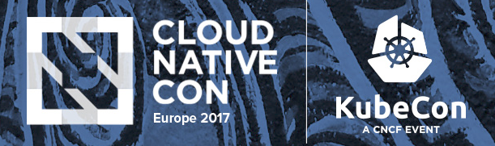

= CloudNativeCon summary
Juraci Paixão Kröhling
2017-04-07
:jbake-type: post
:jbake-status: published
:jbake-tags: blog, apm, opentracing, cloudnativecon

CloudNativeCon happened last week in Berlin and Hawkular APM was represented there
with a talk, link:https://www.youtube.com/watch?v=utCOfSz202o["Operational and Business Insights from Tracing Distributed Microservices"].
Here's a short summary of the event, with a focus on OpenTracing.

ifndef::env-github[]
image::/img/blog/2017/2017-04-07-teaser.png[CloudNativeCon logo]
endif::[]
ifdef::env-github[]

endif::[]

This event was co-located with KubeCon and as you would expect, pretty much
everything revolved around Kubernetes. There were quite a few tracing vendors
with booths and/or in the audience: Instana, DataDog, Dynatrace, Sysdig,
CA Technologies, among others. It was a great opportunity to talk to them,
watch each others demos, exchange ideas and invite them to the OpenTracing
community. A few of them have components which are similar in purpose to some that
we are developing as part of "opentracing-contrib" and would be the perfect opportunity
for a collaboration!

After the talk, we were able to answer some questions around OpenTracing and
Hawkular APM. Those with good questions got
link:https://pbs.twimg.com/media/C8EgCvzXkAIsr8L.jpg:large["data containers and books"].
There was also quite some interest in OpenShift: most people knew about it already and
among those who didn't, most seemed impressed by its user interface once presented to it.

On the last day, there was a Distributed Tracing Salon: in this workshop, people
were able to get started with OpenTracing by using a demo application written in
Go and adding instrumentation to it. The final goal was to see the traces on
Zipkin's user interface, and I believe most participants reached the goal! Those
who didn't could continue working on it after the workshop, as the
link:https://github.com/tedsuo/ot-walkthrough-go[source code] is available on GitHub.

It was also a great opportunity to meet some OpenTracing members from LightStep,
and I made sure to smuggle a few stickers and T-Shirts back to Munich, to be distributed
during meetup talks there. All the videos from this conference, including the
ones from the OpenTracing track, can be watched on
link:https://www.youtube.com/playlist?list=PLj6h78yzYM2PAavlbv0iZkod4IVh_iGqV[YouTube].

Some interesting topics were brought up during the conference, a few of them more than once:

* What's the overhead? Hint: As OpenTracing is a specification and API, the
overhead is dependent on the concrete implementation.
* Multiplexer: sending traces to more than one backend seems to be a common use-case.
* Should the "wire transport" be part of the specification?
* Should an export format, like `pcap`, be part of the specification?
* What can be used for "reacting" on data (alerting)? Hint:
link:http://www.hawkular.org/community/docs/developer-guide/alerts.html[Hawkular Alerts ]
is a great alternative and can be used as a standalone solution!

And you, what's your opinion on the questions related to the specification?
link:http://opentracing.io[Join the OpenTracing community] and make your opinion count!
