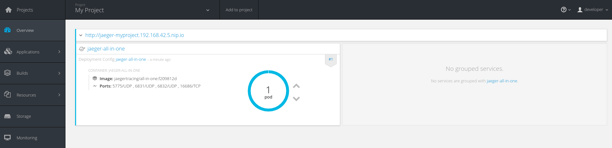

= Kubernetes and OpenShift Templates for Jaeger
Pavol Loffay
2017-5-25
:icons: font
:jbake-type: post
:jbake-status: published
:jbake-tags: blog, apm, tracing, jaeger

I am happy to announce that we have made it easier to deploy Jaeger on Kubernetes.
This work has been carried out in a new github organization https://github.com/jaegertracing[Jaegertracing]
established to contain contributions for the Jaeger ecosystem. At the moment this organization holds
repositories for Kubernetes and OpenShift templates.

Currently, we provide templates for deploying an all-in-one distribution. These bits are designed for demo
and test purposes since they use only in-memory database. Be careful and do not use it in production!
More sophisticated templates using a pure microservice approach and Cassandra storage will be available soon.

The templates have been tested against minikube and minishift using an excellent integration testing framework
https://github.com/arquillian/arquillian-cube[Arquillian Cube].

ifndef::env-github[]
image::/img/blog/2017/jaeger-openshift.png[caption="Figure 1: ", title="Jaeger deployed on OpenShift"]
endif::[]
ifdef::env-github[]

endif::[]

== Links
 * Kubernetes templates: https://github.com/jaegertracing/jaeger-kubernetes
 * Openshift templates: https://github.com/jaegertracing/jaeger-openshift

