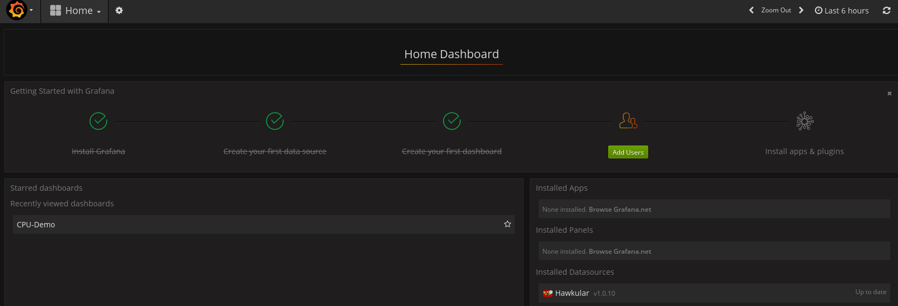
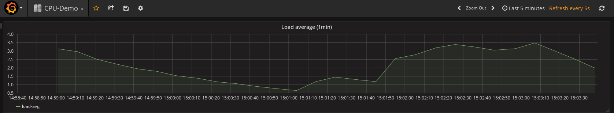
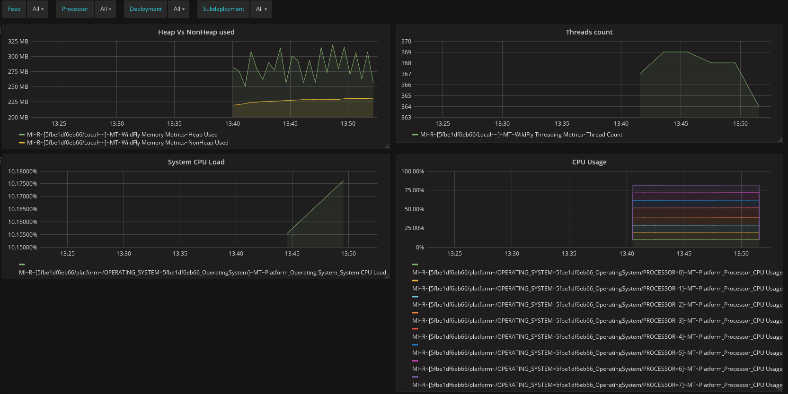
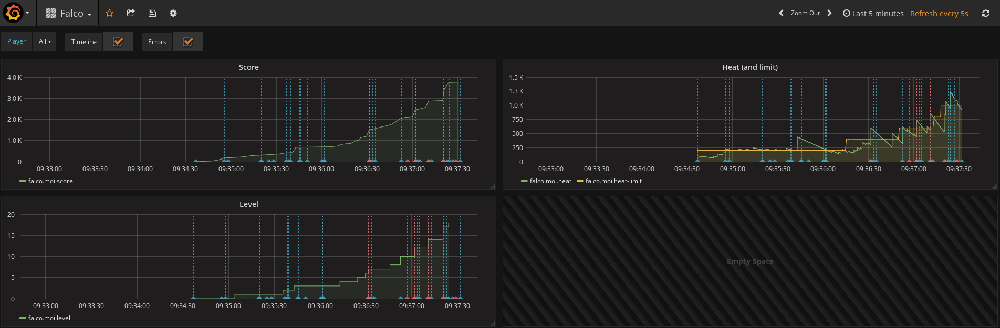
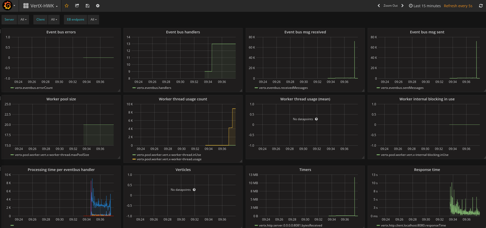

= Hawkular and Grafana Out of the Box
Joel Takvorian
2017-05-31
:jbake-type: post
:jbake-status: published
:jbake-tags: blog, metrics, grafana, docker, vertx
:figure-caption!:

link:https://github.com/jotak/hawkular-grafana-outofthebox[Hawkular and Grafana Out of the Box] is a new way to quickly setup Hawkular and Grafana together with very little work.

Assuming you already have docker installed and recent enough (you need at least Compose 1.6.0 and Docker Engine 1.10.0),
you're just 2 lines of YAML edition and a `docker-compose up` away from having Hawkular + Grafana running and pre-configured.

NOTE: It is NOT intended for production/long-term usage unless you do some extra work to make it secured.

== How does it work?

Let's have a look to the docker-compose file:

[source,yaml]
.docker-compose.yml
----
version: '2' # <1>
services:
  hawkular:
    image: "hawkular/hawkular-services:latest" # <2>
    ports:
      - "8080:8080"
      - "8443:8443"
      - "9990:9990"
    # volumes: # <3>
    #   - /tmp/opt/hawkular/server:/opt/data:Z
    environment:
      - CASSANDRA_NODES=hawkular-cassandra
      - ADMIN_TOKEN
      - HAWKULAR_AGENT_ENABLE=false # <4>
  hawkular-cassandra: # <5>
    image: cassandra:3.0.9
    environment:
      - CASSANDRA_START_RPC=true
  grafana: # <6>
    image: "hawkular/hawkular-grafana-datasource:latest"
    ports:
      - "3000:3000"
  bootstrap: # <7>
    image: "jotak/hawkular-grafana-bootstrap:latest"
    environment:
      - TENANT=put_your_tenant_here
      - DASHBOARDS=put_dashboard_file_names_here
----
<1> Docker-compose format v2 brings some networking improvements that proved to be useful here, that's why you'll need docker 1.10.0+ and docker-compose 1.6.0+.
<2> Using the official Hawkular Services image. Accessible on http://localhost:8080/hawkular/metrics or http://localhost:8080/hawkular/alerts, with credentials _jdoe_/_password_.
<3> The volume is commented-out, so data is not persisted if you run `docker-compose down`. To persist data, uncomment these lines and eventually set something different than `/tmp/opt/hawkular/server` as the host directory. Make sure this directory exists on your host.
<4> The Hawkular agent is disabled by default, which means Hawkular is not self-monitored. You can enable it if you want, and use the `hawkular-self` dashboard.
<5> The Cassandra node. Note that it's not exposed outside of the compose's subnetwork.
<6> The Grafana server with pre-installed Hawkular plugin, accessible on http://localhost:3000, with credentials _admin_/_admin_
<7> This image contains a bootstrap script that configures a Grafana datasource with the `TENANT` defined as environment variable, which is also injected in dashboard templates defined here (`DASHBOARDS`). Those dashboards are sent to Grafana through its REST API. Current available dashboard templates are listed below.

If you want to have more than one tenant configured, you can add other sections to this compose file (_bootstrap2_, _bootstrap3_, etc. the name doesn't matter),
with the same docker image and different environment variables. You are limited, however, in the number of tenants per dashboard (a single dashboard cannot use several tenants).
You need to duplicate dashboards, or create them manually.

== Available dashboard templates

Only a few are available right now, but the list should grow and pull requests are welcome!

Some dashboards may be very specific, dedicated to the demos presented here, while others aim to be generic and reusable. The next step will be to inject custom dashboards through volume in docker-compose without having the rebuild the bootstrap image. Anyway, the current list is:

- *vertx-hwk*: for Vert.X applications that use the link:http://vertx.io/docs/vertx-hawkular-metrics/java/[vertx-hawkular-metrics] module.
- *vertx-dw*: for Vert.X applications that use the link:http://vertx.io/docs/vertx-dropwizard-metrics/java/[vertx-dropwizard-metrics] module along with the link:https://github.com/hawkular/hawkular-metrics/tree/master/clients/dropwizard[Hawkular reporter].
- *hawkular-self*: for Hawkular self monitoring using its WildFly agent (but could work with other WF apps)
- *cpudemo*: for the CPU demo (explained below)
- *falco*: for the game/demo "link:https://github.com/jotak/falco-demo[Falco the Hawk]"

== CPU Demo

Want a demo? Take the docker-compose file located in `cpudemo/` (link:https://github.com/jotak/hawkular-grafana-outofthebox/blob/master/cpudemo/docker-compose.yml[yes, this one]) and store it locally. From its location run:

[source,bash]
----
docker-compose up
----
The first run may take some time since the docker engine has to download several images.
Also, the Hawkular first start is longer because it has to setup schema in Cassandra.

Then open Grafana (http://localhost:3000), log in (_admin_/_admin_), click on "Home" and you will see that a dashboard is already listed:

[.text-center]
ifndef::env-github[]
image::/img/blog/2017/2017-05-30-hgootb-grafana-startup.png[Grafana startup]
endif::[]
ifdef::env-github[]

endif::[]

Open it:

[.text-center]
ifndef::env-github[]
image::/img/blog/2017/2017-05-30-hgootb-grafana-cpudemo.png[Grafana CPU demo]
endif::[]
ifdef::env-github[]

endif::[]

You can see it's updated regularly with your host's CPU usage (to be more accurate, it's the link:https://en.wikipedia.org/wiki/Load_(computing)[system load average] over the past minute).

=== How does it work?

It's actually very simple. A link:https://github.com/jotak/hawkular-grafana-outofthebox/blob/master/cpudemo/push-cpu.sh[shell script] runs `top` and extracts the system load average.
That value is pushed to Hawkular every 10 seconds under the tenant `$TENANT` and gauge `load-avg`.

[source,bash]
----
while :
do
  loadavg=`awk '{ print $1 }' /proc/loadavg`
  ux_timestamp=`date +%s`
  timestamp=$(($ux_timestamp * 1000))
  curl -u jdoe:password -X POST http://hawkular:8080/hawkular/metrics/gauges/load-avg/raw \
    -d "[{\"timestamp\": $timestamp, \"value\": $loadavg}]" \
    -H "Content-Type: application/json" -H "Hawkular-Tenant: $TENANT"
  sleep 10
done
----

This script is then included in a docker image (`jotak/hawkular-grafana-cpudemo`) with a simple Dockerfile:

[source,docker]
----
FROM centos:7
ADD ./push-cpu.sh /tmp/push-cpu.sh
RUN chmod +x /tmp/push-cpu.sh
ENTRYPOINT ["/tmp/push-cpu.sh"]
----

The docker image is on dockerhub so you don't have to worry about building it.

And finally, all the glue is done in the docker-compose file:

[source,yaml]
.docker-compose.yml
----
hawkular:
  # (same as before)
hawkular-cassandra:
  # (same as before)
grafana:
  # (same as before)
bootstrap:
  image: "jotak/hawkular-grafana-bootstrap:latest"
  environment:
    - TENANT=cpudemo
    - DASHBOARDS=cpudemo
cpudemo:
  image: "jotak/hawkular-grafana-cpudemo:latest"
  environment:
    - TENANT=cpudemo
----

As you can see, we just configured the tenant and dashboards in `bootstrap`,
and added a section for our new image `jotak/hawkular-grafana-cpudemo` with the same tenant configured.

== Hawkular self monitoring

Building Hawkular self monitoring is even simpler as there's no outside application involved.
Take link:https://github.com/jotak/hawkular-grafana-outofthebox/blob/master/hawkular/docker-compose.yml[this docker-compose file] and put it up
(make sure you've stopped the other one before, to avoid port conflicts).
After several minutes of monitoring (be patient, some metrics take longer than others to gather), Grafana would display something like this:

[.text-center]
ifndef::env-github[]
image::/img/blog/2017/2017-05-30-hgootb-grafana-hawkular.png[Grafana Hawkular selfmon]
endif::[]
ifdef::env-github[]

endif::[]

[.text-center]
ifndef::env-github[]
image::/img/blog/2017/2017-05-30-hgootb-grafana-hawkular2.png[Grafana Hawkular selfmon]
endif::[]
ifdef::env-github[]
image::../../../../../assets/img/blog/2017/2017-05-30-hgootb-grafana-hawkular2.png[Grafana Hawkular selfmon]
endif::[]

This dashboard can be reused for other WildFly application that uses the Hawkular WildFly agent, since the metrics come from there.

=== How does it work?

Just some tweaks in the docker-compose file were needed:

[source,yaml]
.docker-compose.yml
----
hawkular:
  image: "hawkular/hawkular-services:latest"
  ports:
    - "8080:8080"
    - "8443:8443"
    - "9990:9990"
  environment:
    - CASSANDRA_NODES=hawkular-cassandra
    - ADMIN_TOKEN
    - HAWKULAR_AGENT_ENABLE=true # <1>
hawkular-cassandra:
  # (same as before)
grafana:
  # (same as before)
bootstrap:
  image: "jotak/hawkular-grafana-bootstrap:latest"
  environment: # <2>
    - TENANT=hawkular
    - DASHBOARDS=hawkular-self
----

<1> Hawkular environment variable `HAWKULAR_AGENT_ENABLE` was set to true to enable collecting agent's metrics
<2> In `bootstrap`, _TENANT_ is set to _hawkular_ (this is the tenant used internally to collect agent's metrics) and the dashboard template is _hawkular-self_.

== Falco the Hawk

"link:https://github.com/jotak/falco-demo[Falco the Hawk]" is a demo game developed for the occasion. It runs with Vert.X with metrics enabled, and also provide its own game metrics to Hawkular.
You can download its `docker-compose.yml` and put it up:
[source,bash]
----
wget -O docker-compose.yml https://raw.githubusercontent.com/jotak/falco-demo/master/docker-compose.yml

docker-compose up
----

You can open http://localhost:8081 to play the game (beware, 8bits-style music inside!), and see the metrics at the same time on http://localhost:3000.

[.text-center]
ifndef::env-github[]
image::/img/blog/2017/2017-05-30-hgootb-grafana-falco.png[Grafana Falco the Hawk]
endif::[]
ifdef::env-github[]

endif::[]

[.text-center]
ifndef::env-github[]
image::/img/blog/2017/2017-05-30-hgootb-grafana-vertx.png[Grafana Vert.X]
endif::[]
ifdef::env-github[]

endif::[]

== Next

That's all for now. Please don't hesitate to give feedback, ask for feature requests, maybe new dashboard templates, ask for help or submit pull requests. One link for that: https://github.com/jotak/hawkular-grafana-outofthebox
