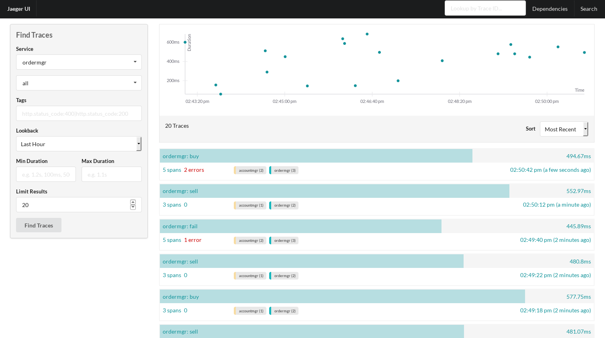
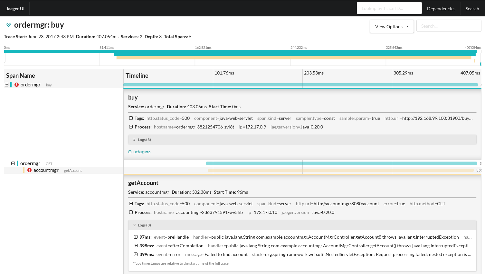
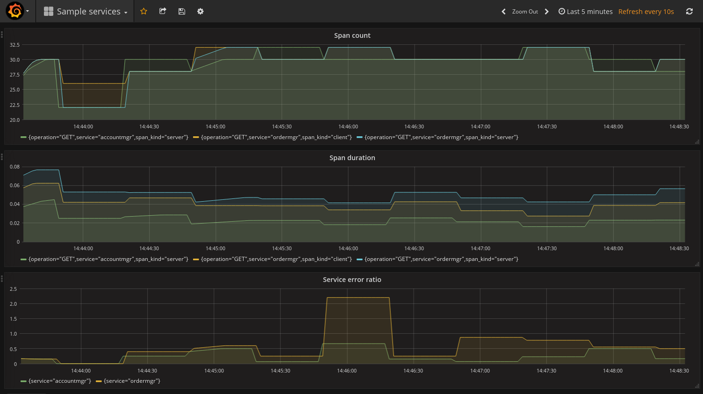

= Using OpenTracing to collect Application Metrics in Kubernetes
Gary Brown
2017-6-23
:icons: font
:jbake-type: post
:jbake-status: published
:jbake-tags: blog, apm, tracing, jaeger, opentracing, kubernetes, prometheus

This article will show how http://opentracing.io/[OpenTracing] instrumentation can be used to
collect Application Metrics, in addition (but independent) from reported tracing data, from services
deployed within https://kubernetes.io/[Kubernetes].

== The example application

In a recent article we showed how a Spring Boot application could easily be
http://www.hawkular.org/blog/2017/06/9/opentracing-spring-boot.html[instrumented using OpenTracing].

The https://github.com/objectiser/opentracing-prometheus-example[example] we are going to use in
this article uses the same approach to create two services, _service1_ and _service2_ (sorry, not very
imaginative names).

_Service2_ presents a single REST endpoint (`/hello`) for internal use by _Service1_. The code for this endpoint
is:

.Service 2's Hello Controller:
----
    @Autowired
    private io.opentracing.Tracer tracer;

    @RequestMapping("/hello")
    public String hello() throws InterruptedException {
        Thread.sleep(1 + (long)(Math.random()*500));
        if (Math.random() > 0.8) {
            tracer.activeSpan().setTag("error", true);
        }
        return "Hello from Spring Boot!";
    }
----

The first line simply introduces a random delay, to make the collected metrics more interesting. The next three
lines randomly cause the span (associated with the REST endpoint invocation) being tagged as an error.

_Service1_ presents three REST endpoints for use by an end user. These are:

.Service 1's Txn Controller:
----
    @RequestMapping("/buy")
    public String buy() throws InterruptedException {
        Thread.sleep(1 + (long)(Math.random()*500));
        tracer.activeSpan().setBaggageItem("transaction", "buy");
        ResponseEntity<String> response = restTemplate.getForEntity(service2Url + "/hello", String.class);
        return "BUY + " + response.getBody();
    }

    @RequestMapping("/sell")
    public String sell() throws InterruptedException {
        Thread.sleep(1 + (long)(Math.random()*500));
        tracer.activeSpan().setBaggageItem("transaction", "sell");
        ResponseEntity<String> response = restTemplate.getForEntity(service2Url + "/hello", String.class);
        return "SELL + " + response.getBody();
    }

    @RequestMapping("/fail")
    public String fail() throws InterruptedException {
        Thread.sleep(1 + (long)(Math.random()*500));
        ResponseEntity<String> response = restTemplate.getForEntity(service2Url + "/missing", String.class);
        return "FAIL + " + response.getBody();
    }
----

All three methods introduce a random delay.

The `buy` and `sell` methods additional set a baggage item `transaction` with the name of the business
transaction being performed (i.e. buy or sell). For those not familiar with OpenTracing, the
https://github.com/opentracing/specification/blob/master/specification.md#set-a-baggage-item[baggage concept]
allows information to be carried _in band_ with the trace context between invoked services. Shortly we will show
how this can be used to isolate the metrics relevant only for a particular business transaction.

Finally, the first two methods call the `/hello` endpoint on _service2_, while the third method invokes
a non-existent endpoint on _service2_, which will lead to an error being reported in the trace and metric
data.

== Adding Metrics Reporting to the OpenTracing instrumentation

The OpenTracing API defines the concept of a _Span_ which represents a unit of work performed by a service,
e.g. to receive a service invocation, perform some internal task (e.g. accessing a database) or
invoking an external service. They provide an ideal basis upon which to report metrics
(count and duration) regarding these points within a service.

Therefore a new https://github.com/opentracing-contrib/java-metrics[OpenTracing contrib project] has
been established (initially just for Java) to intercept
the finished spans, and create the relevant metrics. These metrics are then submitted to a _MetricsReporter_
for recording - the initial implementation of this interface being for https://prometheus.io/[Prometheus].

The first step is to expose an endpoint for collecting the Prometheus metrics. Each service has the following
configuration:

----
@Configuration
@ConditionalOnClass(CollectorRegistry.class)
public class PrometheusConfiguration {

     @Bean
     @ConditionalOnMissingBean
     CollectorRegistry metricRegistry() {
         return CollectorRegistry.defaultRegistry;
     }

     @Bean
     ServletRegistrationBean registerPrometheusExporterServlet(CollectorRegistry metricRegistry) {
           return new ServletRegistrationBean(new MetricsServlet(metricRegistry), "/metrics");
     }
}
----

This will allow the Prometheus metrics to be obtained from the service's `/metrics` REST endpoint.

Each service then requires a configuration to obtain the `io.opentracing.Tracer`: 

----
@Configuration
public class TracerConfiguration implements javax.servlet.ServletContextListener {

	@Bean
	public io.opentracing.Tracer tracer() {
		return io.opentracing.contrib.metrics.Metrics.decorate(
			io.opentracing.contrib.tracerresolver.TracerResolver.resolveTracer(),
			PrometheusMetricsReporter.newMetricsReporter()
				.withBaggageLabel("transaction","n/a")
				.build());
	}

	@Override
	public void contextInitialized(javax.servlet.ServletContextEvent sce) {
		sce.getServletContext().setAttribute(io.opentracing.contrib.web.servlet.filter.TracingFilter.SKIP_PATTERN, Pattern.compile("/metrics"));
	}

	...
----

The first method uses the
https://github.com/opentracing-contrib/java-tracerresolver[TracerResolver] to provide a vendor
neutral approach for accessing a `Tracer`. This tracer is then decorated with the metrics capability
using a `PrometheusMetricsReporter`. This metrics reporter is further configured to add a special
label related to the baggage key `transaction` (discussed later).

By default, the Servlet OpenTracing integration will trace all REST endpoints. Therefore in the
second method above we add an attribute that will inform the instrumentation to ignore the `/metrics`
endpoint. Otherwise will we have tracing data reported each time Prometheus reads the metrics for the
service.

== Deploying on Kubernetes

The steps to setup an environment on Kubernetes is discussed in the
https://github.com/objectiser/opentracing-prometheus-example[example codebase]. A summary of the steps is:

* Start https://kubernetes.io/docs/getting-started-guides/minikube[minikube]

* Deploy Prometheus - using the https://github.com/coreos/prometheus-operator[Prometheus Operation] project to
capture metrics from the services

* Deploy https://github.com/uber/jaeger[Jaeger] - an OpenTracing compatible tracing system

* For this article, we also https://github.com/kubernetes/charts/tree/master/stable/grafana[deployed Grafana]
to display the metrics, although the Prometheus dashboard could be used.

Once they are all running, then the simple example with the two services can be deployed. At this stage
the Kubernetes dashboard would look like this:

ifndef::env-github[]
image::/img/blog/2017/2017-06-23-kubernetes-dashboard.png[caption="Figure 1: ", title="Kubernetes dashboard"]
endif::[]
ifdef::env-github[]

endif::[]

The example code includes a script that loops randomly invoking the three REST endpoints provided by
_service1_. Once some example requests have been created, you can view the tracing dashboard:

ifndef::env-github[]
image::/img/blog/2017/2017-06-23-traces.png[caption="Figure 2: ", title="Jaeger tracing dashboard"]
endif::[]
ifdef::env-github[]

endif::[]

Then you can select a specific trace instance and see further details:

ifndef::env-github[]
image::/img/blog/2017/2017-06-23-trace.png[caption="Figure 3: ", title="Jaeger trace instance view"]
endif::[]
ifdef::env-github[]

endif::[]

This shows that the trace instance has three spans, the first representing the receipt of the `/buy` request on
_service1_, the second where _service1_ is invoking _service2_, and finally the _service2_ receiving the
`/hello` request. In this particular trace instance, the _service2_ invocation has reported an error, indicated
by the `error=true` tag.

Now we will look at the Grafana dashboard to see what metrics have been reported from the OpenTracing
instrumentation within the two services:

ifndef::env-github[]
image::/img/blog/2017/2017-06-23-grafana-dashboard.png[caption="Figure 4: ", title="Grafana dashboard"]
endif::[]
ifdef::env-github[]

endif::[]

This dashboard includes three graphs, the first showing the span count, the second showing the average duration
of the spans, and third showing the ratio between successful and erronous spans.

The metrics reported by Prometheus are based on a range of labels - a metric exists for each unique combination
of those labels.

The standard labels included with the OpenTracing java-metrics project are: `operation`, `span.kind` and `error`.

With this particular example, we also included the `transaction` label.

However when the services are deployed to Kubernetes, the following additional labels are included for free: `pod`,
`instance`, `service`, `job` and `namespace`.

In our example Prometheus queries, we have ignored most of the Kubernetes added labels (except `service`) so that
the metrics are aggregated across the specific pods, namespaces, etc. However, having these labels available means
it is possible to segment the metrics in whatever way is required to analyse the data.

When using the `java-metrics` project outside of Kubernetes, it is still possible to include the `service`
label, however this would be configured when setting up the tracer.

We can also filter the data, to focus on specific areas of interest:

ifndef::env-github[]
image::/img/blog/2017/2017-06-23-grafana-txn-service.png[caption="Figure 5: ", title="Customized Grafana graph focusing on metrics for transaction 'sell' and service 'service2'"]
endif::[]
ifdef::env-github[]
image::../../../../../assets/img/blog/2017/2017-06-23-grafana-txn-service.png[caption="Figure 5: ", title="Customized Grafana graph focusing on metrics for transaction 'sell' and service 'service2'"]
endif::[]

In this image we have filtered the metrics based on the `transaction='sell'` and `service='service2'`. This is
where using the metric label based on the baggage item `transaction` can be useful, to understand the
usage of a particular shared service by a business transaction. With further work it would be possible
to show the distribution of requests for a service across the various business transactions.

== Conclusion

This article has shown how a service can be instrumented once (using OpenTracing) and generate both
tracing and application metrics.

When deployed to a Kubernetes environment, the metrics also benefit from additional labels automatically
add to the metrics describing the service, pod, namespace, etc, that can make it easy to isolate
specific metrics of interest, or view high level aggregated metrics to gain an overview of your
applications performance.

== Links
* OpenTracing: http://opentracing.io
* Github repository with demo: https://github.com/objectiser/opentracing-prometheus-example
* OpenTracing java metrics: https://github.com/opentracing-contrib/java-metrics
* Kubernetes: https://kubernetes.io
* Jaeger: https://github.com/uber/jaeger
* Prometheus: https://prometheus.io

