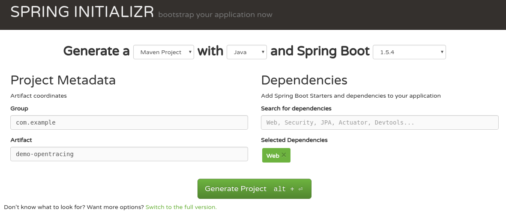
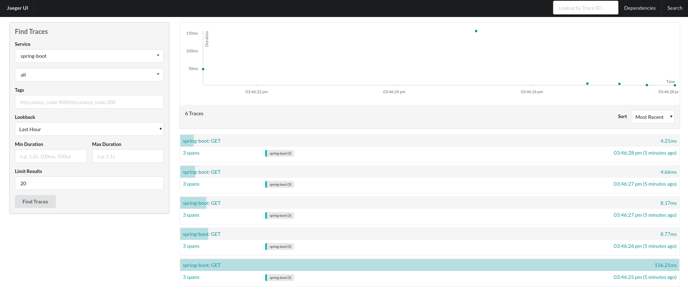
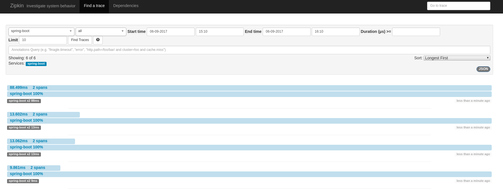

= OpenTracing Spring Boot Instrumentation
Pavol Loffay
2017-6-13
:icons: font
:jbake-type: post
:jbake-status: published
:jbake-tags: blog, apm, tracing, jaeger, opentracing

In this demo series we are going to look at how simple it is to instrument various Java frameworks using
http://opentracing.io[OpenTracing]. You will see that it requires minimal changes to the
application code. In the last demo we will have microservice apps deployed on Kubernetes and
all services will be traced with an OpenTracing compliant tracing system.

In this first demo we are going to develop and trace a simple Spring Boot app.

== Create a web application
First let's write a simple web app. Or better, let's generate it! All we have to do is just to select a web dependency.

ifndef::env-github[]
image::/img/blog/2017/spring-initializr.png[caption="Figure 1: ", title="Spring boot generator."]
endif::[]
ifdef::env-github[]

endif::[]

Now the application is generated, but it does not contain any web controller. We are going to implement a simple
controller with two methods. One will return a greeting and the other creates HTTP request which calls
hello endpoint. This demonstrates simple request chaining between services. Do not worry all the code is
on https://github.com/pavolloffay/opentracing-java-examples[GitHub]. At the bottom of this article you will
find all necessary links.

.Hello Controller:
----
@RestController
public class HelloController {

    @Autowired
    private RestTemplate restTemplate;

    @RequestMapping("/hello")
    public String hello() {
        return "Hello from Spring Boot!";
    }

    @RequestMapping("/chaining")
    public String chaining() {
        ResponseEntity<String> response = restTemplate.getForEntity("http://localhost:8080/hello", String.class);
        return "Chaining + " + response.getBody();
    }
}
----

Now the application can serve requests for URLs `http://localhost:8080/hello` and `http://localhost:8080/chaining`.
The app is still not instrumented, we won't see any data coming to a tracing system.

== Instrumentation
Instrumentation with OpenTracing integrations is very simple. For Spring Boot there is
an auto-configuration which instruments all REST controllers and `RestTemplate` beans. Just add the following
dependency to the classpath:

----
<dependency>
    <groupId>io.opentracing.contrib</groupId>
    <artifactId>opentracing-spring-web-autoconfigure</artifactId>
</dependency>
----

This dependency requires only one thing and that is a tracer bean which will be used to report data to the chosen
tracing system. If we don't specify this bean auto-configuration will choose `NoopTracer`.

Because we are using OpenTracing instrumentation we are not bound to any specific tracing system.
We will now show how to first use Jaeger and then switch to Zipkin. We will see that changing the tracing system is just
a matter of configuration.

As we mentioned the only tracing configuration needed here is to provide a tracer bean.

=== Jaeger
To create a Jaeger tracer is very simple. It just requires a sampler configuration and because it is a demo we are going
to sample all requests. Note that we are not specifying the URL to Jaeger server. By default it will assume that it
runs on localhost.

----
@Bean
public io.opentracing.Tracer jaegerTracer() {
    return new Configuration("spring-boot", new Configuration.SamplerConfiguration(ProbabilisticSampler.TYPE, 1),
        new Configuration.ReporterConfiguration())
        .getTracer();
----

Now we can start the Jaeger server using `docker run --rm -it --network=host jaegertracing/all-in-one`, compile and
run our app. When everything is up and running generate some requests to URL's defined in the previous section.

Open the Jaeger UI on `http://localhost:16686`:

ifndef::env-github[]
image::/img/blog/2017/boot-jaeger-traces.png[caption="Figure 1: ", title="Jaeger showing reported traces."]
endif::[]
ifdef::env-github[]

endif::[]

On the picture we can see traces for the request to the `/chaining` endpoint. There are three spans: one representing
server processing of `/chaining`, the second a client request to `/hello` and the third server processing of `/hello` endpoint.

=== Zipkin
Now let's benefit from OpenTracing and switch tracing system with O(1) effort. To do that we just need to
provide an instance of Zipkin tracer bean. Do not forget to comment out the Jaeger tracer bean, otherwise instrumentation
would not know which tracer to use.

Zipkin configuration is very similar it just requires to know Zipkin URL:

----
@Bean
public io.opentracing.Tracer zipkinTracer() {
    OkHttpSender okHttpSender = OkHttpSender.create("http://localhost:9411/api/v1/spans");
    AsyncReporter reporter = AsyncReporter.builder(okHttpSender).build();
    Tracing braveTracer = Tracing.newBuilder().localServiceName("spring-boot").reporter(reporter).build();
    return BraveTracer.create(braveTracer);
}
----

Zipkin server can be started with `docker run --rm -it -p 9411:9411 openzipkin/zipkin`. Now we have to rebuild and
start our demo app and generate requests.

ifndef::env-github[]
image::/img/blog/2017/boot-zipkin-traces.png[caption="Figure 1: ", title="Zipkin showing reported traces."]
endif::[]
ifdef::env-github[]

endif::[]

This screenshot also show traces for invocation of `/chaining` endpoint. In this case it shows only two spans because Zipkin
uses so called shared span model which means that client and server invocation of `/hello` uses the same span.
This is a great example that different OpenTracing providers might model and show things differently.

== Video
video::RvCcWltMY7U[youtube, width=853, height=480]

== Conclusion
We have seen how simple it is to instrument Spring Boot with OpenTracing. This instrumentation leverages all
key OpenTracing http://opentracing.io/documentation/#why-opentracing[benefits] like: vendor-neutrality,
O(1) change of tracing system or wiring different instrumentations together. In the next blog post we will look at JAX-RS instrumentation and in the
last demo all applications will be deployed on Kubernetes and traced using Jaeger's production deployment with Cassandra cluster.

== Links
* OpenTracing: http://opentracing.io
* Github repository with demo: https://github.com/pavolloffay/opentracing-java-examples
* OpenTracing Spring Boot instrumentation: https://github.com/opentracing-contrib/java-spring-web
* Jaeger: https://github.com/uber/jaeger
* Zipkin: https://github.com/openzipkin/zipkin

