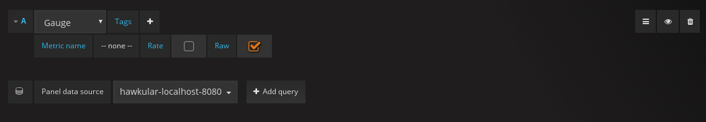
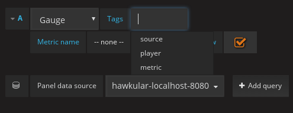
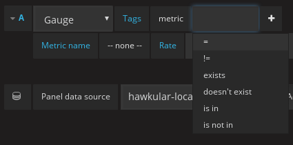
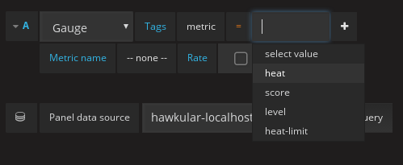
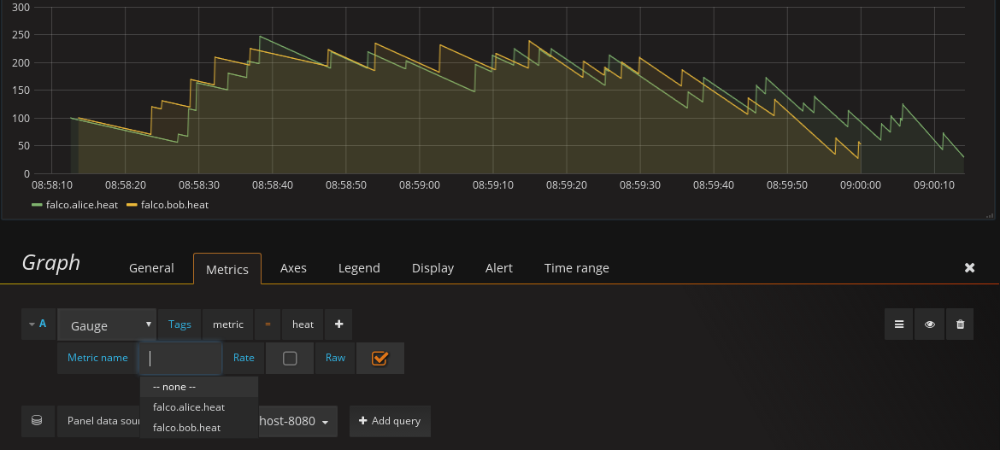
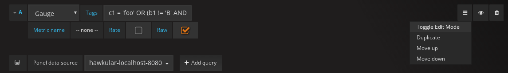
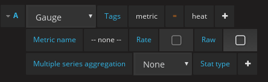
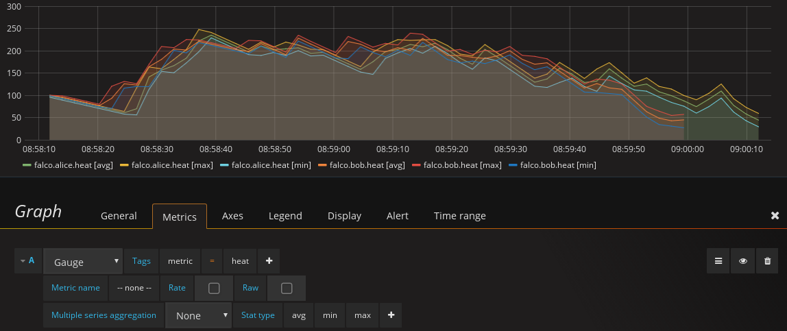
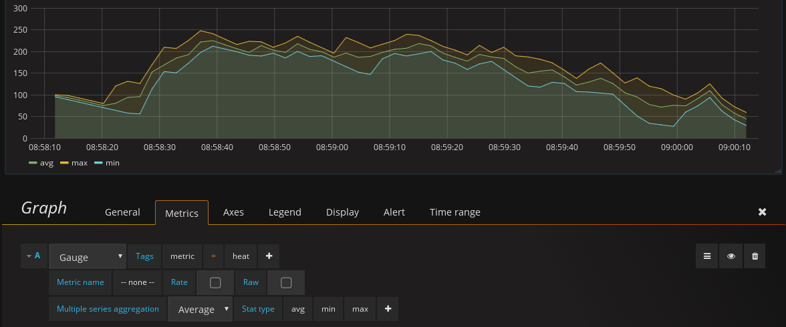

= Grafana: new query interface
Joel Takvorian
2017-07-20
:jbake-type: post
:jbake-status: published
:jbake-tags: blog, metrics, grafana
:figure-caption!:

There have been improvements lately in the Hawkular Grafana datasource that are worth mentioning.

- The way to query metrics by tags has changed since plugin link:https://github.com/hawkular/hawkular-grafana-datasource/releases/tag/v1.0.8[v1.0.8].
It now takes advantage of the Hawkular Metrics' tags query language,
that was introduced server-side in link:http://www.hawkular.org/blog/2017/02/08/hawkular-metrics-0.24.0.Final-released.html[Metrics 0.24.0]
and enhanced in link:http://www.hawkular.org/blog/2017/03/07/hawkular-metrics-0.25.0.Final-released.html[0.25.0].
To sum it up, Metrics integrates a parser that allows queries such as:
`tag1 = 'awesome!' AND tag2 NOT IN ['foo', 'bar']`.

- The datasource in now able to fetch bucketized metrics stats, instead of raw metrics.
It consists in aggregating datapoints in slices of time (buckets) and providing, for each slice, some statistics like _min_, _max_, _average_ and more.
The exact content of a bucket is described in link:http://www.hawkular.org/docs/rest/rest-metrics.html#NumericBucketPoint[Metrics REST API].
Hawkular has always been able to provide metric stats server-side,
but being able to use them in the Grafana plugin is new, introduced in link:https://github.com/hawkular/hawkular-grafana-datasource/releases/tag/v1.0.9[v1.0.9].

[.text-center]
ifndef::env-github[]
image::/img/blog/2017/2017-07-20-grafana-empty-query.png[New query interface]
endif::[]
ifdef::env-github[]

endif::[]

[.text-center]
_The new query interface_

=== Tags query language

The first change is that you don't have to choose between _query by tag_ and _query by metric id_ anymore, you can do both at the same time.
Querying by tag will refine the available list of metric names (much like a filter) and can result in multiple metrics from a single query.
By selecting a _metric name_, you restrict the query to only display that one.
This filtering is really nice when there's tons of metrics available, like in the case of
hundreds of OpenShift pods being monitored with the same tenant.

The simple _key/value_ pairs interface is now replaced with a more elaborated query builder, following the pattern:
_'tag-key'_ _'operator'_ _'tag-value(s)'_ [_'AND/OR'_ etc.]

The following images show a walk-through:

[.text-center]
ifndef::env-github[]
image::/img/blog/2017/2017-07-20-grafana-tag_key.png[Selecting tag key]
endif::[]
ifdef::env-github[]

endif::[]

[.text-center]
_Selecting the tag key_

[.text-center]
ifndef::env-github[]
image::/img/blog/2017/2017-07-20-grafana-tag_operator.png[Selecting tag operator]
endif::[]
ifdef::env-github[]

endif::[]

[.text-center]
_Selecting the tag operator_

[.text-center]
ifndef::env-github[]
image::/img/blog/2017/2017-07-20-grafana-tag_value.png[Selecting tag value]
endif::[]
ifdef::env-github[]

endif::[]

[.text-center]
_Selecting the tag value_

The text fields include dynamic suggestions, you can use Grafana template variables within tag values, or enter free text.
Once you've set up a tag query expression, the relevant metrics immediately show up on the chart and the list of available metrics in the dropdown list in updated.

[.text-center]
ifndef::env-github[]
image::/img/blog/2017/2017-07-20-grafana-tag-filtering.png[Filtered metrics]
endif::[]
ifdef::env-github[]

endif::[]

[.text-center]
_Filtered metrics_

This query builder lets you build almost any tag query that the Hawkular server understands.
There are however some corner cases. For now this builder doesn't allow you to prioritize expressions with parentheses.
For instance, you cannot build `c1 = 'foo' OR (b1 != 'B' AND a1 = 'abcd')`.
As a workaround you can turn off the query builder and directly type in your query expression.

[.text-center]
ifndef::env-github[]
image::/img/blog/2017/2017-07-20-grafana-editor-mode.png[Toggle editor mode]
endif::[]
ifdef::env-github[]

endif::[]

[.text-center]
_Toggle editor mode_

It will be sent as is to the Hawkular Metrics server.
This will also be useful to fill the gap if the language evolves server-side and this plugin isn't updated immediately.

=== Stats query

The other important feature is the ability to run link:http://www.hawkular.org/hawkular-metrics/docs/user-guide/#_downsampling[stats] queries against Hawkular Metrics, instead of link:http://www.hawkular.org/hawkular-metrics/docs/user-guide/#_raw_data[raw] queries.
There are several reasons to do this:

- it reduces the network load, and client-side processing load, especially when raw data would contain tons of datapoints
- it enables some aggregation methods
- it also allows higher-level analysis with stats such as percentiles

To enable it, just clear the _raw_ checkbox.

[.text-center]
ifndef::env-github[]
image::/img/blog/2017/2017-07-20-grafana-stats-mode.png[Toggle stats mode]
endif::[]
ifdef::env-github[]

endif::[]

[.text-center]
_Toggle stats mode_

When you clear the _raw_ checkbox, you can configure _Multiple series aggregation_ to _None_, _Sum_ or _Average_
and can configure _Stat type_ as _avg_, _min_, _max_, _median_, _sum_ and different percentiles.
You can display several different _Stat types_ within the same query.

[.text-center]
ifndef::env-github[]
image::/img/blog/2017/2017-07-20-grafana-stats-none.png[Stats without aggregation]
endif::[]
ifdef::env-github[]

endif::[]

[.text-center]
_Stats without aggregation: each two metrics show avg, min and max_

[.text-center]
ifndef::env-github[]
image::/img/blog/2017/2017-07-20-grafana-stats-avg.png[Stats avg]
endif::[]
ifdef::env-github[]

endif::[]

[.text-center]
_Same query with series aggregation: the two metrics are averaged into one, which shows avg, min and max_

If the query returns multiple series, use _Multiple series aggregation_ to define if and how to aggregate them.
_None_ will show them individually on the chart. But consider for instance the case of an OpenShift pod with many replicas, and you're tracking their memory usage.
It may be more relevant here to aggregate all of them, both _sum_ and _average_ are meaningful here.

The _Stat type_ option refers to an aggregation at a different level: not between multiple metrics, but within a single metric,
all raw datapoints are aggregated within time buckets.

=== Conclusion

These two improvements aim a common goal, that is facilitating querying over large amounts of data. This is becoming crucial especially
in the context of microservices and applications running on container platforms, as the number of metrics explodes.
Proper metrics tagging is the corner stone to make sense of this data.
