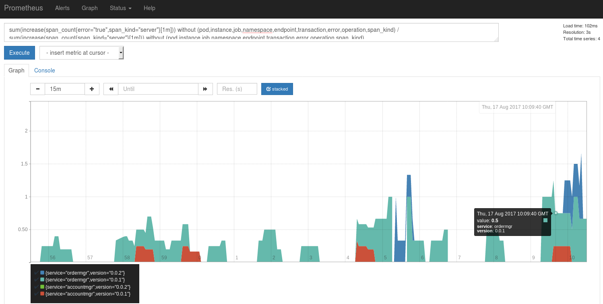
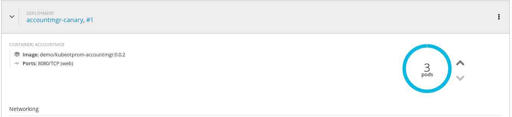
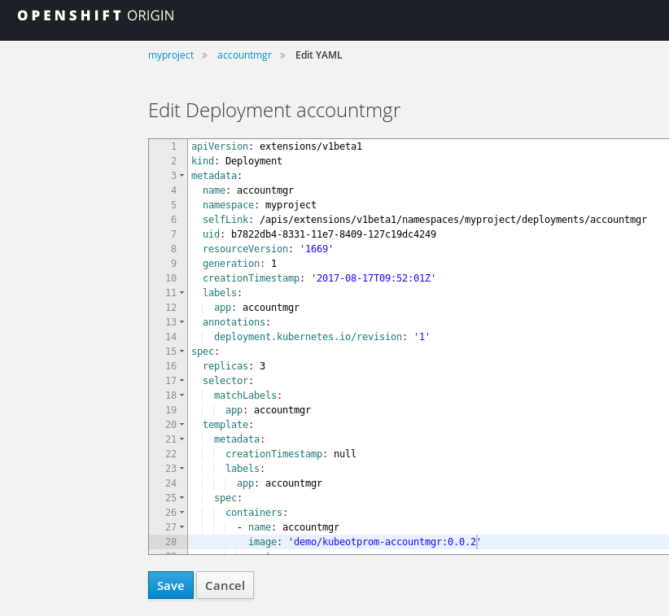
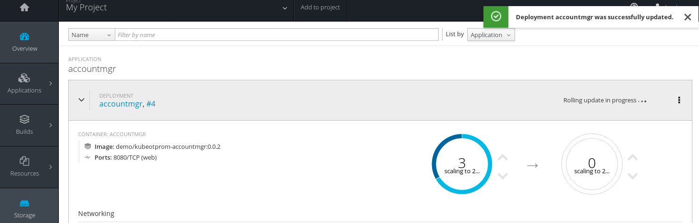
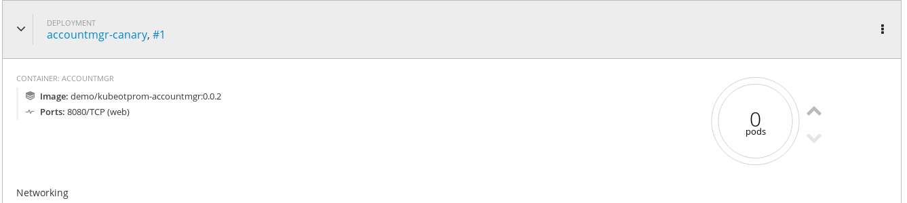

= Canary Deployment in OpenShift using OpenTracing based Application Metrics
Gary Brown
2017-8-18
:icons: font
:jbake-type: post
:jbake-status: published
:jbake-tags: blog, apm, tracing, jaeger, opentracing, kubernetes, prometheus, openshift, canary

In a http://www.hawkular.org/blog/2017/06/26/opentracing-appmetrics.html[previous article]
we showed how http://opentracing.io/[OpenTracing] instrumentation can be used to
collect application metrics, in addition to (but independent from) reported tracing data, from services
deployed within a cloud environment (e.g. https://kubernetes.io/[Kubernetes] or https://openshift.io/[OpenShift]).

In this article we will show how this information can be used to aid a
https://martinfowler.com/bliki/CanaryRelease.html[Canary deployment strategy] within OpenShift.

[[error-ratio-service-version,Figure 1]]
ifndef::env-github[]
image::/img/blog/2017/2017-08-18-canary-service-compare.png[caption="Figure 1: ", title="Error ratio per service and version"]
endif::[]
ifdef::env-github[]

endif::[]

== The updated example application

We will be using the same https://github.com/objectiser/opentracing-prometheus-example[example] as used in the previous
article.

However since writing that article, the configuration of the tracer and Prometheus metrics support has been
simplified. There is now no explicit configuration of either, with only some auto configuration of `MetricLabel` beans
to identify some custom labels to be added to the Prometheus metrics, e.g.

.Metrics configuration used in both services:
----
@Configuration
public class MetricsConfiguration {

    @Bean
    public MetricLabel transactionLabel() {
        return new BaggageMetricLabel("transaction", "n/a"); <1>
    }

    @Bean
    public MetricLabel versionLabel() {
        return new ConstMetricLabel("version", System.getenv("VERSION")); <2>
    }

}
----

<1> This metric label identifies the business transaction associated with the metrics, which can be used to isolate the
specific number of requests, duration and errors that occurred when the service was used within the particular business
transaction
<2> This metric label identifies the service version, which is especially useful in the Canary deployment use case being
discussed in this article

The first step is to following the instructions in the https://github.com/objectiser/opentracing-prometheus-example[example]
for deploying and using the services within OpenShift.

Once the `./genorders.sh` script has been running for a while, to generate plenty of metrics for version `0.0.1` of the
services, then deploy the new version of the services. This is achieved by:

* updating the versions in the `pom.xml` files, within the `simple/accountmgr` and `simple/ordermgr` folders
from `0.0.1` to `0.0.2`
* re-run the `mvn clean install docker:build` command from the `simple` folder
* deploy the canary versions of the services using the command `oc create -f services-canary-kubernetes.yml`

As our services `accountmgr` and `ordermgr` determine the backing deployment based on the respective labels
`app: accountmgr` and `app: ordermgr`, simply having a second deployment with these labels will make them serve requests
in a round-robin manner.

This deployment script has been pre-configured with the `0.0.2` version, and to only start a single instance of the
new version of the services. This may be desirable if you want to monitor the behaviour of the new service versions over
a reasonable time period, but as we want to see results faster we will scale them up to see more activity. You can do this
by expanding the deployment area for each service in the OpenShift web console and selecting the up arrow to scale
up each service:

ifndef::env-github[]
image::/img/blog/2017/2017-08-18-canary-scale-up.png[caption="Figure 2: ", title="Scaling up canary deployment"]
endif::[]
ifdef::env-github[]

endif::[]

Now we can monitor the Prometheus dashboard, using the following query, to see the error ratio per service and version:

```
sum(increase(span_count{error="true",span_kind="server"}[1m])) without (pod,instance,job,namespace,endpoint,transaction,error,operation,span_kind) / sum(increase(span_count{span_kind="server"}[1m])) without (pod,instance,job,namespace,endpoint,transaction,error,operation,span_kind)
```

The result of this query can be seen in <<error-ratio-service-version>> at the top of the article.
This chart shows that version `0.0.2` of the `accountmgr` service has not generated any errors, while the `0.0.2`
of the `ordermgr` appears to be less error prone than version `0.0.1`.

Based on these metrics, we could decide that the new versions of these services are better than the previous, and
therefore update the main service deployments to use the new versions.
In the OpenShift web console you can do this by clicking the three vertical dots in the upper right hand side of the
deployment region and selecting _Edit YAML_ from the menu.
This will display an editor window where you can change the version from `0.0.1` to `0.0.2` in the YAML file.

ifndef::env-github[]
image::/img/blog/2017/2017-08-18-canary-service-update.png[caption="Figure 3: ", title="Update the service version"]
endif::[]
ifdef::env-github[]

endif::[]

After you save the YAML configuration file, in the web console you can see the service going through a "rolling update" as OpenShift incrementally changes each service instance over to the new version.

ifndef::env-github[]
image::/img/blog/2017/2017-08-18-canary-rolling-update.png[caption="Figure 4: ", title="Rolling update"]
endif::[]
ifdef::env-github[]

endif::[]

After the rolling update has completed for both the `ordermgr` and `accountmgr` services, then you can scale down or
completely remove the canary version of each deployment.

An alternative to performing the rolling update would simply be to name the canary version something else (i.e. specific
to the version being tested), and when it comes time to switch over, simply scale down the previous deployment version. This
would be more straightforward, but wouldn't show off the cool rolling update approach in the OpenShift web console :-)

ifndef::env-github[]
image::/img/blog/2017/2017-08-18-canary-scale-down.png[caption="Figure 5: ", title="Scaling down canary deployment"]
endif::[]
ifdef::env-github[]

endif::[]

NOTE: Although we have updated both services at the same time, this is not necessary. Generally microservices would be managed
by separate teams and subject to their own deployment lifecycles.


== Conclusion

This article has shown how application metrics, captured by instrumenting services using the OpenTracing API, can
be used to support a simple Canary deployment strategy.

These metrics can similarly be used with other deployment strategies,
such as https://en.wikipedia.org/wiki/A/B_testing[A/B testing], which can be achieved
using a https://docs.openshift.com/container-platform/3.6/dev_guide/routes.html#routes-load-balancing-for-AB-testing[weighted load balancing capability] within OpenShift.


== Links
* OpenTracing: http://opentracing.io
* Github repository with demo: https://github.com/objectiser/opentracing-prometheus-example
* OpenTracing java metrics: https://github.com/opentracing-contrib/java-metrics
* Kubernetes: https://kubernetes.io
* OpenShift: https://openshift.io
* Jaeger: https://github.com/uber/jaeger
* Prometheus: https://prometheus.io


