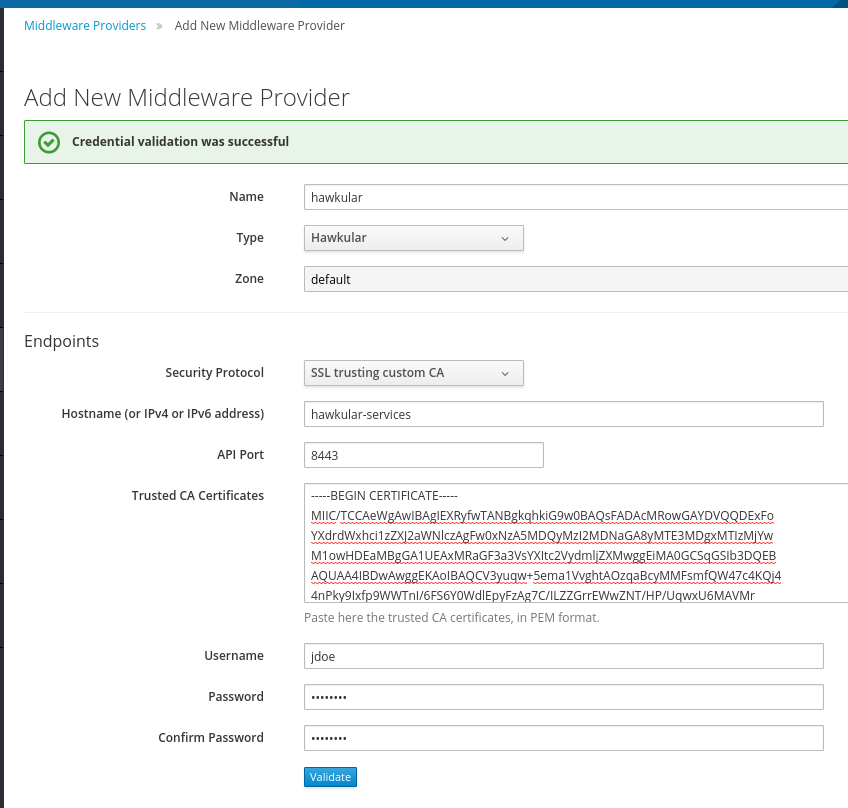
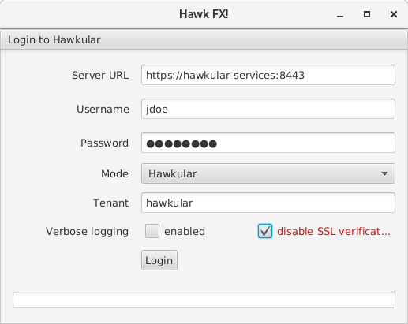

= Connecting Hawkular Agent to Hawkular Services over SSL
Josejulio Martínez
2017-09-11
:jbake-type: post
:jbake-status: published
:jbake-tags: blog, services, ssl

SSL provides identification of the communicating parties, confidentiality and integrity of the information being shared.

In production environments, network eavesdropping could be a concern. You can use SSL to provide a secure communication
channel between servers.

Hawkular Services expects Hawkular Agents to connect, push information and listen for commands.
These commands also include server credentials that could be vulnerable to a man-in-the-middle attack.

A previous link:http://www.hawkular.org/hawkular-services/docs/installation-guide/secure-comm.html[article] shows how
to configure your Hawkular Services with SSL and have Hawkular Agents connect to it trough SSL.
This guide will show how is done for Dockerized Hawkular Services Agents.

== Preparing your certificates

Before starting we need to prepare the certificates that we are going to use.
Your public and private key for Hawkular Services need to be on PEM or PKC12 format.
For this guide we will use PEM.

We can create self-signed certificates (in PEM format) using:
```
keytool -genkey -keystore hawkular.keystore -alias hawkular -dname "CN=hawkular-services" -keyalg RSA -storepass hawkular -keypass hawkular -validity 36500 -ext san=ip:127.0.0.1,dns:hawkular-services
keytool -importkeystore -srckeystore hawkular.keystore  -destkeystore hawkular.p12 -deststoretype PKCS12 -srcalias hawkular -deststorepass hawkular -destkeypass hawkular -srcstorepass hawkular
openssl pkcs12 -in hawkular.p12 -password pass:hawkular -nokeys -out hawkular-services-public.pem
openssl pkcs12 -in hawkular.p12 -password pass:hawkular -nodes -nocerts -out hawkular-services-private.key
```

IMPORTANT: When creating the certificates, remember to include the host that Hawkular will use
(as Common Name(CN) and Subject Alternative Name(SAN)), else the certificate validation will fail.
Through this guide, host will be set to hawkular-services.

WARNING: Always include san=ip:127.0.0.1 in your certificate, as this will be used internally by Hawkular Services.

== Starting Cassandra

Hawkular Services requires a cassandra instance, you can start one by doing:

```
docker run --name hawkular-cassandra -e CASSANDRA_START_RPC=true -d cassandra:3.0.9
```

== Starting Hawkular Services on SSL

Now that there is a cassandra ready, Hawkular Services can be started,
it will be linked to the cassandra instance (hawkular-cassandra)

```
docker run --name hawkular-services --link=hawkular-cassandra -e CASSANDRA_NODES=hawkular-cassandra -e HAWKULAR_HOSTNAME=hawkular-services -e HAWKULAR_USE_SSL=true -p 8443:8443 -v `pwd`/hawkular-services-private.key:/client-secrets/hawkular-services-private.key -v `pwd`/hawkular-services-public.pem:/client-secrets/hawkular-services-public.pem hawkular/hawkular-services
```

NOTE: To avoid guessing the host, we explicitly set it to hawkular-services
using HAWKULAR_HOSTNAME environmental variable.

WARNING: If you don't specify any certificate, Hawkular services will create one,
but we won't be able to connect agents unless we export the certificate.

== Starting a Hawkular Agent

By now there should be a Hawkular Services listening on default secure port 8443, if any agent wants to connect,
it will need to know and trust its certificate.
If you are self-signing your certificate, you will need to pass Hawkular Service's certificate when starting the agent.

```
docker run --name hawkular-agent-01 --link=hawkular-services -e HAWKULAR_SERVER_PROTOCOL=https -e HAWKULAR_SERVER_ADDR=hawkular-services -e HAWKULAR_SERVER_PORT=8443 -v `pwd`/hawkular-services-public.pem:/client-secrets/hawkular-services-public.pem wildfly-hawkular-javaagent
```

NOTE: Host must match with the one specified in the certificate, thus setting HAWKULAR_SERVER_ADDR to hawkular-services
is required. Update as needed if using other value.

== Testing the setup

Any Hawkular client that supports connecting using SSL can be used. ManageIQ and HawkFX will be show below.

NOTE: If using self-signed certificates, the client machine needs to trust Hawkular Services certificate or the client
should support to specify which certificate to trust.
See link:http://www.hawkular.org/blog/2016/09/14/consuming-hawkular-api-over-ssl.html[here]
for more info.

=== ManageIQ

It can be quickly tested using the dockerized ManageIQ as follow:

```
docker run --link=hawkular-services --privileged -d -p 8444:443 manageiq/manageiq:fine-3
```

Once ManageIQ has started, add a Middleware Provider, there is three secured ways to do that:

. SSL  -- Requires that the client box trusts Hawkular Services certificate.
. SSL trusting custom CA -- Requires to provide the certificate to trust.
. SSL without validation -- No validation is performed.

We will focus on (2) and (3) as (1) will require to trust the certificates on the machine itself.

==== SSL trusting custom CA

We need to select `SSL trusting custom CA` in `Security Protocol`
and copy the certificate from the contents of `hawkular-services-public.pem`.
Fill the Hostname with the one used in the certificate and complete the required information.

[[mw-ssl-trusting-custom-ca,Figure 1]]
ifndef::env-github[]
image::/img/blog/2017/2017-09-manageiq-custom-ca.png[caption="Figure 1: ", title="Middleware Provider SSL trusting custom ca"]
endif::[]
ifdef::env-github[]

endif::[]

==== SSL without validation

We need to select `SSL without validation` in `Security Protocol`.
No validation regarding the certificate is made with this option, only fill the required information.

[[mw-ssl-without-validation,Figure 2]]
ifndef::env-github[]
image::/img/blog/2017/2017-09-manageiq-custom-ca.png[caption="Figure 2: ", title="Middleware Provider SSL without validation"]
endif::[]
ifdef::env-github[]

endif::[]


=== HawkFX

One can connect using HawkFx by either installing the certificate on the machine or disabling the verification as
show in the image.

[[hawkfx-disable-validation,Figure 3]]
ifndef::env-github[]
image::/img/blog/2017/2017-09-hawkfx-disable-validation.png[caption="Figure 3: ", title="HawkFX without validation"]
endif::[]
ifdef::env-github[]

endif::[]


== Conclusion

Securing communications between a dockerized Hawkular Agent and Hawkular Services is possible with
self-signed certificates. Connecting clients is also possible with the additional step of providing the certificate.
