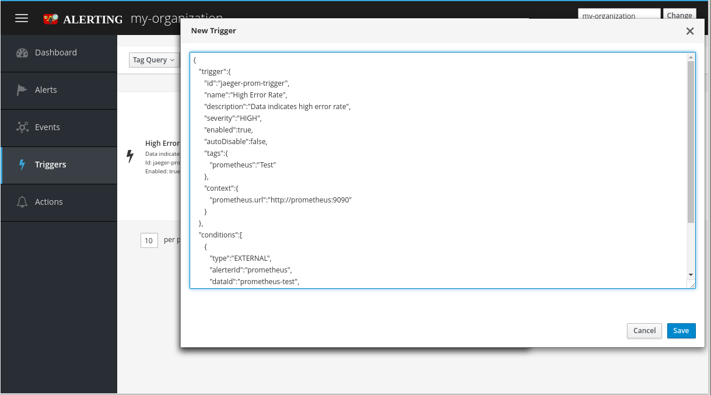
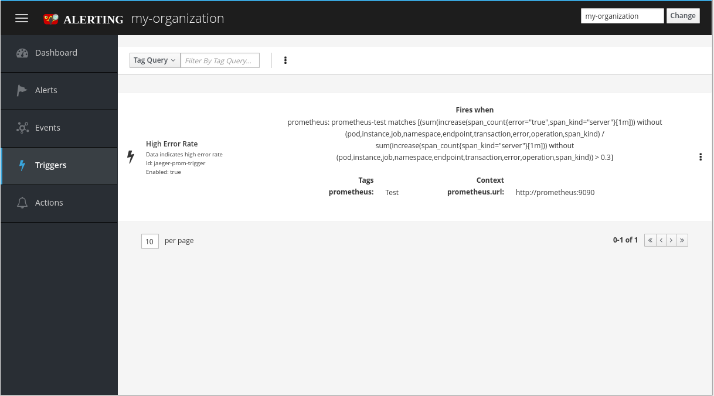
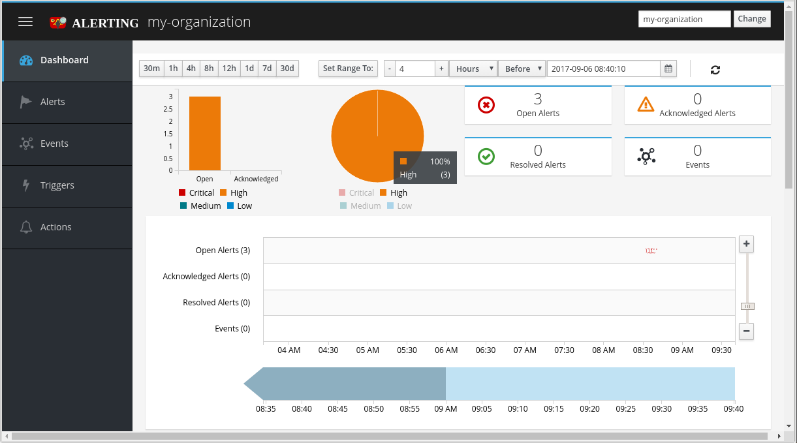
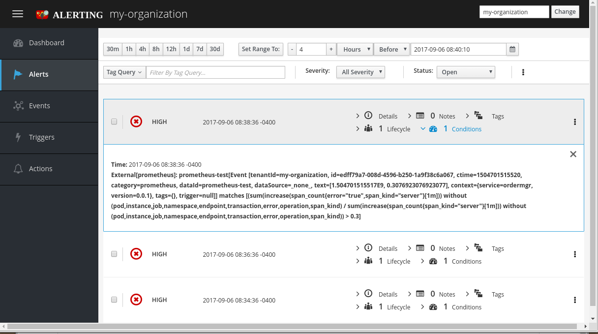

= Hawkular Alerts with OpenTracing
John Mazzitelli
2017-09-06
:jbake-type: post
:jbake-status: published
:jbake-tags: blog, alerts, opentracing, jaeger
:figure-caption!:

Two recent blogs discuss how OpenTracing instrumentation can be used to collect application metrics:

* http://www.hawkular.org/blog/2017/06/26/opentracing-appmetrics.html
* http://www.hawkular.org/blog/2017/08/opentracing-appmetrics-canary.html

A further interesting integration can be the addition of Hawkular Alerts to the environment.

As the previous http://www.hawkular.org/blog/2017/08/alerts-multiple-sources.html[blog] and https://www.youtube.com/watch?v=mM1mwJneKO4[demo] discuss, Hawkular Alerts is a generic, federated alerts system that can trigger events, alerts, and notifications from different, independent systems such as Prometheus, ElasticSearch, and Kafka.

Here we can combine the two. Let's follow the directions for the OpenTracing demo (using the Jaeger implementation) and add Hawkular Alerts.

What this can show is OpenTracing application metrics triggering alerts when (as in this example) OpenTracing spans encounter a larger-than-expected error rates.

(Note: these instructions assume you are using Kubernetes / Minikube - see the Hawkular OpenTracing blogs linked above for more details on these instructions)

=== START KUBERNETES

Here we start minikube giving it enough resources to run all of the pods necessary for this demo. We also start up a browser pointing to the Kubernetes dashboard, so you can follow the progress of the remaining instructions.

```
minikube start --cpus 4 --memory 8192

minikube dashboard
```

=== DEPLOY PROMETHEUS

```
kubectl create -f https://raw.githubusercontent.com/coreos/prometheus-operator/v0.11.0/bundle.yaml

kubectl create -f https://raw.githubusercontent.com/objectiser/opentracing-prometheus-example/master/prometheus-kubernetes.yml
```

(Note: the last command might not work depending on your version - if you get errors, download a copy of prometheus-kubernetes.yml and edit it, changing “v1alpha1” to “v1”)

=== DEPLOY JAEGER

```
kubectl create -f https://raw.githubusercontent.com/jaegertracing/jaeger-kubernetes/master/all-in-one/jaeger-all-in-one-template.yml
```

The following will build and deploy the Jaeger example code that will produce the OpenTracing data for the demo:

```
mkdir -p ${HOME}/opentracing ; cd ${HOME}/opentracing

git clone git@github.com:objectiser/opentracing-prometheus-example.git

cd opentracing-prometheus-example/simple

eval $(minikube docker-env)

mvn clean install docker:build

kubectl create -f services-kubernetes.yml
```

(Note: The last command might not work depending on your version - if you get errors, edit services-kubernetes.yml, changing “v1alpha1” to “v1”)

=== DEPLOY HAWKULAR-ALERTS AND CREATE ALERT TRIGGER

The following will deploy Hawkular Alerts and create the trigger definition that will trigger an alert when the Jaeger OpenTracing data indicates an error rate that is over 30%

```
kubectl create -f https://raw.githubusercontent.com/hawkular/hawkular-alerts/master/dist/hawkular-alerts-k8s.yml
```

Next use `minikube service hawkular-alerts --url` to determine the Hawkular Alerts URL and point your browser to the path “/hawkular/alerts/ui” at that URL (i.e. `http://host:port/hawkular/alerts/ui`).

From the browser page running the Hawkular Alerts UI, enter a tenant name in the top right text field (“my-organization” for example) and click the “Change” button.

Navigate to the “Triggers” page (found in the left-hand nav menu).

Click the kabob menu icon at the top and select “New Trigger”.

In the text area, enter the following to define a new trigger that will trigger alerts when the Prometheus query shows that there is a 30% error rate or greater in the accountmgr or ordermgr servers:

[source,json]
----
{
   "trigger":{
      "id":"jaeger-prom-trigger",
      "name":"High Error Rate",
      "description":"Data indicates high error rate",
      "severity":"HIGH",
      "enabled":true,
      "autoDisable":false,
      "tags":{
         "prometheus":"Test"
      },
      "context":{
         "prometheus.url":"http://prometheus:9090"
      }
   },
   "conditions":[
      {
         "type":"EXTERNAL",
         "alerterId":"prometheus",
         "dataId":"prometheus-test",
         "expression":"(sum(increase(span_count{error=\"true\",span_kind=\"server\"}[1m])) without (pod,instance,job,namespace,endpoint,transaction,error,operation,span_kind) / sum(increase(span_count{span_kind=\"server\"}[1m])) without (pod,instance,job,namespace,endpoint,transaction,error,operation,span_kind)) > 0.3"
      }
   ]
}
----

'''

[[new-trigger,Figure 1]]
ifndef::env-github[]
image::/img/blog/2017/2017-09-06-new-trigger.png[caption="Figure 1: ", title="Create New Alert Trigger"]
endif::[]
ifdef::env-github[]

endif::[]


[[trigger,Figure 2]]
ifndef::env-github[]
image::/img/blog/2017/2017-09-06-trigger.png[caption="Figure 2: ", title="Alert Trigger"]
endif::[]
ifdef::env-github[]

endif::[]

'''

Now navigate back to the “Dashboard” page (again via the left-hand nav menu). From this Dashboard page, look for alerts when they are triggered. We'll next start generating the data that will trigger these alerts.

=== GENERATE SOME SAMPLE OPEN TRACING APPLICATION DATA

```
export ORDERMGR=$(minikube service ordermgr --url)

${HOME}/opentracing/opentracing-prometheus-example/simple/genorders.sh
```

Once the data starts to be collected, you will see alerts in the Hawkular Alerts UI as error rates become over 30% in the past minute (as per the Prometheus query).

'''

[[dashboard,Figure 3]]
ifndef::env-github[]
image::/img/blog/2017/2017-09-06-dashboard.png[caption="Figure 3: ", title="Alerts Dashboard"]
endif::[]
ifdef::env-github[]

endif::[]


[[alert-list,Figure 4]]
ifndef::env-github[]
image::/img/blog/2017/2017-09-06-alert-list.png[caption="Figure 4: ", title="Alert"]
endif::[]
ifdef::env-github[]

endif::[]

'''

If you look at the alerts information in the Hawkular Alerts UI, you’ll see the conditions that triggered the alerts. For example, one such alert could look like this:

[subs="+quotes,+macros"]
----
Time: 2017-09-01 17:41:17 -0400
External[prometheus]: prometheus-test[Event [tenantId=my-organization,
id=1a81471d-340d-4dba-abe9-5b991326dc80, ctime=1504302077288, category=prometheus,
dataId=prometheus-test, dataSource=_none_, text=[1.504302077286E9, *0.3333333333333333*],
context={*service=ordermgr*, version=*0.0.1*}, tags={}, trigger=null]] matches
[(sum(increase(span_count{error="true",span_kind="server"}[1m])) without
(pod,instance,job,namespace,endpoint,transaction,error,operation,span_kind) /
sum(increase(span_count{span_kind="server"}[1m])) without
(pod,instance,job,namespace,endpoint,transaction,error,operation,span_kind)) > 0.3]
----

Notice the “*ordermgr*” service (version "*0.0.1*") had an error rate of *0.3333* (33%) which caused the alert since it is above the allowed 30% threshold.

At this point, the Hawkular Alerts UI provides the ability for system admins to log notes about the issue, acknowledge the alert and mark the alert resolved if the underlying issue has been fixed. These lifecycle functions (also available as REST operations) are just part of the value add of Hawkular-Alerts.

You could do more complex things such as only trigger this alert if this Prometheus query generated results AND some other condition was true (say, ElasticSearch logs match a particular pattern, or if a Kafka topic had certain data). This demo merely scratches the surface, but does show how Hawkular Alerts can be used to work with OpenTracing to provide additional capabilities that may be found useful by system administrators and IT support personnel.
