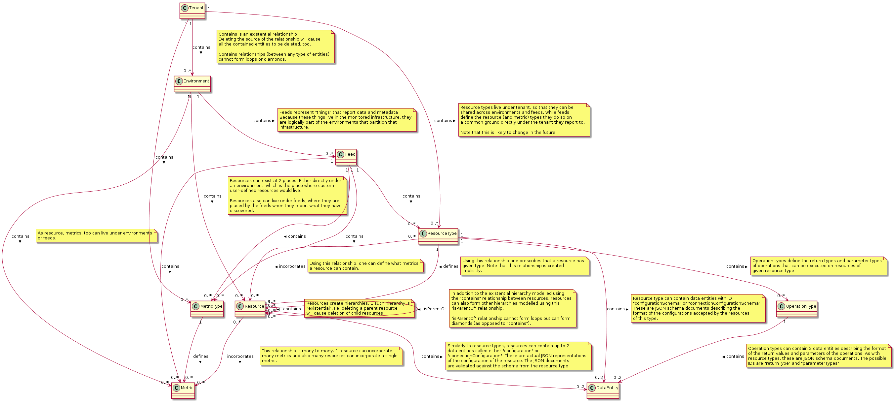

= Inventory Documentation
Lukas Krejci
2016-01-05
:icons: font
:jbake-type: page
:jbake-status: published
:toc: macro
:toc-title:

toc::[]

[[Introduction]]
== Introduction

Inventory is simply a registry of "things" that Hawkular knows about. It
contains info about your applications, servers, etc. It also keeps track of
their relationships with each other.

As such inventory is a graph where nodes are the "things" or "resources" you
monitor and manage in Hawkular and edges are relationships between those
resources.

[[types-of-entities]]
== Types of Entities

To help with classification of the resources you want to monitor, inventory
understands a couple of other types of entities.

[[tenant]]
=== Tenant
Tenants are units of data separation. There may be no relationships between
entities in different tenants.

From the point of view of the REST API user, tenants are invisible, because they
are directly deduced from the login credentials (+ optionally a persona) passed
in the request.

[[environment]]
=== Environment
Environments correspond to the common deployment policies in the enterprise
where for example applications are developed in an "development" environment and
then are promoted to "test", "staging" and finally to "production".

[[resource]]
=== Resource
A resource, as already hinted in the <<Introduction>>, is the representation of
the "thing" in your infrastructure that is being monitored and managed by
Hawkular.

Most importantly, a resource references metrics that are relevant to it. Notice
that metrics are standalone entities that can exist even without a resource
referencing them though and that there is essentially an M to N mapping between
resources and metrics (meaning that a single metric can be referenced by
multiple resources).

The idea behind this separation is that metrics represent concrete qualities
or measurements being collected while resources are essentially only a logical
concept that may or may not correspond to an actual piece of software deployed
on some machine.

This is best imagined if you consider the resources as things you yourself can
compose on your own. For example you might want to create a resource "Health
Indicators" for which you would pick and choose several metrics collected
possibly on several machines representing the health of your infrastructure.

To make things slightly more complicated though, metrics CAN also be contained
within a resource. This is mainly useful for feeds that want to model the fact
that a metric cannot exist without a resource in question. Such metrics still can
be incorporated into othe resources but as soon as the containing resource is
deleted, the resources that incorporate the metric "lose" it.

Resources can have configuration. A configuration is JSON document that the
feed can take and apply in some manner to the target resource that it is managing.

A resource can also have a connection configuration. This describes to the feed
how to connect to the managed resource.

The two types of configurations are described by <<data-entity, data entities>>
with possible IDs `configuration` or `connectionConfiguration` that are contained
in the resource entities.

[[metric]]
=== Metric
Each resource can have a number of metrics associated with it. As an example,
we can monitor the `response time` on an URL. While the actual data, i.e. the
individual measurements of the response time, are being stored in
link:../metrics/index.html[Hawkular Metrics], the definition of the metric is
held in inventory, too. This is to keep track of what resources are composed of.

Notice though that resources do not have to "own" their metrics. Rather, an m-to-n
relationship can exist between the two, meaning that a single metric can be
incorporated into several resources (or none). Please refer to
<<resource, Resource chapter>> for more detailed discussion of this.

[[resource-type]]
=== Resource Type
A resource type provides metadata about resources - i.e. what metrics they
support what are the operations one can execute on them and with what kind of
parameters, etc.

Each resource (i.e. thing being monitored and managed by Hawkular) has to have
a resource type.

As with resources and metrics, resource types can reference metric types which
define the metadata of the metrics to be referenced by the resources. As with
resources and metrics, resource types and metric types are separate standalone
entities with m-to-n relationships.

Resource types can also contain 2 kinds of data entities - either
`configurationSchema` or `connectionConfigurationSchema`. The former is a JSON
schema document describing the format of the configuration of the resources of
this type, while the latter describes the format of the connection configuration
of the resources. See <<resource, Resource chapter>> for what those are in
more detail.

[[metric-type]]
=== Metric Type
Metric type defines metadata of a metric. Namely it is its unit and data type
(gauge, counter, ...).

[[operation-type]]
=== Operation Type

Resource types can define types of operations that can be executed on resources
of those types. The operation types define the format of the return values
as well as the format of the parameters accepted.

[[feed]]
=== Feed
A feed is a representation of an "agent" that collects monitoring data and
performs management operations. Feeds also report on the metrics and resources
(along with their types) it found in the place they are running.

[[data-entity]
=== Data Entity

A data entity holds a JSON value. It can be contained in a variety of other
entities (resource types, resource, operation types) and the ID of the data
entity defines its "purpose" in the containing entity. E.g. operation types
can have data entities with ID either `returnType` or `parameterTypes`.

[[metadata-pack]]
=== Metadata Pack
A metadata pack is a means of grouping resource types and metric types together
and ensuring they do not change. If a metadata pack with a certain "identity hash"
exists, the users can be sure that a set of resource types and metric types with
the exact configuration schemas, units, operation types, etc. are also defined. As
such a metadata pack is a means of quickly making sure that other metadata exists
in a way the user expects.

[[inventory-organization]]
== Inventory Organization

[[img-inventory-organization]]
.Inventory Organization
ifndef::env-github[]
image::/img/docs/components/inventory/index/inventory-entity-diagram.png[Inventory Organization, align="center"]
endif::[]
ifdef::env-github[]

endif::[]

[[basic-principles]]
=== Basic Principles

Data is Pushed::
All data, including identifiers of the entities, is generated in the clients
of inventory.
+
This means that, generally speaking, an entity cannot be uniquely identified by
its, client-generated, ID. To uniquely identify an entity, one has to use its
canonical path.

Canonical Paths::
A canonical path follows the `contains` relationships from a tenant down to the
entity in question.
+
The canonical path has a form illustrated by the following example:
+
====
**/t;**__tenant-id__**/e;**__env-id__**/r;**__resource-id__
====
+
The above example is a canonical path to a resource with ID `resource-id` which
is located in environment `env-id` which is inside a tenant `tenant-id`.
+
The type specifiers in the individual path segments can be these:

  * *t* - tenant
  * *e* - environment
  * *rt* - resource type
  * *mt* - metric type
  * *f* - feed
  * *r* - resource
  * *m* - metric
  * *ot* - operation type
  * *d* - data entity
  * *mp* - metadata pack

Globally Unique Feeds::
The only thing that needs to be globally unique in inventory are the feeds.
+
NOTE: Currently this fact is not taken advantage of, but in future, new APIs
will be added specifically for feeds so that the only piece of information they
need will be their ID and inventory will store the data in the correct place.
+
Therefore, feeds need to register with inventory prior to their normal
operation. The feeds can propose their ID and inventory will accept it if it is
unique, otherwise inventory will assign a new unique ID to the feed and the feed
is expected to make note of it and use it from that point on.

[[configuration]]
== Configuration
Inventory is configurable using several means.

* There are built-in defaults.
* Configuration can be read from a configuration file
* Several configuration properties can be overriden using java system properties and environment variables.

Inventory uses a single configuration file even though several different and
independent subsystems are configured using it.

First it can be used to override the choice of inventory implementation in case
there are more of them on the classpath.

Second,
[[locating-config-file]]
=== Locating Configuration File

. If there is a system property called `hawkular-inventory.conf` the value is
supposed to be a path to file from which the configuration will be loaded.

. If such system property is not defined, the system checks for existence of a
file called `.hawkular-inventory.conf` in the home directory of the user running
the server.

. If no such file exists, the default configuration is used.

[[configuration-properties]]
=== Configuration Properties

++++

++++

.Available Configuration Properties
[options="header",cols=5]
|====
|Property Name|Availability|Environment Variable|Default Value|Description

e|This is the property to be used in the configuration file. Also this is the
name of the system property to override the configured value with (if not
specified otherwise)
e|Some properties are only available for certain components inside inventory
that might or might not be present during the runtime
e|This is the name of the environment variable to override the value
|
|

|`hawkular.inventory.impl`
|_always_
|`HAWKULAR_INVENTORY_IMPL`
|_undefined_
|The fully qualified class name of the `org.hawkular.inventory.api.Inventory`
interface implementation that is accessible on the runtime classpath.

If this property is not present, the first implementation available using Java
service loading mechanism is used.

|`hawkular.inventory.transaction.retries`
|Inventory implementation inheriting from
`org.hawkular.inventory.base.BaseInventory` (this is true by default)
|`HAWKULAR_INVENTORY_TRANSACTION_RETRIES`
|5
|The base implementation assumes that the backend storage uses some kind of
optimistic locking for transaction handling. This property defines the number of
retries of transactions if they fail due to locking or concurrent access
situations.

|`hawkular.inventory.tinkerpop.graph-provider-impl`
|Inventory implementation based on Tinkerpop2 API (the default)
|`HAWKULAR_INVENTORY_TINKERPOP_GRAPH_PROVIDER_IMPL`
|_undefined_
|The fully qualified class name of an implementation of the
`org.hawkular.inventory.impl.tinkerpop.spi.GraphProvider` interface.

Tinkerpop is an API that is implemented by multiple graph databases. This
property can be used to override the default selection mechanism that is to use
the first implementation loaded using the Java services mechanism. Hawkular is
by default packaged with http://thinkaurelius.github.io/titan/[Titan].

|`storage.hostname` (system property
`hawkular.inventory.titan.storage.hostname`)
|Titan graph provider used (which is the default)
|`HAWKULAR_INVENTORY_TITAN_STORAGE_HOSTNAME` or `CASSANDRA_NODES`
|127.0.0.1
|The host for contacting backend storage for Titan. Because Titan in Hawkular
by default uses Cassandra which is also used by Metrics, the `CASSANDRA_NODES`
environment variable is recognized by both components.

|`storage.port` (system property `hawkular.inventory.titan.storage.port`)
|Titan graph provider used (which is the default)
|`HAWKULAR_INVENTORY_TITAN_STORAGE_PORT`
|_undefined_
|This is the port to connect to the Titan storage backend. The default value
is dependent on the storage chosen. For Cassandra, this is `9160` which is the
default Thrift API port.

|`storage.cassandra.keyspace` (system property
`hawkular.inventory.titan.storage.cassandra.keyspace`)
|Titan graph provider used (which is the default)
|`HAWKULAR_INVENTORY_TITAN_STORAGE_CASSANDRA_KEYSPACE`
|`hawkular_inventory`
|The Cassandra keyspace to use for storing inventory data through Titan.

5+e|The configuration file can also contain any other configuration option
specific for the Titan backend. Please consult the
http://s3.thinkaurelius.com/docs/titan/current/titan-config-ref.html[Titan configuration].

You can also consult the
https://github.com/hawkular/hawkular-inventory/blob/master/hawkular-integrated-inventory-rest/src/main/resources/hawkular-inventory.properties[default configuration]
of the default inventory deployment (using Titan with Cassandra backend).

|====

++++

++++

[[rest-api]]
== REST API

While the main, generated, REST API documentation is present
link:../../rest/rest-inventory.html[here], in here we discuss some aspects of
the API that are not well described in the docs generated from the code.

=== Paths
As mentioned in <<basic-principles, Basic Principles>> entities can only be
uniquely defined by their paths, not just IDs.

In REST API, such paths are inlined in the URL address like in the following
example:

  http://my.host/hawkular/inventory/tenant/env/res/metrics/../metric

The above URL means that we want to check if the resource `res` incorporates
a metric called `metric` that is located in the same environment. I.e. the path
to the metric is expressed as a relative path to the resource.

For example, if one wanted to relate to a metric in another environment, one
would use a URL similar to this one:

  http://my.host/hawkular/inventory/tenant/env/res/metrics/../../env2/metric

Notice that one needn't to specify the type in the path segments, contrary to
what was shown in <<basic-principles, Basic Principles>>. This is because
the REST API is trying to infer the type from what type is being looked for and
the current "location" of the entity to which the path is relative.

The inference mechanism is quite powerful but some relative paths are inherently
ambiguous without specific type information so there will be situations where
the type specifier in some of the segments will need to be provided like this:

  http://my.host/hawkular/inventory/tenant/env/res/metrics/../../e;env2/metric

In <<basic-principles, Basic Principles>> the canonical path is described to
start with a tenant ID. While technically that is true, the REST API presents
and receives the paths WITHOUT the tenant id. This is because the REST API
deduces the tenant ID from the authentication information in the request.

Thus, when you pass canonical paths to the REST API, don't start it with the
tenant ID, but with the path segment following it. The paths returned from the
REST API will not contain the tenant ID either.

