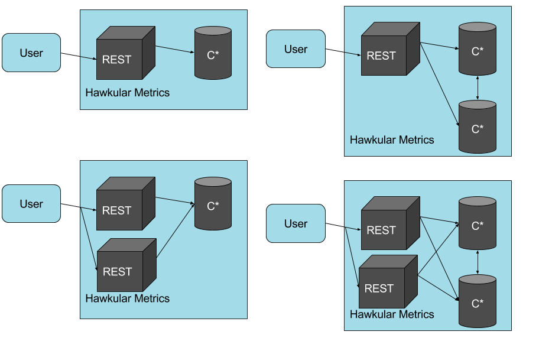

= Metrics Documentation
Thomas Segismont
2015-06-15
:icons: font
:jbake-type: page
:jbake-status: published
:toc: macro
:toc-title:

toc::[]

== Introduction
Hawkular Metrics is a scalable, asynchronous, multi tenant, long term metrics storage engine that uses
 link:http://cassandra.apache.org[Cassandra] as the data store and REST as the primary interface. It

*Scalability* +
Hawkular Metrics is all about scalability. You can run a single instance backed by a single Cassandra node. You can
also scale out Cassandra to multiple nodes to handle increasing loads. The Hawkular Metrics server employs a stateless
architecture, which makes it easy to scale out as well.

This diagram illustrates the various deployment options made possible with scalable and flexible architecture.

a rich, growing set of features that includes:

* Multi tenancy
* Multiple metric types
* Tagging
* Automatic data removal
* REST API
* Scalability
* Rich query support

== Identifiers
All identifiers are stored as variable length, UTF-8 encoded strings. This includes:

* Tenant ids
* Metric names (see <<Metric Ids>> section below for more details on metric names
* Tag keys (for both metric and data point tags)

[TIP]
At present there is no restriction on characters that can be used in identifiers. This may change in the future
though (See link:https://issues.jboss.org/browse/HWKMETRICS-208[HWKMETRICS-208] for details). For this reason it is
recommended to restrict the characters to letters, numbers, underscore, period, and forward slash.

[TIP]
If an identifier uses a character that is defined as special character in the HTTP spec, it must be encoded. Forward
slashes are no exception. If for example I have a tenant id of `com/acme`, then in HTTP requests it should be encoded
as `com%2Facme`.

== Multi Tenancy
Hawkular Metrics provides _virtual_ multi tenancy. All data is mapped to a tenant, but the data on disk is not
physically partitioned by tenant. From an API perspective though, everything is partitioned by tenant. All requests,
both reads and writes, must include a tenant id.

TIP: Tenants do not have to be explicitly created. They will be created when inserting data points.

=== Tenant Ids
A tenant has an id that uniquely identifies it. The id is a variable length, UTF-8 encoded string. Hawkular Metrics
does not perform any validation checks to prevent duplicate ids. This is in large part due to Cassandra's design. Among
other things, Cassandra is a key/value store. Inserting a row into Cassandra is similar to inserting an entry into a
map. If the key already exists in the map, it will simply be overwritten with the new value. This is exactly how
Cassandra behaves.

[IMPORTANT]
If a duplicate id is used, data will be silently overwritten. Users are responsible for ensuring that tenant ids are
unique.

== Metric Types
A metric represents a single time series or continuous stream of data points. A data point consists of a timestamp and
a value. The type of value will vary depending on the metric type. Three types of metrics are currently supported:

* Availability
* Gauge
* Counter

TIP: Metrics do not have to be explicitly created. They will be created when inserting data points.

TIP: A string metric type may be added in a future release. See
link:https://issues.jboss.org/browse/HWKMETRICS-384[HWKMETRICS-384] for details.

=== Availability
Represents the availability of a resource such as host machine (physical or virtual) or an application server. There
are only three supported availability types or values:

* up
* down
* unknown

Availability is stored as single, unsigned byte.

=== Gauge
Has a numeric value that can fluctuate, going up or down. Some examples of gauges include,

* Available heap space in the JVM
* Number of active HTTP sessions on a web server
* Disk space used by a database table
* Execution time for a REST API call

With each of these examples, values can increase or decrease. In some instances, like JVM heap space, there are
well-defined bounds for the possible values.

A gauge value is stored as a 64-bit floating point number.

=== Counter
Has a numeric value that monotonically increases or decreases. Some examples include:

* Total number of requests to a REST endpoint
* Total number of request timeouts for a Cassandra node
* Total number of request timeouts for a Cassandra cluster

These examples involve values that are always increase. Counters can also be decreasing.

A counter value is stored as a 64-bit signed long.

There are two types of counters commonly uses with time series databases (TSDB). One stores the current count or total with
each data point. The other stores the delta or increment with each data point. The former is more commonly used with
counters that can easily be maintained by the client. Tracking the total number of requests to a REST endpoint for a
specific server can be done easily by the client. Tracking the total number of requests for the endpoint across all
servers however is more challenging. This can be done more easily by storing the deltas and allowing the TSDB to
compute and maintain the total count.

Hawkular Metrics only supports the former in which each data point represents the total count; however, we can easily
simulate counters that store deltas. See the <<Incrementing Counters>> section for more details.

==== Rate
A rate is a derived metric whose values are computed from counter data points. Rate data points can retrieved for any
counter. They are stored as 64-bit floating point numbers.

== Metric Ids
Every metric has an id that uniquely identifies it. The id consists of three parts - the tenant id, the metric type,
and the metric name. The tenant id is a variable length, UTF-8 encoded string. The metric type is stored as a one byte
integer. The metric name is stored as a variable length, UTF-8 encoded string.

The parts that comprise the metric id provide namespacing. A metric name only has to be unique for the metric type and
the tenant. For example, suppose we have a tenant id of com.acme. The com.acme tenant could have a gauge named
http_request_time and also have a counter named http_request_time.

Just like with tenant ids, Hawkular Metrics does not perform any validation checks to ensure metric ids are unique.
It is also import to remember that the name portion of the id only needs to be unique for the metric type and tenant.

[IMPORTANT]
If a duplicate id is used, data will be silently overwritten. Users are responsible for ensuring that metric ids are
unique.

== Inserting Data
Inserting data is a synchronous operation with respect to the client. An HTTP response is not returned all data points
are inserted. On the server side, multiple inserts to the database are done in parallel to achieve higher throughput.

=== Failures
If there is an error inserting a data point, the operation is aborted and any data in the request not yet written into
the database will be ignored. When there is an error, there is no reliable way to determine the remaining data
points that still need to be persisted. This is due to the fact that writes to the database are asynchronous and are
done in parallel. This means data points will not necessarily be written in the order received.

[TIP]
Unless stated otherwise, it can be assumed that writes in Hawkular Metrics are idempotent as is the case with writing
data points. If there is an error writing data points, the client can simply retry the request.

=== Examples
There are several operations available for insert data points.

==== Gauge Data
[source,shell]
.Insert data points for a single gauge
----
curl -X POST http://server/hawkular/metrics/gauges/request_size/raw -d @request.json \
-H "Content-Type: application/json" -H "Hawkular-Tenant: com.acme"
----

[source,javascript]
.request.json
----
[
  {"timestamp:" 1460413065369, "value": 3.14},
  {"timestamp:" 1460413025569, "value": 4.57},
  {"timestamp:" 1460111065369, "value": 5.056}
]
----

The gauge name is `request_size` and the endpoint is `/hawkular/metrics/gauges/$metric/raw`.
The value of the `timestamp` property should be a unix timestamp. +
 +

[source,shell]
.Insert data points for multiple gauges
----
curl -X POST http://server/hawkular/metrics/gauges/raw -d @request.json \
-H "Content-Type: application/json" -H "Hawkular-Tenant: com.acme"
----

[source,javascript]
.request.json
----
[
  {
    "id": "free_memory",
    "data": [
      {"timestamp": 1460111065369, "value": 2048},
      {"timestamp": 1460151065369, "value": 2012}
    ]
  },
  {
    "id": "used_memory",
    "data": [
      {"timestamp": 1460111065369, "value": 2048},
      {"timestamp": 1460151065369, "value": 2075}
    ]
  }
]
----

The request body is a bit more complex. Each array element is an object that has `id` and `data` properties. `data`
contains an array of data points.

==== Counter Data
[source,shell]
.Insert data points for a single counter
----
curl -X POST http://server/hawkular/metrics/counters/total_requests/raw -d @request.json \
-H "Content-Type: application/json" -H "Hawkular-Tenant: com.acme"
----

[source,javascript]
.request.json
----
[
  {"timestamp:" 1460413065369, "value": 69},
  {"timestamp:" 1460413025569, "value": 65},
  {"timestamp:" 1460111065369, "value": 51}
]
----

[source,shell]
.Insert data points for multiple counters
----
curl -X POST http://server/hawkular/metrics/counters/raw -d @request.json \
-H "Content-Type: application/json" -H "Hawkular-Tenant: com.acme"
----

[source,javascript]
.request.json
----
[
  {
    "id": "page_views",
    "data": [
      {"timestamp": 1460111065369, "value": 238},
      {"timestamp": 1460151065369, "value": 254}
    ]
  },
  {
    "id": "error_count",
    "data": [
      {"timestamp": 1460111065369, "value": 12},
      {"timestamp": 1460151065369, "value": 17}
    ]
  }
]
----

==== Availability Data
[source,shell]
.Insert data points for a single availability
----
curl -X POST http://server/hawkular/metrics/availability/server1/raw -d @request.json \
-H "Content-Type: application/json" -H "Hawkular-Tenant: com.acme"
----

[source,javascript]
.request.json
----
[
  {"timestamp:" 1460413065369, "value": "down"},
  {"timestamp:" 1460413025569, "value": "down"},
  {"timestamp:" 1460111065369, "value": "up"}
]
----

[source,shell]
.Insert data points for multiple availabilities
----
curl -X POST http://server/hawkular/metrics/availability/raw -d @request.json \
-H "Content-Type: application/json" -H "Hawkular-Tenant: com.acme"
----

[source,javascript]
.request.json
----
[
  {
    "id": "server1",
    "data": [
      {"timestamp": 1460111065369, "value": "up"},
      {"timestamp": 1460151065369, "value": "up"}
    ]
  },
  {
    "id": "server2",
    "data": [
      {"timestamp": 1460111065369, "value": "unknown"},
      {"timestamp": 1460151065369, "value": "up"}
    ]
  }
]
----

==== Mixed Data
[source,shell]
----
curl -X POST http://server/hawkular/metrics/metrics/data -d @request.json \
-H "Content-Type: application/json" -H "Hawkular-Tenant: com.acme"
----

[source,javascript]
.request.json
----
{
  "gauges": [
    {
      "id": "free_memory",
      "data": [
        {"timestamp": 1460111065369, "value": 2048},
        {"timestamp": 1460151065369, "value": 2012}
      ]
    },
    {
      "id": "used_memory",
      "data": [
        {"timestamp": 1460111065369, "value": 2048},
        {"timestamp": 1460151065369, "value": 2075}
      ]
    }
  ],
  "counters": [
    {
      "id": "page_views",
      "data": [
        {"timestamp": 1460111065369, "value": 238},
        {"timestamp": 1460151065369, "value": 254}
      ]
    },
    {
      "id": "error_count",
      "data": [
        {"timestamp": 1460111065369, "value": 12},
        {"timestamp": 1460151065369, "value": 17}
      ]
    }
  ],
  "availability": [
    {
      "id": "server1",
      "data": [
        {"timestamp": 1460111065369, "value": "up"},
        {"timestamp": 1460151065369, "value": "up"}
      ]
    },
    {
      "id": "server2",
      "data": [
        {"timestamp": 1460111065369, "value": "unknown"},
        {"timestamp": 1460151065369, "value": "up"}
      ]
    }
  ]
}
----

== Data Retention and Removal
Metric data is automatically deleted from the system after an amount of time that is determined by data retention
settings. Data retention can be specified at various levels and is specified in days. There is a system-wide default of
seven days. This setting will apply to all metrics in the system if no other settings are specified. The system-wide
setting can be overridden at start up by either setting the `hawkular.metrics.default-ttl` system property or by
setting the `DEFAULT_TTL` environment variable.

Data retention can also be set per tenant. To do this, you need to explicitly create the tenant as in the following
example.

[source,shell]
----
curl -X POST http://server/hawkular/metrics/tenants -d @request.json \
-H "Content-Type: application/json"
----

[source,javascript]
.request.json
----
{
  "id": "com.acme",
  "retentions": {
    "gauge": 10,
    "counter": 5,
    "availability": 8
  }
}
----

This example uses the curl shell command. The request body is put in a file to improve readability. The `retentions`
map consists of names of one or more metric types. The value of each is an integer which represents the data retention
for that metric type in days.

You can also set data retention at the individual metric level. This would override any tenant data retention as well
as the system-wide default. Here is an example.

[source,shell]
----
curl -X POST http://server/hawkular/metrics/metrics -d @request.json \
-H "Content-Type: application/json" -H "Hawkular-Tenant: com.acme"
----

[source,javascript]
.request.json
----
{
  "id": "request_size",
  "dataRetention": 10
}
----

This request creates a gauge named `request_size` with a data retention of 10 days.

WARNING: Hawkular Metrics currently lacks APIs for changing data retention. See
https://issues.jboss.org/browse/HWKMETRICS-380[HWKMETRICS-380] for details.

*TODO*
Add section on how Cassandra handles deletes.

== Creating Tenants and Metrics
*TODO*

== Tagging
Tags in Hawkular Metrics are key/value pairs. Tags can be applied to a metric to provide meta data for the time series
as a whole. Tags can also be applied to individual data points. Tags can be used to perform filtering in queries.

=== Creating Metric Tags
[source,shell]
----
curl -X POST http://server/hawkular/metrics/gauges -d @request.json \
-H "Content-Type: application/json" -H "Hawkular-Tenant: com.acme"
----

[source,javascript]
.request.json
----
{
  "id": "request_size",
  "tags": {
    "datacenter": "dc1",
    "env": "stage"
    "units": "bytes"
  }
}
----

There are similar endpoints for other metric types.

=== Updating Metric Tags
This endpoint is used to add or replace tags.

[source,shell]
----
curl -X PUT http://server/hawkular/metrics/gauges/request_size/tags -d @request.json \
-H "Content-Type: application/json" -H "Hawkular-Tenant: com.acme"
----

[source,javascript]
----
{
  "datacenter": "dc2",
  "hostname": "server1"
}
----

=== Deleting Metric Tags
[source,shell]
----
curl -X DELETE http://server/hawkular/metrics/gauges/request_size/tags -d @request.json \
-H "Content-Type: application/json" -H "Hawkular-Tenant: com.acme"
----

[source,javascript]
----
{
  "env": "stage",
  "status": "active"
}
----

[TIP]
Note that both the key and value have to have to be specified, but anything can be specified for the tag value.
In the future, this endpoint might be updated to only require the tag keys. See
https://issues.jboss.org/browse/HWKMETRICS-385[HWKMETRICS-385] for details.

=== Data Point Tags
Tags can be added to individual data points. They are a bit different than metric tags because they are immutable.
Tags cannot be added or updated after a data point is written. The following examples demonstrate how to add
tags to a data point.

[source,shell]
----
curl -X POST http://server/hawkular/metrics/gauges/raw -d @request.json \
-H "Content-Type: application/json" -H "Hawkular-Tenant: com.acme"
----

[source,javascript]
.request.json
----
[
  {
    "id": "request_size",
    "data": [
      {
        "timestamp": 1460111065369,
        "value": 2048
        "tags": {
          "clientId": "1234",
          "zone": "us-east-1"
        }
      },
      {
        "timestamp": 1460151065369,
        "value": 2012,
        "tags": {
          "clientId": "5678",
          "zone": "us-west-1"
        }
      }
    ]
  },
  {
    "id": "request_time",
    "data": [
      {
        "timestamp": 1460111065369,
        "value": 2048,
        "tags": {
          "clientId": "1234",
          "zone": "us-east-1"
        }
      },
      {
        "timestamp": 1460151065369,
        "value": 2075,
        "tags": {
          "clientId": "5678",
          "zone": "us-west-1"
        }
      }
    ]
  }
]
----

TIP: Data point tags can be supplied in requests to any of the endpoints that write data points.

=== Tag Filtering

Hawkular Metrics provides a mini tag filtering expression language that is available in several query APIs. It has a
number of features including:

* Search by tag key only, ignoring the value
** Only exact match searches are supported for tag keys
* Exact match search by key and value
* Search for any number of tag values, i.e., logical OR
* Regular expression support in tag value
* Negation in tag value
* Compound search filter

The remainder of this section provides several examples that illustrate the aforementioned features. Examples of how
tag filtering is supported in various APIs can be found in <<Querying>>.

[grid="all"]
|===
|Expression |Example |Description
|tag_name:* |zone:* |Search for tag named `zone` having any value.
|tag_name:value |zone:us-east-1 |Search for tag named `zone` having value `us-east-1`.
|tag_name:value1\|value2 |zone:us-east-1\|us-west-1 |Search for tag named `zone` having a value of either `us-east-1`
or `us-west-1`.
|tag_name:!value |zone:!us-east-1 |Search for tag named `zone` with any value except `us-east-1`.
|tag_name:regex |hostname:.*01 |Search for tag named `hostname` with a value that ends with `01`.
|tag_name:value,tag_name:value |zone:us-east-1,hostname:dbserver01 | Search for tag named `zone` with value `us-east-1`
and tag named `hostname` with value `dbserver01`.
|tag_name:value,tag_name:value1\|value2 |zone:us-east1,server:server01\|server02 |Search for tag named `zone`
with value `us-east-1` and tag named `server` having a value of either `server01` or `server01`.
|===

== Querying
The examples provided in the following sections are not an exhaustive listing of the full API. For a complete reference
see the complete link:../../rest/rest-metrics.html[REST API documentation].

=== Metric Definitions
These operations do not fetch data points but rather the metric definition itself.

==== Query for Metrics of specific type
[source,shell]
----
curl -X POST http://server/hawkular/metrics/gauges \
-H "Content-Type: application/json" -H "Hawkular-Tenant: com.acme"
----

The response body will look something like,

[source,javascript]
----
[
  {
    "tenantId": "com.acme",
    "id": "gauge_1"
  },
  {
    "tenantId": "com.acme",
    "id": "gauge_2",
    "dataRetention": 20
  },
  {
    "tenantId": "com.acme",
    "id": "gauge_3",
    "dataRetention": 15,
    "tags": {
      "datacenter": "dc1",
      "hostname": "server01"
    }
  }
]
----

`gauge_1` has neither any tags or data retention defined. Its the tenant data retention. If that is not defined, it
uses the system default. `gauge_2` has its own data retention of 20 days. `gauge_3` has a data retention of 15 days and
also defines some tags.

Tag filter queries can be used to filter the list of metrics returned.

[source,shell]
----
curl -X POST http://server/hawkular/metrics/gauges?tags=zone:us-west-1,kernel_version=4.0.9 \
-H "Content-Type: application/json" -H "Hawkular-Tenant: com.acme"
----

Similar endpoints exist for each of the metric types.

==== Query Across All Metric Types
You can query across all metric types. The next example illustrates the `type` parameter which filters the results by
the specified types.

[source,shell]
----
curl -X POST http://server/hawkular/metrics/metrics?type=gauge,counter \
-H "Content-Type: application/json" -H "Hawkular-Tenant: com.acme"
----

The next example demonstrates querying across all metric types and filtering the results using tag filters.

[source,shell]
----
curl -X POST http://server/hawkular/metrics/metrics?tags=zone:us-west-1,kernel_version=4.0.9 \
-H "Content-Type: application/json" -H "Hawkular-Tenant: com.acme"
----

=== Raw Data
The simplest form of querying for raw data points does not require any parameters and returns a list of data points.
This API is available for each metric type.

[source,shell]
.simple request to fetch gauge data points
----
curl -X GET http://server/hakwular/metrics/gauges/request_size/raw \
-H "Content-Type: application/json" -H "Hawkular-Tenant: com.acme"
----

[source,javascript]
.response with gauge data points
----
[
  {"timestamp:" 1460413065369, "value": 3.14},
  {"timestamp:" 1460212025569, "value": 4.57},
  {"timestamp:" 1460111065369, "value": 5.056}
]
----

[source,shell]
.simple request to fetch counter data points
----
curl -X GET http://server/hakwular/metrics/counters/request_count/raw \
-H "Content-Type: application/json" -H "Hawkular-Tenant: com.acme"
----

[source,javascript]
.response with counter data points
----
[
  {"timestamp:" 1460413065369, "value": 7},
  {"timestamp:" 1460212025569, "value": 11},
  {"timestamp:" 1460111065369, "value": 19}
]
----

[source,shell]
.simple request to fetch availability data points
----
curl -X GET http://server/hakwular/metrics/availability/server1/raw \
-H "Content-Type: application/json" -H "Hawkular-Tenant: com.acme"
----

[source,javascript]
.response with availability data points
----
[
  {"timestamp:" 1460413065369, "value": "up"},
  {"timestamp:" 1460212025569, "value": "up"},
  {"timestamp:" 1460111065369, "value": "down"}
]
----

==== Date Range
Every query is bounded by a start and an end time. The end time defaults to _now_, and the start time defaults to 8
hours ago. These can be overridden with the `start` and `end` parameters respectively. The expected format of their
values is a unix timestamp.

[source,shell]
.Override start and end times for gauge
----
curl -X GET http://server/hawkular/metrics/gauges/request_size?start=1235,end=6789 \
-H "Content-Type: application/json" -H "Hawkular-Tenant: com.acme"
----

[source,shell]
.Override start and end times for counter
----
curl -X GET http://server/hawkular/metrics/counters/request_count?start=1235,end=6789 \
-H "Content-Type: application/json" -H "Hawkular-Tenant: com.acme"
----

[source,shell]
.Override start and end times for availability
----
curl -X GET http://server/hawkular/metrics/availability/server1?start=1235,end=6789 \
-H "Content-Type: application/json" -H "Hawkular-Tenant: com.acme"
----

If the end time is greater than the start time, an error response will be returned with a 400 status code.

==== Sort Order
Data is sorted by timestamp and returned in sorted order by default. The order by specified with the `order` parameter.
Accepted values are `ASC` and `DESC`.

[source,shell]
.Return results in ascending order for gauge
----
curl -X GET http://server/hawkular/metrics/gauges/request_size?order=ASC \
-H "Content-Type: application/json" -H "Hawkular-Tenant: com.acme"
----

[source,shell]
.Return results in ascending order for counter
----
curl -X GET http://server/hawkular/metrics/counters/request_count?order=ASC \
-H "Content-Type: application/json" -H "Hawkular-Tenant: com.acme"
----

[source,shell]
.Return results in ascending order for availability
----
curl -X GET http://server/hawkular/metrics/availability/server1?order=ASC \
-H "Content-Type: application/json" -H "Hawkular-Tenant: com.acme"
----

==== Limiting Results
By default there is no limit on the number of data points returned. The `limit` parameter will limit the number of data
points returned.

[source,shell]
.Limit results for gauge
----
curl -X GET http://server/hawkular/metrics/gauges/request_size?limit=100 \
-H "Content-Type: application/json" -H "Hawkular-Tenant: com.acme"
----

[source,shell]
.Limit results for counter
----
curl -X GET http://server/hawkular/metrics/counters/request_count?limit=100 \
-H "Content-Type: application/json" -H "Hawkular-Tenant: com.acme"
----

[source,shell]
.Limit results for availability
----
curl -X GET http://server/hawkular/metrics/availability/server1?limit=100 \
-H "Content-Type: application/json" -H "Hawkular-Tenant: com.acme"
----

=== Counter Rates
Often times with counters, particularly with rendering graphs, we are more interested in rates. Hawkular Metrics
generates rate data points on the server side, freeing the client from that work. This is done at query time by simply
calculating the delta between raw counter data points. The result is multiplied by a factor of 60,000 in order to give
us a per-minute rate.

Suppose we have the following counter data points:

[grid="all"]
.Counter data points
|===
|Timestamp |Value
|60000 |0
|90000 |200
|210000 |400
|300000 |550
|===

To fetch the rates for the counter:

[source,shell]
.Fetch rate data points
----
curl -X GET http://server/hawkular/metrics/counters/request_count/rate
----

[source,javascript]
.Counter rates
----
[
  {"timestamp": 90000, "value": 400.00},
  {"timestamp": 210000, "value": 100.00},
  {"timestamp": 300000, "value": 100.00}
]
----

Note that the values are returned as floating point numbers.

==== Counter Resets
Sometimes there are events which occur counters to reset. For instance, suppose we are tracking the total number of
requests to a server since start up. Whenever the server is restarted, we will have a reset event. Hawkular Metrics
detects a reset event whenever a counter value is less than the previous value. If resets are not handled, they can
cause inconsistencies in graphs.

Hawkular Metrics handles resets during rate calculations by excluding the data point where the reset is detected. Let's
illustrate this with an example.

[grid="all"]
.Counter data points with a reset event
|===
|Timestamp |Value
|60000 |0
|90000 |200
|210000 |130
|300000 |180
|===

A reset event occurs some time between 90000 and 210000; consequently, we will get back the following rate data points.

[grid="all"]
.Rate data points with reset
|===
|Timestamp |Value
|90000 |400
|300000 |33.33
|===

Note that we exclude the rate data point between 90000 and 210000 timestamps.

=== Downsampling

== Incrementing Counters
*TODO*

== Security
*TODO*

== Links
Please visit the following pages for more details:

* link:../../rest/rest-metrics.html[Metrics - REST API documentation]
* https://github.com/hawkular/hawkular-metrics[GitHub Repository]
* link:installation.html[Installation Guide]
* link:configuration.html[Configuration Guide]
* link:grafana_integration.html[Grafana integration]
