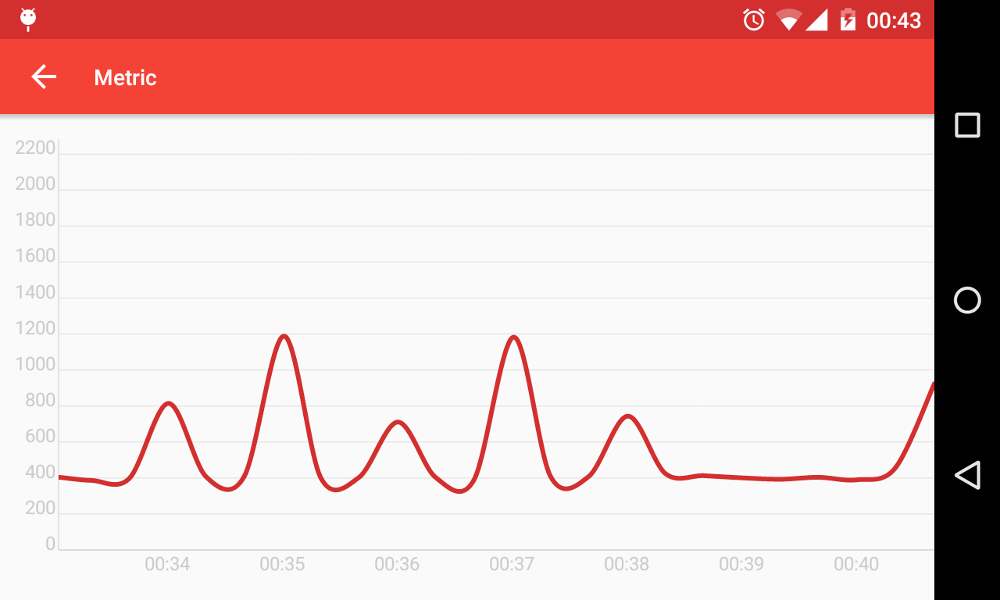

= Hawkular Android Client
Artur Dryomov
2015-09-24
:description:
:jbake-type: page
:jbake-status: published
:jbake-tags: android, client, hawkular android client

link:https://github.com/hawkular/hawkular-android-client[GitHub repository]

A full featured application.

* All authorization is done using OAuth.
* Personas are fully supported within an account.
* Displays resources, metrics and metric data as a chart.
* Alerts are available as well, it is possible to acknowledge and resolve them.
* Push notifications are available with some additional AeroGear configuration.

ifndef::env-github[]
image::/img/docs/clients/android.png[Android client, align="center"]
endif::[]

ifdef::env-github[]

endif::[]
